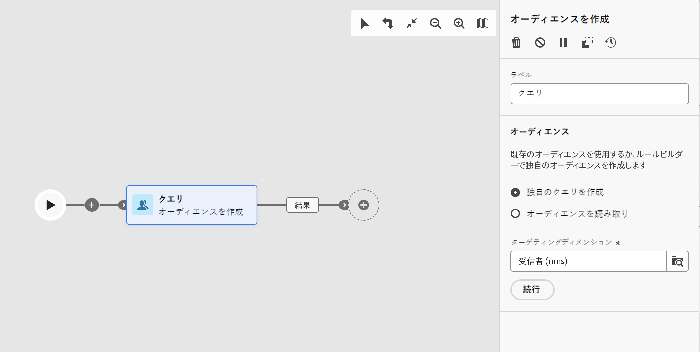
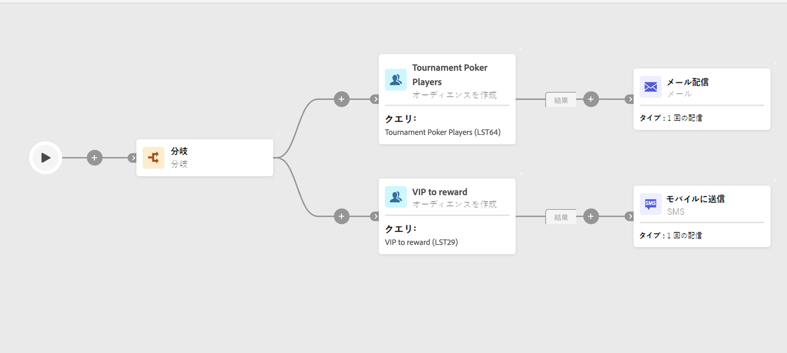

# オーディエンスを作成 {#build-audience}

>[!CONTEXTUALHELP]
>id="acw_orchestration_build_audience"
>title="オーディエンスを作成アクティビティ"
>abstract="**オーディエンスを作成**&#x200B;アクティビティを使用すると、ワークフローに入るオーディエンスを定義できます。 ワークフローのコンテキストでメッセージを送信する場合、メッセージオーディエンスはチャネルアクティビティではなく、**オーディエンスを作成**&#x200B;アクティビティで定義されます。"

**オーディエンスを作成**&#x200B;アクティビティは、**ターゲティング**&#x200B;アクティビティです。 このアクティビティを使用すると、ワークフローに入るオーディエンスを定義できます。 ワークフローのコンテキストでメッセージを送信する場合、メッセージオーディエンスはチャネルアクティビティではなく、**オーディエンスを作成**&#x200B;アクティビティで定義されます。

オーディエンス母集団を定義するには、次の操作を実行します。

* クライアントコンソールでリストとして作成した既存のオーディエンスを選択します。
* Adobe Experience Platform オーディエンスを選択します。
* クエリモデラーを使用してフィルタリング条件を定義および組み合わせて、新しいオーディエンスを作成します。

>[!NOTE]
>
>ファイルから読み込まれたオーディエンスは、「オーディエンスを作成」アクティビティを使用してターゲット設定できません。 これを行うには、「**ファイルを読み込み**」アクティビティの後に、「**紐付け**」アクティビティを使用する必要があります。 [詳細情報](../../audience/about-recipients.md)

<!--
The **Build audience** activity can be placed at the beginning of the workflow or after any other activity. Any activity can be placed after the **Build audience**.
-->

## オーディエンスを作成アクティビティの設定 {#build-audience-configuration}

>[!CONTEXTUALHELP]
>id="acw_orchestration_build_audience_audienceselector"
>title="オーディエンス"
>abstract="新しい配信をデザインする際にオーディエンスを使用するのと同じ方法で、オーディエンスを選択します。"

**オーディエンスを作成**&#x200B;アクティビティを設定するには、次の手順に従います。

1. **オーディエンスを作成**&#x200B;アクティビティを追加します。
1. ラベルを定義します。
1. **独自に作成**&#x200B;または&#x200B;**オーディエンスを読み取り**&#x200B;のオーディエンスタイプを定義します。
1. 以下のタブに示す手順に従って、オーディエンスを設定します。

>[!BEGINTABS]

>[!TAB 独自のクエリを作成]

独自のクエリを作成するには、次の手順に従います。

1. 「**独自のクエリを作成**」を選択します。
1. 「**ターゲティングディメンション**」を選択します。 ターゲティングディメンションは、受信者、契約の受益者、オペレーター、サブスクライバーなど、ターゲットされる母集団を操作ごとに定義します。 デフォルトでは、ターゲットが受信者から選択されます。 [ターゲティングディメンションについての詳細を学ぶ](../../audience/targeting-dimensions.md#targeting)
1. ターゲティングディメンションの横にあるアイコンをクリックして、「**フィルタリングディメンション**」を選択します。 フィルタリングディメンションを使用すると、メインのターゲティングディメンションを変更せずに、関連する条件を参照して、ターゲット母集団にフィルターを適用できます。 [ターゲティングディメンションについての詳細を学ぶ](../../audience/targeting-dimensions.md#filtering)
1. 「**続行**」をクリックします。
1. 新しいメールをデザインする際にオーディエンスを作成するのと同じ方法で、クエリモデラーを使用してクエリを定義します。 [クエリモデラーの操作方法の詳細を学ぶ](../../query/query-modeler-overview.md)
1. 「**エンリッチメントデータ**」セクションを使用して、データベースからの追加情報（例：契約参照やニュースレター購読）でターゲットにするデータを強化します。 そのデータは、ワークフローの&#x200B;**作業用テーブル**&#x200B;のオーディエンスと共に保存され、後続のアクティビティで使用できます。 単一のエンリッチメント属性、コレクションリンクまたは式を追加し、高度なオプションにアクセスできます。手順と例について詳しくは、[エンリッチメントデータの追加](enrichment.md#enrichment-add)を参照してください。

>[!TAB オーディエンスの閲覧]

既存のオーディエンスを選択するには、次の手順に従います。

1. 「**オーディエンスを読み取り**」を選択します。
1. 「**続行**」をクリックします。
1. 新しい配信をデザインする際にオーディエンスを使用するのと同じ方法で、オーディエンスを選択します。 [こちら](../../audience/add-audience.md)を参照してください。

>[!ENDTABS]

## 例 {#build-audience-examples}

2 つの&#x200B;**オーディエンスを作成**&#x200B;アクティビティを使用したワークフローの例を次に示します。 最初のアクティビティは、ポーカープレーヤーのオーディエンスをターゲットにし、次にメール配信が続きます。 2 番目のアクティビティは VIP クライアントオーディエンスをターゲットにし、次に SMS 配信が続きます。

