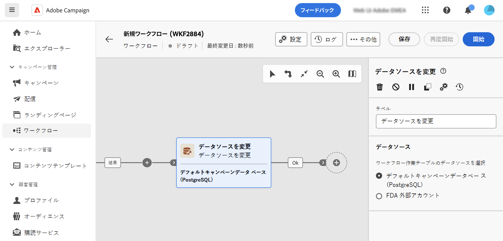

# データソースを変更 {#change-data-source}

>[!CONTEXTUALHELP]
>id="acw_orchestration_change_data_source"
>title="データソースを変更"
>abstract="「**データソースを変更**」アクティビティでは、ワークフローの作業用テーブルに別のデータソースを選択できます。"

「**データソースを変更**」アクティビティは、**ターゲティング**&#x200B;アクティビティです。このアクティビティを使用すると、ワークフローの作業用テーブルで使用されるデータソースを変更できます。これにより、様々なデータベースをまたいでデータを管理できるようになるので、パフォーマンスが向上し、柔軟性が高まります。

ワークフローでは、トランジションを通じて 1 つのアクティビティから別のアクティビティへ移されたデータは、一時的な&#x200B;**作業用テーブル**&#x200B;に保存されます。デフォルトでは、作業用テーブルは、処理済みデータのソースと同じデータベースに作成されます。例えば、クラウドデータベースに格納された「プロファイル」テーブルに対してクエリを実行する場合、同じクラウドデータベースに作業用テーブルを作成します。

場合によっては、データが現在のデータベースで使用できないか、単一操作を実行するのに十分に効率的でないことがあります。したがって、「**[!UICONTROL データソースを変更]**」アクティビティを追加して、ワークフローに別のデータベースを使用してこのような操作を実行させる必要が生じる場合があります。

Campaign のアーキテクチャについて詳しくは、[Campaign v8（クライアントコンソール）ドキュメント](https://experienceleague.adobe.com/docs/campaign/campaign-v8/config/architecture/architecture.html?lang=ja)を参照してください

<!--

Let's say you want to send to your  VIP customers a unique offer code that they can redeem on your online store. To do this, you need to:

1. Query VIP customers on the "Profiles" table located on the Cloud database,
1. Retrieve an offer code for each targeted profile through API calls,
1. Update each profile with the assigned offer code,
1. Send an email to the profiles with their offer code.

In this situation, it is recommended to execute the offer code assignment operation on the local database, which is better suited for unitary operations. To do this, you need to add a **[!UICONTROL Change data source]** activity before the operation in order to execute it on the Campaign local database.

Before executing the operation, the working table is copied to the local database so that the operation can run there. Once done, the system detects that the profiles that we want to update are on another location. The data is therefore automatically copied back to the Cloud database where the "Profiles" table is located.
-->

## 「データソースを変更」アクティビティの設定 {#configure}

「**ディメンションを変更**」アクティビティを設定するには、次の手順に従います。

1. 「**データソースを変更**」アクティビティをワークフローに追加します。

1. 作業用テーブルの移動先となるデータソースを定義します。

   * **[!UICONTROL デフォルトの Campaign データベース（PostgreSQL）]**：デフォルトの Campaign ローカルデータベースを使用します。
   * **[!UICONTROL FDA 外部アカウント]**：Federated Data Access 機能を使用して、Adobe Campaign に接続された外部のクラウドデータベースを使用します。

     >[!AVAILABILITY]
     >
     >Campaign の設定と外部システムへの接続は、上級ユーザーに制限され、クライアントコンソールからのみ使用できます。[詳細情報](https://experienceleague.adobe.com/docs/campaign/campaign-v8/connect/fda.html?lang=ja){target="_blank"}

1. 新しいデータソースを使用して目的の操作を実行するようにワークフローを設定します。

<!--
## Example {#example}

The workflow belows illustrates the use case detailed earlier, i.e. sending VIP customers offer codes that they can redeem on our online store.

-->
