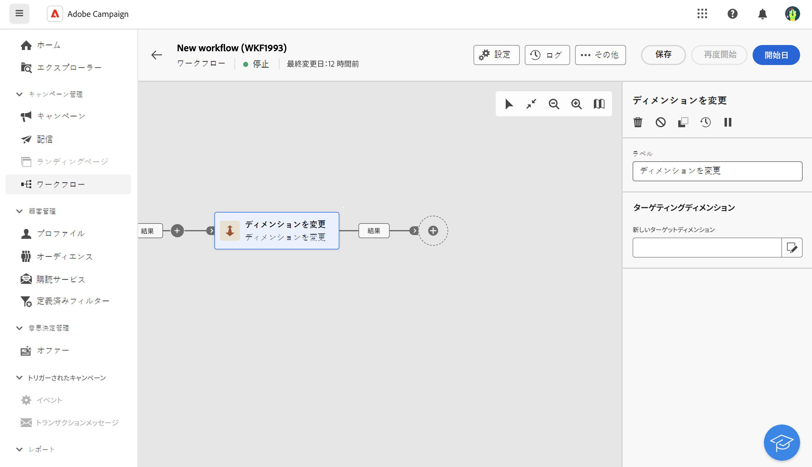

# ディメンションを変更 {#change-dimension}

>[!CONTEXTUALHELP]
>id="acw_orchestration_dimension_complement"
>title="補集合を生成"
>abstract="残りの母集団が重複として除外された、追加のアウトバウンドトランジションを生成できます。 これをおこなうには、 **補集合を生成** オプション"

>[!CONTEXTUALHELP]
>id="acw_orchestration_change_dimension"
>title="ディメンションアクティビティを変更"
>abstract="このアクティビティを使用すると、オーディエンスの作成時にターゲティングディメンションを変更できます。 データテンプレートと入力ディメンションに応じて軸が移動します。 例えば、「契約」ディメンションから「クライアント」ディメンションに切り替えることができます。"

The **ディメンションを変更** アクティビティは **ターゲット設定** アクティビティ。 このアクティビティを使用すると、オーディエンスの作成時にターゲティングディメンションを変更できます。 このアクティビティでは、データテンプレートと入力ディメンションに応じて軸を移動します。例えば、「契約」ディメンションから「クライアント」ディメンションに切り替えることができます。

さらに、このアクティビティを使用して、新しいターゲットの列を追加して定義したり、データの重複排除条件を定義したりできます。

## 設定

次の手順に従って、 **ディメンションを変更** アクティビティ：

1. を追加します。 **ディメンションを変更** アクティビティをワークフローに追加します。

   

1. 次を定義： **新しいターゲットディメンション**.

ディメンションの変更時に、すべてのレコードが保持されます。