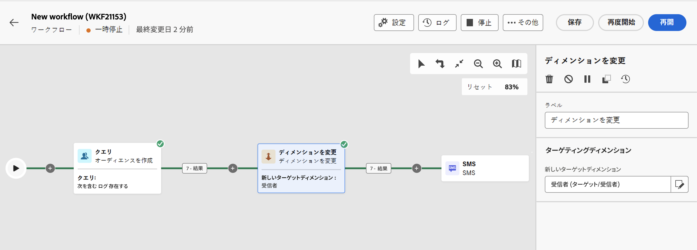

# ディメンションを変更 {#change-dimension}

>[!CONTEXTUALHELP]
>id="acw_orchestration_dimension_complement"
>title="補集合を生成"
>abstract="重複として除外された残りの母集団を使用して、追加のアウトバウンドトランジションを生成できます。これを行うには、「**補集合を生成**」オプションの切替スイッチをオンにします。"

>[!CONTEXTUALHELP]
>id="acw_orchestration_change_dimension"
>title="ディメンションを変更アクティビティ"
>abstract="このアクティビティを使用すると、オーディエンスの作成時にターゲティングディメンションを変更できます。データテンプレートと入力ディメンションに応じて軸を移動します。例えば、「契約」ディメンションから「クライアント」ディメンションに切り替えることができます。"

**ディメンションを変更**&#x200B;アクティビティは、**ターゲティング**&#x200B;アクティビティです。このアクティビティを使用すると、ワークフローの作成時にターゲティングディメンションを変更できます。データテンプレートと入力ディメンションに応じて軸を移動します。[詳しくは、ターゲティングディメンションを参照してください](../../audience/about-recipients.md#targeting-dimensions)

例えば、ワークフローのターゲティングディメンションを「受信者」から「サブスクライバーのアプリケーション」に切り替えて、ターゲットの受信者にプッシュ通知を送信できます。

## ディメンションを変更アクティビティの設定 {#configure}

**ディメンションを変更**&#x200B;アクティビティを設定するには、次の手順に従います。

1. **ディメンションを変更**&#x200B;アクティビティをワークフローに追加します。

   

1. **新しいターゲットディメンション**&#x200B;を定義します。ディメンションの変更時に、すべてのレコードが保持されます。その他のオプションはまだ利用できません。

1. ワークフローを実行して結果を表示します。ディメンションを変更アクティビティの前後のテーブル内のデータを比較して、ワークフローテーブルの構造を比較します。

## 例 {#example}

この例では、購入を行ったすべてのプロファイルに SMS 配信を送信します。これを行うには、まず、カスタムの「購入」ターゲティングディメンションにリンクされた&#x200B;**[!UICONTROL オーディエンスを作成]**&#x200B;アクティビティを使用して、発生したすべての購入をターゲットにします。

次に、**[!UICONTROL ディメンションを変更]**&#x200B;アクティビティを使用して、ワークフローのターゲティングディメンションを「受信者」に切り替えます。これにより、クエリに一致する受信者をターゲットにすることができます。

