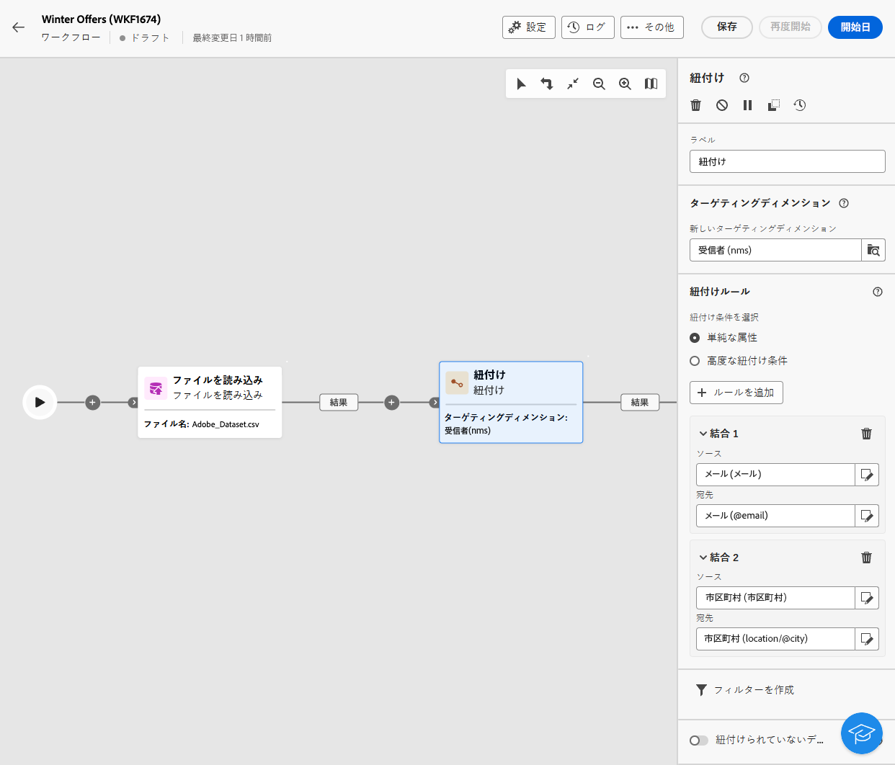

# メール, SMS, プッシュ, ダイレクトメールアクティビティ {#channel}

Adobe Campaign web を使用すると、メール、SMS、ダイレクトメール、プッシュチャネルにおいて、マーケティングキャンペーンを自動化および実行できます。チャネルアクティビティをワークフローキャンバスに組み合わせて、顧客の行動とデータに基づいてアクションをトリガーするクロスチャネルワークフローを作成できます。

例えば、メール、SMS、プッシュ、ダイレクトメールなど、様々なチャネルをまたいで一連のメッセージを含むウェルカムメールキャンペーンを作成します。また、顧客が購入を完了した後や、SMS を使用してパーソナライズされた誕生日メッセージを顧客に送信した後に、フォローアップメールを送信することもできます。

チャネルアクティビティを使用すると、複数のタッチポイントで顧客を惹きつけてコンバージョンを促進する、パーソナライズされた包括的キャンペーンを作成できます。

>[!NOTE]
>
>キャンペーンワークフローのコンテキスト外で、1 回限りの配信を作成することもできます。詳しくは、以下の節を参照してください。
>* [スタンドアロンメール配信を作成](../../email/create-email.md)
>* [スタンドアロン SMS 配信を作成](../../sms/create-sms.md)
>* [スタンドアロンプッシュ配信を作成](../../push/create-push.md)
>* [スタンドアロンダイレクトメール配信を作成](../../direct-mail/create-direct-mail.md)

## 前提条件 {#channel-activity-prereq}

関連するアクティビティを使用してワークフローの作成を開始します。

* チャネルアクティビティを挿入する前に、オーディエンスを定義します。オーディエンスは配信のメインターゲットであり、メッセージを受信するプロファイルとなります。キャンペーンワークフローのコンテキストでメッセージを送信する場合、メッセージオーディエンスはチャネルアクティビティではなく、次のような専用アクティビティ内で定義されます。

   * 「**オーディエンスを作成**」アクティビティ。[詳細情報](build-audience.md)。

     

   * 「**ファイルを読み込み**」アクティビティと、これに続く「**紐付け**」アクティビティ。[詳細情報](load-file.md)。

     

* 繰り返し配信を送信するには、「**スケジューラー**」アクティビティでワークフローを開始します。「**スケジューラー**」アクティビティを 1 回限りのワンショット配信に使用して、その配信の連絡日を設定します。この連絡日は、配信設定でも設定できます。詳しくは、[この節](scheduler.md)を参照してください。

## チャネルアクティビティを設定 {#create-a-delivery-in-a-workflow}

>[!CONTEXTUALHELP]
>id="acw_orchestration_email"
>title="メールアクティビティ"
>abstract="「メール」アクティビティでは、ワークフロー内でのメール送信を促進し、1 回限りのメッセージと繰り返しメッセージの両方を送信できます。これは、同じワークフロー内で計算されたターゲットにメールを送信するプロセスを自動化します。チャネルアクティビティをワークフローキャンバスに組み合わせて、顧客の行動とデータに基づいてアクションをトリガーするクロスチャネルワークフローを作成できます。"

>[!CONTEXTUALHELP]
>id="acw_orchestration_sms"
>title="SMS アクティビティ"
>abstract="「SMS」アクティビティでは、ワークフロー内で SMS 送信を促進し、1 回限りのメッセージと繰り返しメッセージの両方を送信できます。これは、同じワークフロー内で計算されたターゲットに SMS を送信するプロセスを自動化します。チャネルアクティビティをワークフローキャンバスに組み合わせて、顧客の行動とデータに基づいてアクションをトリガーするクロスチャネルワークフローを作成できます。"

>[!CONTEXTUALHELP]
>id="acw_orchestration_push_ios"
>title="iOS アクティビティをプッシュ"
>abstract="「iOS をプッシュ」アクティビティでは、ワークフローの一部として iOS プッシュ通知を送信するプロセスを効率化します。これにより、1 回限りのメッセージと繰り返しメッセージの両方の配信が可能になり、同じワークフロー内の定義済みターゲットへの iOS プッシュ通知の送信が自動化されます。チャネルアクティビティをワークフローキャンバスに組み合わせて、顧客の行動とデータに基づいてアクションをトリガーするクロスチャネルワークフローを作成できます。"

>[!CONTEXTUALHELP]
>id="acw_orchestration_push_android"
>title="Android アクティビティをプッシュ"
>abstract="「Android をプッシュ」アクティビティでは、ワークフローの一部として Android プッシュ通知を送信するプロセスを効率化します。これにより、1 回限りのメッセージと繰り返しメッセージの両方の配信が可能になり、同じワークフロー内の定義済みターゲットへの Android プッシュ通知の送信が自動化されます。チャネルアクティビティをワークフローキャンバスに組み合わせて、顧客の行動とデータに基づいてアクションをトリガーするクロスチャネルワークフローを作成できます。"

>[!CONTEXTUALHELP]
>id="acw_orchestration_directmail"
>title="ダイレクトメールアクティビティ"
>abstract="ダイレクトメールアクティビティでは、ワークフロー内でダイレクトメール送信を促進し、1 回限りのメッセージと繰り返しメッセージの両方を送信できます。これは、ダイレクトメールプロバイダーが必要とする抽出ファイルを生成するプロセスを自動化します。チャネルアクティビティをワークフローキャンバスに組み合わせて、顧客の行動とデータに基づいてアクションをトリガーするクロスチャネルワークフローを作成できます。"

ワークフローのコンテキストで配信を設定するには、次の手順に従います。

1. チャネルアクティビティ（**[!UICONTROL メール]**、**[!UICONTROL SMS]**、**[!UICONTROL プッシュ通知（Android）]**、**[!UICONTROL プッシュ通知（iOS）]**&#x200B;または&#x200B;**[!UICONTROL ダイレクトメール]**）を追加します。

1. 「**配信のタイプ**」（単一または繰り返し）を選択します。

   * **単一の配信**&#x200B;は 1 回限りの配信で、ブラックフライデーのメールなど 1 回だけ送信されます。
   * **繰り返し配信**&#x200B;は、「[スケジューラーアクティビティ](scheduler.md)」で定義した実行頻度に基づいて複数回送信されます。ワークフローが実行されるたびに、オーディエンスが再計算され、更新されたコンテンツと一緒に更新されたオーディエンスに配信が送信されます。週刊ニュースレターや誕生日の定期的な誕生日メールなどがあります。

1. 配信&#x200B;**テンプレート**&#x200B;を選択します。テンプレートは、チャネルに固有の事前設定済みの配信設定です。ビルトインのテンプレートは各チャネルで使用でき、デフォルトでは事前入力されます。[詳細情報](../../msg/delivery-template.md)

   

   チャネルアクティビティ設定の左側のパネルからテンプレートを選択します。以前に選択したオーディエンスがチャネルに対応していない場合は、テンプレートを選択できません。これを解決するには、**オーディエンスを作成**&#x200B;アクティビティを更新して、ターゲットマッピングが正しいオーディエンスを選択します。ターゲットマッピングについて詳しくは、[この節](../../audience/targeting-dimensions.md)を参照してください。

1. 「**配信を作成**」をクリックします。スタンドアロン配信の作成時と同様に、メッセージの設定とコンテンツを定義します。コンテンツをテストおよびシミュレートします。[詳細情報](../../msg/gs-messages.md)

1. ワークフローに戻ります。ワークフローを続行するには、「**アウトバウンドトランジションを生成**」オプションの切替スイッチをオンにし、チャネルアクティビティの後にトランジションを追加します。

1. 「**開始**」をクリックして、ワークフローを開始します。

   デフォルトでは、ワークフローを開始すると、メッセージはすぐに送信されずに、メッセージの準備ステージをトリガーします。

1. チャネルアクティビティを開き、「**確認して送信**」ボタンから送信を確定します。

1. 配信ダッシュボードで、「**送信**」をクリックします。

## 例 {#cross-channel-workflow-sample}

セグメント化と 2 つの配信を含むクロスチャネルワークフローの例を次に示します。ワークフローでは、パリに在住し、コーヒーマシンに興味があるすべての顧客をターゲットにします。この母集団の中で、通常の顧客にはメールが送信され、VIP クライアントには SMS が送信されます。

また、繰り返しワークフローを作成して、パーソナライズされた SMS を、毎月初日の午後 8 時にパリ在住のすべての顧客宛に送信することもできます。

<!--
description, which use case you can perform (common other activities that you can link before or after the activity)

how to add and configure the activity

example of a configured activity within a workflow
The Email delivery activity allows you to configure the sending of an email in a workflow. 
-->

<!-- Scheduled emails available?

This can be a single send email and sent just once, or it can be a recurring email.
* Single send emails are standard emails, sent once.
* Recurring emails allow you to send the same email multiple times to different targets over a defined period. You can aggregate the deliveries per period in order to get reports that correspond to your needs.

When linked to a scheduler, you can define recurring emails.
Email recipients are defined upstream of the activity in the same workflow, via an Audience targeting activity.

-->

<!--The message preparation is triggered according to the workflow execution parameters. From the message dashboard, you can select whether to request or not a manual confirmation to send the message (required by default). You can start the workflow manually or place a scheduler activity in the workflow to automate execution.-->