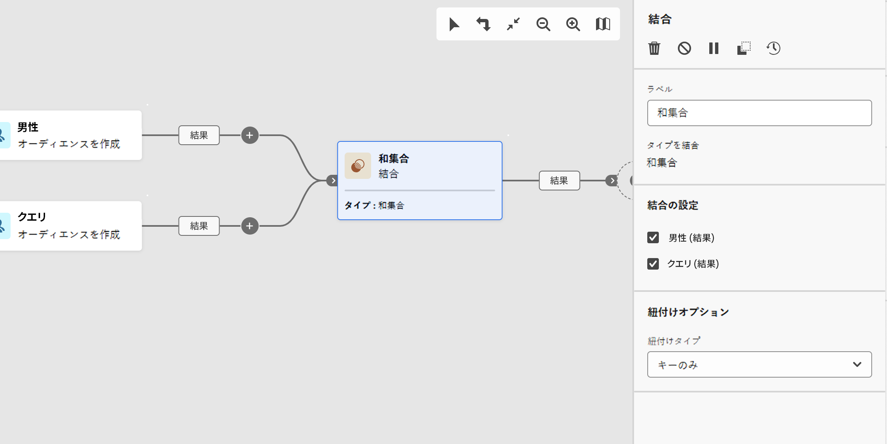

# 結合 {#combine}

>[!CONTEXTUALHELP]
>id="acw_orchestration_combine"
>title="アクティビティを結合"
>abstract="**結合**&#x200B;アクティビティでは、インバウンド母集団に対してセグメント化を実行できます。複数の母集団を組み合わせたり、一部を除外したり、複数のターゲットに共通するデータのみを保持したりできます。"

**エンリッチメント**&#x200B;アクティビティは、**ターゲティング**&#x200B;アクティビティです。このアクティビティを使用すると、インバウンド母集団に対してセグメント化を実行できます。複数の母集団を組み合わせたり、一部を除外したり、複数のターゲットに共通するデータのみを保持したりできます。 使用可能なセグメント化のタイプを次に示します。

<!--
The **Combine** activity can be placed after any other activity, but not at the beginning of the workflow. Any activity can be placed after the **Combine**.
-->

* **和集合** は、複数のアクティビティの結果を 1 つのターゲットに再グループ化します。
* **積集合** は、アクティビティ内の異なるインバウンド母集団に共通の要素のみを保持します。
* **除外** では、特定の条件に従って、ある母集団から要素が除外されます。

## 結合アクティビティを設定 {#combine-configuration}

>[!CONTEXTUALHELP]
>id="acw_orchestration_intersection_merging_options"
>title="積集合の結合オプション"
>abstract="積集合では、アクティビティ内の異なるインバウンド母集団に共通の要素のみが保持されます。 「結合の設定」セクションで、結合する前のアクティビティをすべてオンにします。"

>[!CONTEXTUALHELP]
>id="acw_orchestration_exclusion_merging_options"
>title="除外の結合オプション"
>abstract="除外では、特定の条件に従って、ある母集団から要素が除外されます。 「結合の設定」セクションで、結合する前のアクティビティをすべてオンにします。"

>[!CONTEXTUALHELP]
>id="acw_orchestration_combine_options"
>title="セグメント化タイプを選択"
>abstract="オーディエンスを結合する方法を選択します。**和集合** は、複数のアクティビティの結果を 1 つのターゲットに再グループ化します。 **積集合** は、アクティビティ内の異なるインバウンド母集団に共通の要素のみを保持します。 **除外** では、特定の条件に従って、ある母集団から要素が除外されます。"

**結合** アクティビティを設定するには、次の一般的な手順に従います。

1. **オーディエンスを作成** アクティビティなどの複数のアクティビティを追加して、2 つ以上の異なる実行分岐を形成します。
1. **結合**&#x200B;アクティビティを任意の前の分岐に追加します。
1. [ 和集合 ](#union)、[ 積集合 ](#intersection) または [ 除外 ](#exclusion) のセグメント化タイプを選択します。
1. 「**続行**」をクリックします。
1. 「**結合の設定**」セクションで、結合する前のアクティビティをすべてオンにします。

## 和集合 {#combine-union}

>[!CONTEXTUALHELP]
>id="acw_orchestration_combine_reconciliation"
>title="紐付けオプション"
>abstract="「**紐付けタイプ**」を選択して、重複の処理方法を定義します。デフォルトでは、「**キー**」オプションが有効になっています。つまり、異なるインバウンドトランジションの要素が同じキーを持つ場合、アクティビティは 1 つの要素のみを保持します。 「**列の選択**」オプションを使用して、データの紐付けが適用される列のリストを定義します。"

**結合** アクティビティで、**紐付けタイプ** を選択して **和集合** を設定し、重複の処理方法を定義します。

* **キーのみ**：これはデフォルトモードです。 異なるインバウンドトランジションの要素が同じキーを持つ場合、アクティビティは 1 つの要素のみを保持します。 このオプションは、インバウンド母集団が同質である場合にのみ使用できます。
* **列の選択**：このオプションを選択し、データの紐付けが適用される列のリストを定義します。 最初に、プライマリセット（ソースデータ）を選択し、次に結合に使用する列を選択します。

## 積集合 {#combine-intersection}

>[!CONTEXTUALHELP]
>id="acw_orchestration_intersection_reconciliation_options"
>title="積集合の紐付けオプション"
>abstract="「**紐付けタイプ**」を選択して、重複の処理方法を定義します。デフォルトでは、「**キー**」オプションが有効になっています。つまり、異なるインバウンドトランジションの要素が同じキーを持つ場合、アクティビティは 1 つの要素のみを保持します。 「**列の選択**」オプションを使用して、データの紐付けが適用される列のリストを定義します。"

**結合** アクティビティで、次の追加手順に従って **積集合** を設定します。

1. 「**紐付けタイプ**」を選択して、重複の処理方法を定義します。[和集合](#union)の節を参照してください。
1. 残りの母集団を処理するには、「**補集合を生成**」オプションをチェックします。補集合には、すべてのインバウンドアクティビティから積集合を引いた結果の和集合が含まれます。 その後、追加のアウトバウンドトランジションがアクティビティに追加されます。

## 除外 {#combine-exclusion}

>[!CONTEXTUALHELP]
>id="acw_orchestration_exclusion_options"
>title="除外ルール"
>abstract="必要に応じて、インバウンドテーブルを操作します。 別のディメンションからターゲットを除外するには、このターゲットをメインターゲットと同じターゲティングディメンションに返します。 「除外ルール」セクションの「ルールを追加」をクリックし、ディメンションの変更条件を指定します。 データの紐付けは、属性または結合を使用して実行されます。"

>[!CONTEXTUALHELP]
>id="acw_orchestration_combine_sets"
>title="結合するセットを選択"
>abstract="「**結合の設定**」セクションで、インバウンドトランジションから「**プライマリセット**」を選択します。これは、要素の除外元のセットです。これ以外のセットは、プライマリセットから除外する前の要素に一致します。"

>[!CONTEXTUALHELP]
>id="acw_orchestration_combine_exclusion"
>title="除外ルール"
>abstract="必要に応じて、インバウンドテーブルを操作します。 別のディメンションからターゲットを除外するには、このターゲットをメインターゲットと同じターゲティングディメンションに返します。 「除外ルール」セクションの「ルールを追加」をクリックし、ディメンションの変更条件を指定します。 データの紐付けは、属性または結合を使用して実行されます。"

>[!CONTEXTUALHELP]
>id="acw_orchestration_combine_complement"
>title="結合で補集合を生成"
>abstract="「補集合を生成」オプションの切替スイッチをオンにして、追加のトランジションで残りの母集団を処理します。"

**結合** アクティビティで、次の追加手順に従って **除外** を設定します。

1. 「**結合の設定**」セクションで、インバウンドトランジションから「**プライマリセット**」を選択します。これは、要素の除外元のセットです。これ以外のセットは、プライマリセットから除外する前の要素に一致します。
1. 必要に応じて、インバウンドテーブルを操作します。 別のディメンションからターゲットを除外するには、このターゲットをメインターゲットと同じターゲティングディメンションに返します。 「**除外ルール**」セクションの「**ルールを追加**」をクリックし、ディメンションの変更条件を指定します。 データの紐付けは、属性または結合を使用して実行されます。
1. 残りの母集団を処理するには、「**補集合を生成**」オプションをチェックします。[積集合](#intersection)の節を参照してください。

## 例 {#combine-examples}

次の例では、**結合** アクティビティで **和集合** を使用して、18～27 歳のユーザーと 34～40 歳のユーザーという 2 つのクエリのすべてのプロファイルを取得します。

次の例は、2 つのクエリアクティビティ間の **積集合** を示しています。 18～27 歳のプロファイルと、メールアドレスが指定されたプロファイルを取得します。

次の **除外** 例は、Adobeのメールドメインを持つ 18～27 歳のプロファイルをフィルタリングするように設定された 2 つのクエリを示しています。 Adobe メールドメインを持つプロファイルは、最初のセットから除外されます。

