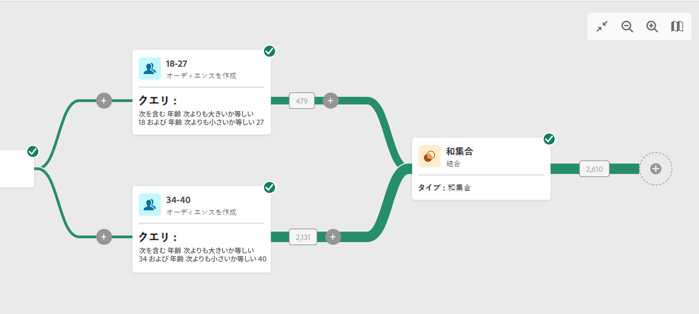
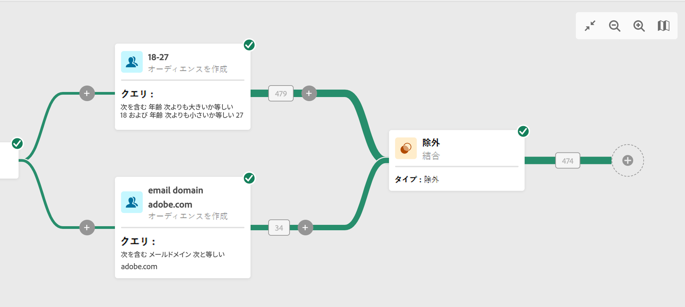

# 結合 {#combine}

このアクティビティを使用すると、インバウンド母集団に対してセグメント化を実行できます。したがって、いくつもの母集団を組み合わせて、一部を除外したり、複数のターゲットに共通するデータのみを保持したりできます。使用可能なセグメント化のタイプを次に示します。

<!--
The **Combine** activity can be placed after any other activity, but not at the beginning of the workflow. Any activity can be placed after the **Combine**.
-->

* **和集合**&#x200B;では、複数のアクティビティの結果を 1 つのターゲットに再グループ化できます。
* **積集合**&#x200B;では、アクティビティ内の異なるインバウンド母集団に共通の要素のみを保持できます。
* **除外**&#x200B;では、特定の条件に従って、ある母集団から要素を除外することができます。

## 一般設定 {#general}

>[!CONTEXTUALHELP]
>id="acw_orchestration_intersection_merging_options"
>title="積集合の結合オプション"
>abstract="積集合では、アクティビティ内の異なるインバウンド母集団に共通の要素のみを保持できます。「結合の設定」セクションで、結合する前のアクティビティをすべてオンにします。"

>[!CONTEXTUALHELP]
>id="acw_orchestration_exclusion_merging_options"
>title="除外の結合オプション"
>abstract="除外では、特定の条件に従って、ある母集団から要素を除外することができます。「結合の設定」セクションで、結合する前のアクティビティをすべてオンにします。"

**結合**&#x200B;アクティビティの設定を開始するには、次の一般的な手順に従います。

1. **オーディエンスを作成**&#x200B;アクティビティなどの複数のアクティビティを追加して、2 つ以上の異なる実行分岐を形成します。
1. **結合**&#x200B;アクティビティを任意の前の分岐に追加します。
1. [和集合](#union)、[積集合](#intersection)または[除外](#exclusion)のセグメント化タイプを選択します。
1. 「**続行**」をクリックします。
1. 「**結合の設定**」セクションで、結合する前のアクティビティをすべてオンにします。

## 和集合 {#union}

>[!CONTEXTUALHELP]
>id="acw_orchestration_intersection_reconciliation_options"
>title="積集合の紐付けオプション"
>abstract="紐付けタイプを選択して、重複の処理方法を定義します。"

**和集合**&#x200B;の場合、「**紐付けタイプ**」を選択して、重複の処理方法を定義する必要があります。

* **キーのみ**：これはデフォルトのモードです。アクティビティは、異なるインバウンドトランジションの要素が同じキーを持つ場合、1 つの要素のみを保持します。このオプションは、インバウンド母集団が同質である場合にのみ使用できます。
* **列の選択**：このオプションを選択し、データの紐付けが適用される列のリストを定義します。最初に（ソースデータを含む）プライマリセットを選択し、次に結合に使用する列を選択する必要があります。

## 積集合 {#intersection}

**積集合**&#x200B;の場合は、次の追加手順に従う必要があります。

1. 「**紐付けタイプ**」を選択して、重複の処理方法を定義します。[和集合](#union)の節を参照してください。
1. 残りの母集団を処理するには、「**補集合を生成**」オプションをオンにします。補集合には、すべてのインバウンドアクティビティから積集合を引いた結果の和集合が含まれます。その後、追加のアウトバウンドトランジションがアクティビティに追加されます。

## 除外 {#exclusion}

>[!CONTEXTUALHELP]
>id="acw_orchestration_exclusion_options"
>title="除外ルール"
>abstract="必要に応じて、インバウンドテーブルを操作できます。別のディメンションからターゲットを除外するには、このターゲットが同じターゲティングディメンションをメインターゲットとして返します。それには、「除外ルール」セクションの「ルールを追加」をクリックし、ディメンションの変更条件を指定します。データの紐付けは、属性または結合を使用して実行されます。"

**除外**&#x200B;の場合は、次の追加手順に従う必要があります。

1. 「**結合の設定**」セクションで、インバウンドトランジションから「**プライマリセット**」を選択します。これは、要素の除外元のセットです。これ以外のセットは、プライマリセットから除外する前の要素に一致します。
1. 必要に応じて、インバウンドテーブルを操作できます。別のディメンションからターゲットを除外するには、このターゲットが同じターゲティングディメンションをメインターゲットとして返します。それには、「**除外ルール**」セクションの「**ルールを追加**」をクリックし、ディメンションの変更条件を指定します。データの紐付けは、属性または結合を使用して実行されます。
1. 残りの母集団を処理するには、「**補集合を生成**」オプションをオンにします。[積集合](#intersection)の節を参照してください。

## 例

次の例では、18～27 歳のユーザーと 34～40 歳のユーザーという 2 つのクエリのすべてのプロファイルを取得する&#x200B;**和集合**&#x200B;を追加しました。

次の例は、2 つのクエリアクティビティ間の&#x200B;**積集合**&#x200B;を示しています。ここでは、18～27 歳のプロファイルと、メールアドレスが指定されたプロファイルを取得するために使用されています。

次の&#x200B;**除外**&#x200B;例は、アドビのメールドメインを持つ 18～27 歳のプロファイルをフィルタリングするように設定された 2 つのクエリを示しています。以降、アドビのメールドメインを持つプロファイルが、最初のセットから除外されます。

