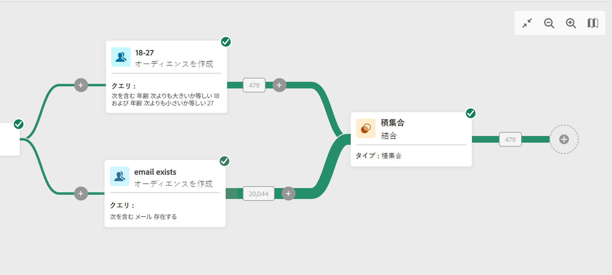

# 結合 {#combine}

このアクティビティを使用すると、インバウンドデータのセットを処理できます。 したがって、いくつもの母集団を組み合わせて、一部を除外したり、複数のターゲットに共通するデータのみを保持したりできます。使用可能なセグメント化のタイプを次に示します。

<!--
The **Combine** activity can be placed after any other activity, but not at the beginning of the workflow. Any activity can be placed after the **Combine**.
-->

* この **和集合** では、複数のアクティビティの結果を 1 つのターゲット内に再グループ化できます。
* この **積集合** では、アクティビティ内の異なるインバウンド母集団に共通の要素のみを保持できます。
* この **除外** では、特定の条件に従って、ある母集団から要素を除外することができます。

## 設定

次の手順に従って、 **結合** アクティビティ：

1. 次のような複数のアクティビティを追加 **オーディエンスの構築** アクティビティを作成して、2 つ以上の異なる実行分岐を形成する必要があります。
1. を追加します。 **結合** アクティビティを以前のセグメント化トランジションのいずれかに追加します。
1. セグメントのタイプを選択します。和集合、積集合、除外のいずれか。
1. 「**続行**」をクリックします。
1. 内 **結合するセット** セクションでは、参加したい前のアクティビティをすべて確認します。

の **和集合** および **積集合**&#x200B;を選択する場合は、 **紐付けタイプ** 重複の処理方法を定義するには：

    *キーのみ：これはデフォルトのモードです。 アクティビティは、異なるインバウンドトランジションの要素が同じキーを持つ場合、1 つの要素のみを保持します。このオプションは、インバウンド母集団が同質である場合にのみ使用できます。
    *列の選択：このオプションを選択し、データの紐付けが適用される列のリストを定義します。 最初に（ソースデータを含む）プライマリセットを選択し、次に結合に使用する列を選択する必要があります。

の **積集合** および **除外**&#x200B;に設定されている場合、 **完了を生成** 」オプションを使用します。 補集合には、すべてのインバウンドアクティビティから積集合を引いた結果の和集合が含まれます。その後、追加のアウトバウンドトランジションがアクティビティに追加されます。

の **除外**&#x200B;を選択し、 **プライマリセット** インバウンドトランジションから、 **結合するセット** 」セクションに入力します。 これは、要素の除外元のセットです。これ以外のセットは、プライマリセットから除外する前の要素に一致します。

## 例

次の例では、 **和集合** は、2 つのクエリのすべてのプロファイルを取得します。18～27 歳、34～40 歳。

次の例は、 **積集合** 2 つのクエリアクティビティ間で ここでは、18～27 歳の、E メールアドレスが指定されたプロファイルを取得するために使用されています。

以下 **除外** 例は、18～27 歳で adobe e メールドメインを持つプロファイルをフィルターするように設定された 2 つのクエリを示しています。 その後、アドビの E メールドメインを持つプロファイルは、最初のセットから除外されます。

