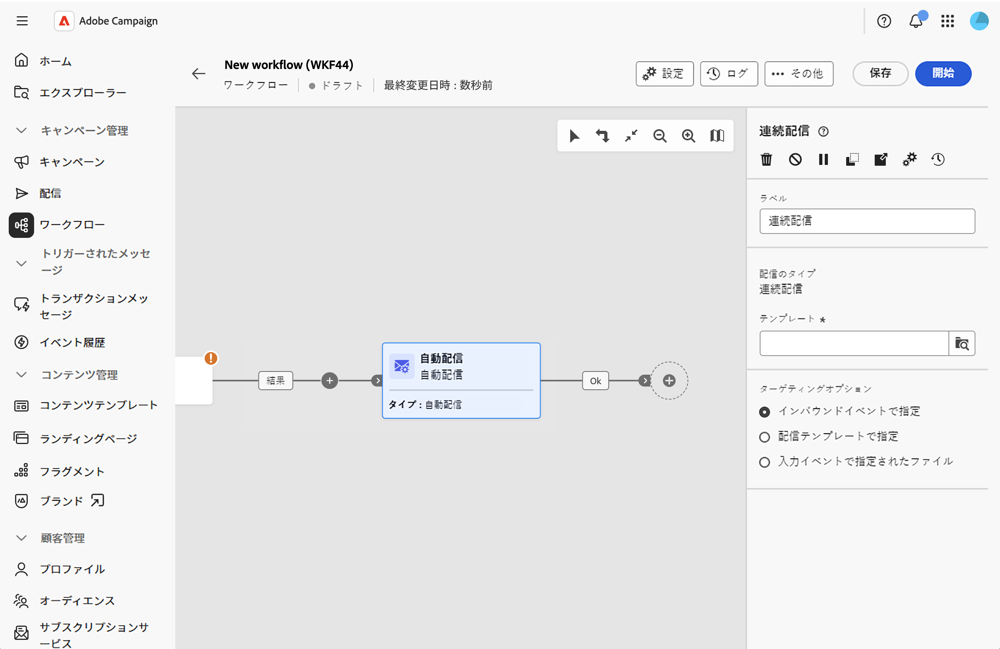

# 連続配信 {#continuous-delivery}

**継続配信** アクティビティを使用すると、既存の配信に新しい受信者を追加できます。 この配信タイプを使用すると、毎回新しい配信を作成する必要がなくなります。このモードは、容量不足のアラートや通知を必要に応じて送信する場合に、より効率的です。

連続配信では、単一の配信インスタンスが作成されます。 すべての配信ログ（broadLog）とトラッキングログがこの 1 つの配信を参照するため、監視とレポートが簡素化されます。

## 継続配信アクティビティの設定 {#configure}

1. ワークフローキャンバスに&#x200B;**継続配信** アクティビティを追加します。

   継続配信アクティビティを示す{zoomable="yes"}

1. アクティビティのカスタム **[!UICONTROL Label]**&#x200B;を入力します（オプション）。 デフォルトでは、「継続配信」というラベルが付けられます。

1. 「**[!UICONTROL テンプレート]**」フィールドの横にある検索アイコンをクリックして、配信テンプレートを選択します。 テンプレート（標準配信ではない）のみが選択できます。 テンプレートは、配信チャネル、コンテンツ、設定を定義します。

1. **[!UICONTROL ターゲティングオプション]**&#x200B;で、ターゲット母集団の定義方法を選択します。

   * **[!UICONTROL インバウンドイベントで指定]**: ターゲットは、インバウンドトランジション（オーディエンスの構築や増分クエリなどのアップストリームアクティビティ）から取得されます。 これは最も一般的なオプションです。

   * **[!UICONTROL 配信テンプレートで指定]**: ターゲットはテンプレート自体で定義されています。

   * **[!UICONTROL 入力イベントで指定されたファイル]**：ターゲットは、ワークフローを渡されたファイルを介して提供されます。

継続的な配信アクティビティは、ワークフローを継続するためのアウトバウンドトランジションを自動的に生成します。

## 関連トピック {#related}

* [ワークフローアクティビティについて](about-activities.md)
* [自動配信](automated-delivery.md)
* [メール, SMS, プッシュ, ダイレクトメールアクティビティ](channels.md)
* [配信テンプレート](../../msg/delivery-template.md)
