# データの読み込み（RDBMS） {#data-loading-rdbms}

>[!CONTEXTUALHELP]
>id="acw_orchestration_data_loading_rdbms"
>title="データ読み込み（RDBMS）アクティビティ"
>abstract="**データ読み込み（RDBMS）** アクティビティは&#x200B;**データ管理** アクティビティです。 このアクティビティを使用すると、外部リレーショナルデータベースからワークフローに直接データをロードできます。 抽出されたデータはワークフロー全体を通じて利用でき、ターゲティング、エンリッチメント、またはさらなるデータ処理に使用できます。"

**データ読み込み（RDBMS）** アクティビティは&#x200B;**データ管理** アクティビティです。 このアクティビティを使用すると、外部リレーショナルデータベースからワークフローに直接データをロードできます。 抽出されたデータはワークフロー全体を通じて利用でき、ターゲティング、エンリッチメント、またはさらなるデータ処理に使用できます。

<!--
This activity relies on the [Federated Data Access (FDA)](https://experienceleague.adobe.com/docs/campaign/campaign-v8/connect/fda.html?lang=ja){target="_blank"} option, which lets Adobe Campaign process information stored in one or more external databases without changing the structure of the Adobe Campaign data.
-->

>[!NOTE]
>
>パフォーマンスを向上させるには、外部データベースから収集するデータ量が許可されている場合に、代わりに外部データを使用して&#x200B;**[!UICONTROL オーディエンスを構築]** アクティビティ（クエリタイプ）を使用することを検討してください。
>
>**[!UICONTROL データ読み込み（RDBMS）]** アクティビティは、ワークフローブランチの最初のアクティビティである必要があります。 キャンバス内の別のアクティビティの後に追加することはできません。

まず、**データ読み込み（RDBMS）** アクティビティをワークフローブランチの最初のアクティビティとして追加します。

アクティビティは、次の4つのセクションに分かれています。

* **[!UICONTROL ターゲット設定]**：読み込まれたデータの保存場所を選択します。 [詳細情報](#target-settings)
* **[!UICONTROL Source settings]**：読み込むデータを含む外部データベースにアクセスする方法を選択します。 [詳細情報](#source-settings)
* **[!UICONTROL 収集された情報]**：外部テーブルから収集する列を定義します。 [詳細情報](#information-collected)
* **[!UICONTROL Source フィルタリング]**：外部テーブルからデータの一部のみを収集するフィルターを定義します。 [詳細情報](#filter)

最後の2つのセクションは、**[!UICONTROL Source設定]**&#x200B;が定義されている場合にのみ表示されます。

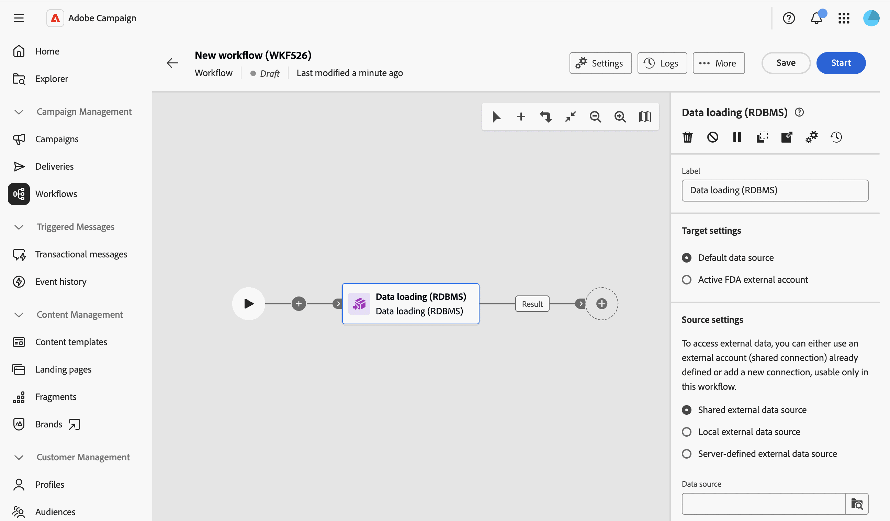

## ターゲット設定 {#target-settings}

「**[!UICONTROL ターゲット設定]**」セクションで、読み込まれたデータの保存場所を選択します。 2つのオプションを使用できます：**[!UICONTROL デフォルトのデータソース]**&#x200B;と&#x200B;**[!UICONTROL アクティブ FDA外部アカウント]**。

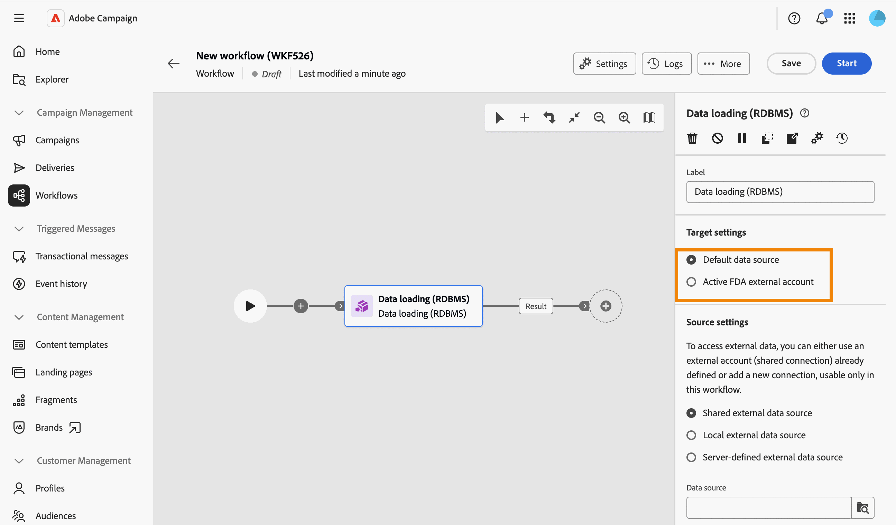

### デフォルトデータソース {#default-data-source}

このオプションは、デフォルトで選択されています。 これにより、読み込まれたデータをデフォルトのCampaign データベースに保存できます。 オプションを選択する必要があります。

### アクティブ FDA 外部アカウント {#active-fda-external-account}

このオプションを使用すると、読み込まれたデータを外部アカウントに保存できます。

1. 「**[!UICONTROL データソース]**」フィールドの右側にあるボタンをクリックします。
1. 使用するアカウントを選択します。

   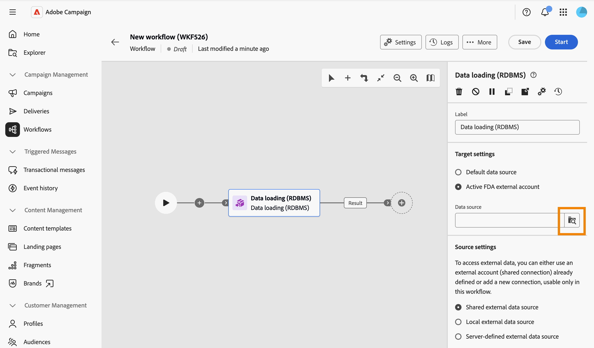

## ソース設定 {#source-settings}

「**[!UICONTROL Source settings]**」セクションで、読み込むデータを含む外部データベースにアクセスする方法を選択します。 3つのオプションを使用できます：**[!UICONTROL 共有外部データソース]**、**[!UICONTROL ローカル外部データソース]**、**[!UICONTROL サーバー定義の外部データソース]**。

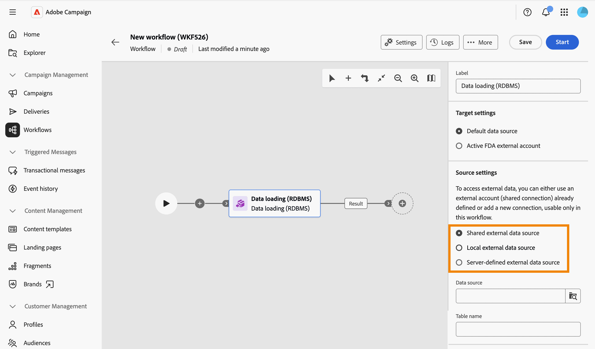

### 共有外部データソース {#shared-data-source}

このオプションは、デフォルトで選択されています。 Campaign管理者が既に設定した外部アカウントを使用できます。 [外部アカウントの設定方法について説明します](../../administration/create-external-account.md)。

1. 「**[!UICONTROL データソース]**」フィールドの右側にあるボタンをクリックし、使用するアカウントを選択します。

   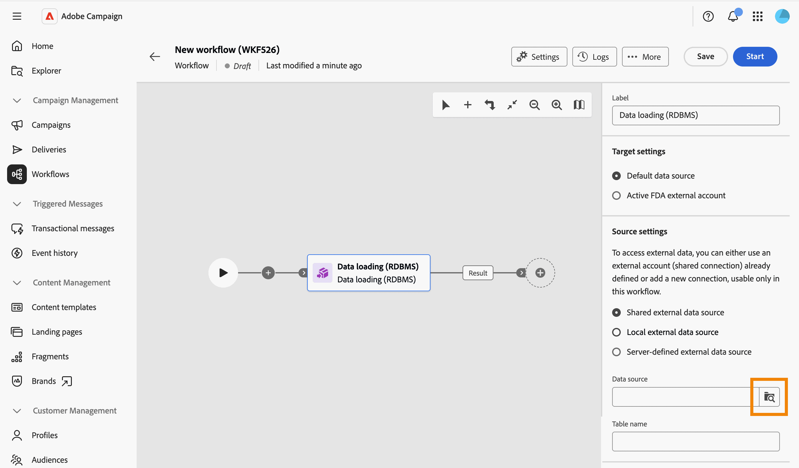

1. 「**[!UICONTROL テーブル名]**」フィールドの横にある「**[!UICONTROL 参照]**」ボタンをクリックし、読み込むデータを含むテーブルを選択します。

   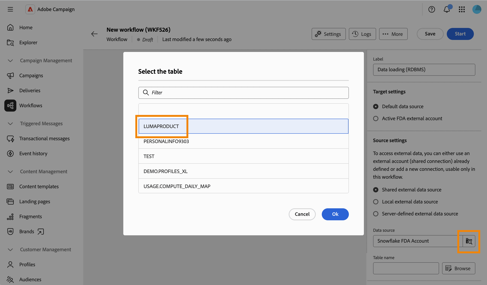

### ローカル外部データソース {#local-external-data-source}

このオプションを使用すると、このワークフロー内でのみ一時的に使用するために、アクティビティ内で外部データベースへの接続を直接定義できます。 この接続は外部アカウントとして保存されません。

1. 「**[!UICONTROL データソースを定義]**」ボタンをクリックし、接続するデータベースエンジンを選択します。

   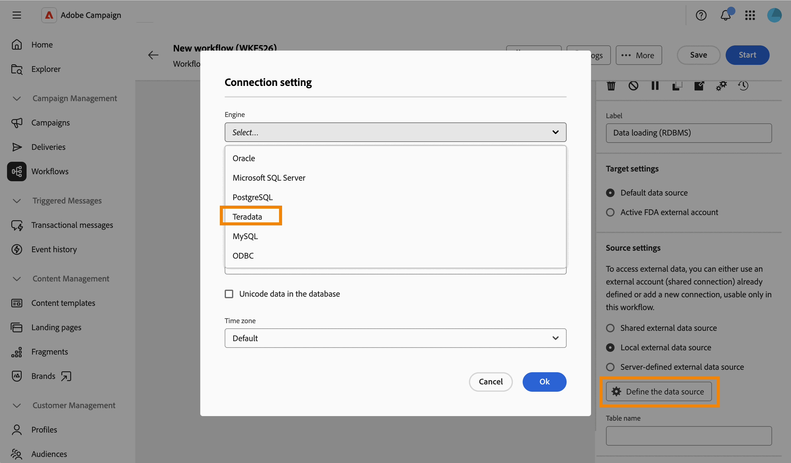

1. 選択したエンジンに表示される接続フィールドに入力します。

   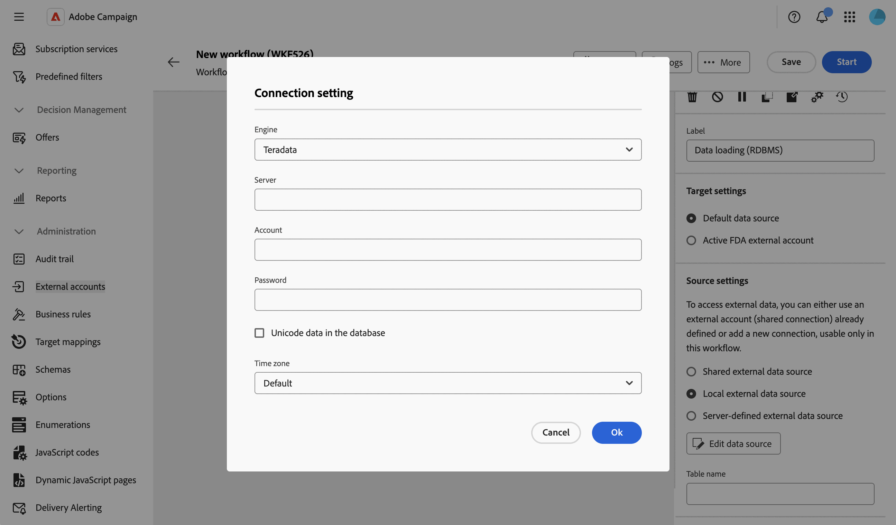

<!--
1. Click **[!UICONTROL Ok]** to confirm. The button is then relabeled **[!UICONTROL Edit data source]**, allowing you to open the dialog again to change the connection settings.
-->

1. 読み込むテーブルの名前を&#x200B;**[!UICONTROL テーブル名]** フィールドに入力します。

### サーバー定義の外部データソース {#server-defined-external-data-source}

このオプションを使用すると、サーバーレベルですでに定義されているデータベース接続を使用できます。

1. 使用する接続の名前を&#x200B;**[!UICONTROL 接続名]** フィールドに入力します。
1. 読み込むテーブルの名前を&#x200B;**[!UICONTROL テーブル名]** フィールドに入力します。

   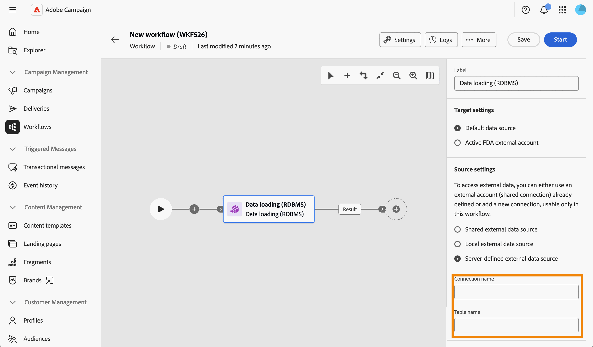

## 収集された情報 {#information-collected}

テーブルを設定すると、**[!UICONTROL 収集された情報]** セクションで、外部テーブルから収集する列を定義できます。

1. 選択したテーブルのすべての列を収集する必要がある場合は、「**[!UICONTROL すべてのソースデータを保持]**」オプション（デフォルト）をオンにします。
1. 「**[!UICONTROL 列を抽出する列を追加]**」をクリックして、代わりに特定の列を収集するか、追加します。

   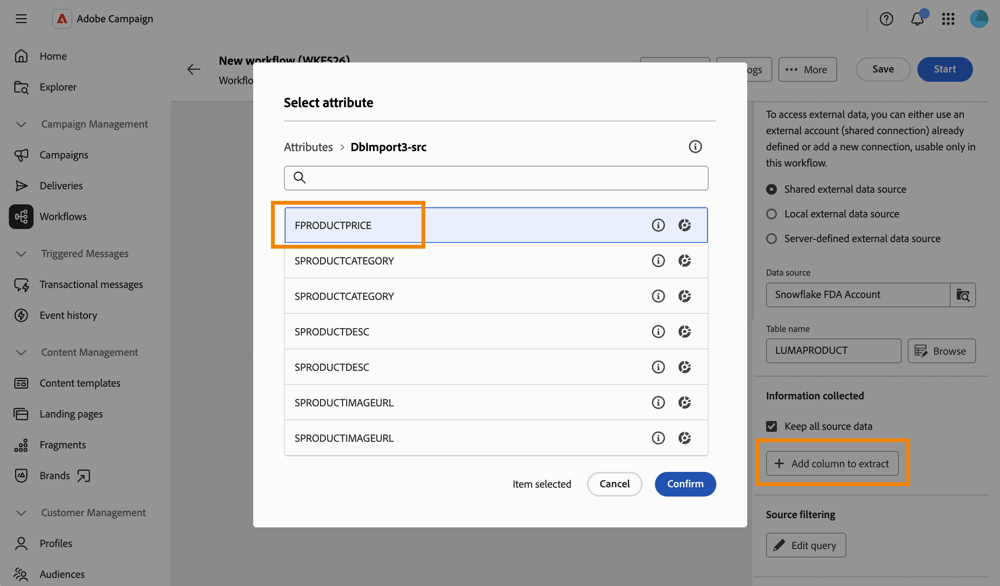

<!--
In the **[!UICONTROL Select attribute]** dialog, scoped to the schema of the selected table, pick an attribute and confirm. [Learn how to select attributes and add them to favorites](../../get-started/attributes.md)
-->

1. 属性を選択して確認します。 属性は、**[!UICONTROL 列]** フィールドと編集可能な&#x200B;**[!UICONTROL ラベル]** フィールドを持つ行として追加されます。 削除アイコンを使用して削除します。

   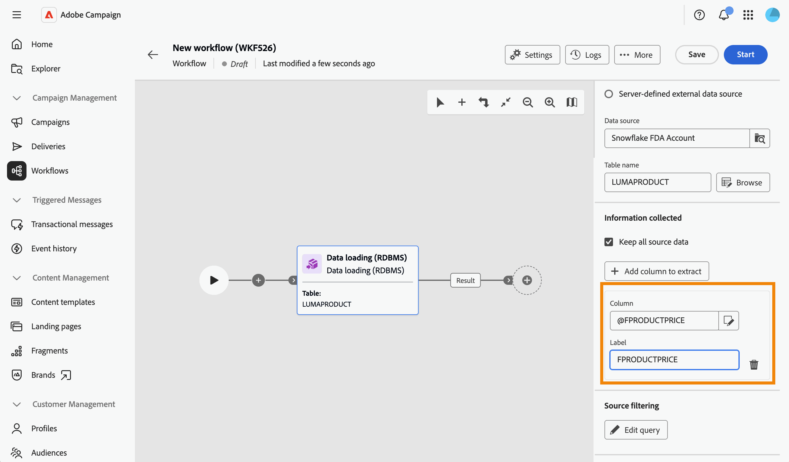

<!--
## Link to another table (optional) {#link}

NOT CONFIRMED — restore and verify before publishing.

Source: transcript of the ACC Web UI - Handsoff 12-06 demo (Herve Phulpin, ~20:49-21:04 mark). At the time of that demo, this part of the activity was explicitly described as unfinished: "the next part is not yet available", "this part is missing", "we are not able to add a link condition". No screenshot of a completed, working flow for this section has been captured since. Two related sub-bugs were still open against NEO-95826 at last check: NEO-97147 ("DBMS activity transition results not shown") and NEO-97148 ("local external data table name is not a picker").

If you need to reconcile the loaded data with an existing table, such as the Recipients table, add a link:

1. Click **Add link**.
1. Select the table to link to. You can browse tables from the Campaign database or from the external data source.
1. Define the join condition between the loaded table and the target table:
   * Simple join: Select the attributes to match between the two tables.
   * Advanced join: Use the query modeler to build the join condition.

[Learn more about link definitions in the Enrichment activity](enrichment.md#create-links).
-->

## Source フィルタリング（オプション） {#filter}

外部テーブルからデータの一部のみを収集するには、フィルターを定義できます。

1. **[!UICONTROL Source フィルタリング]** セクションで、**[!UICONTROL クエリを編集]**&#x200B;をクリックします。

   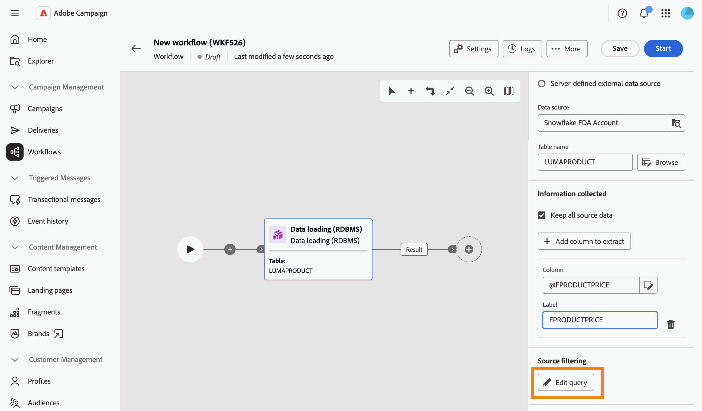

1. 選択したテーブルのスキーマを対象とした専用の画面でクエリモデラーが開きます。 テーブルの属性に対する条件を構築するために使用します。 [クエリモデラーの操作方法の詳細を学ぶ](../../query/query-modeler-overview.md)

   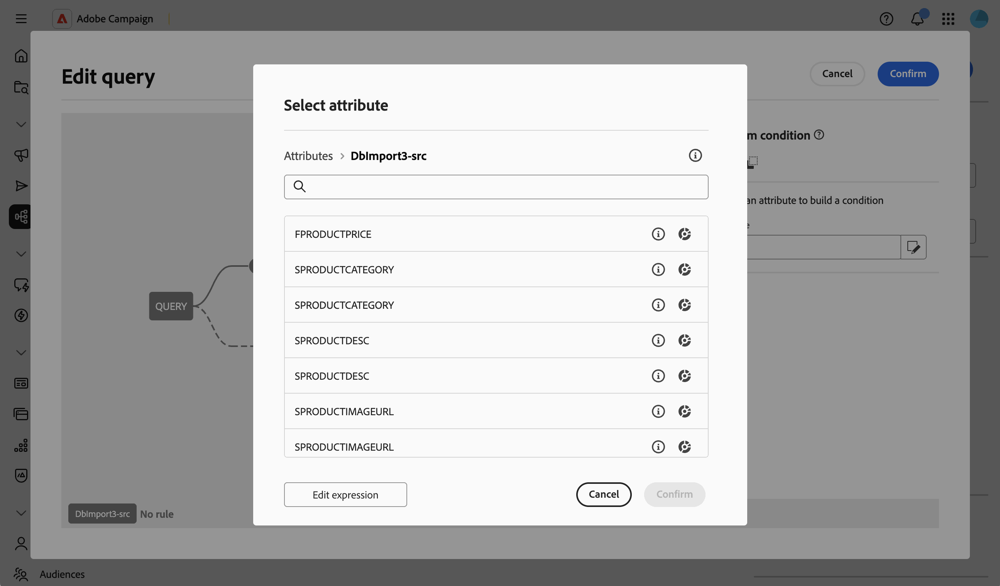

<!--
>[!NOTE]
>
>Some advanced options available for this activity in the client console, such as computing the table name from the inbound transition, are not yet exposed in the Campaign Web User Interface.
-->