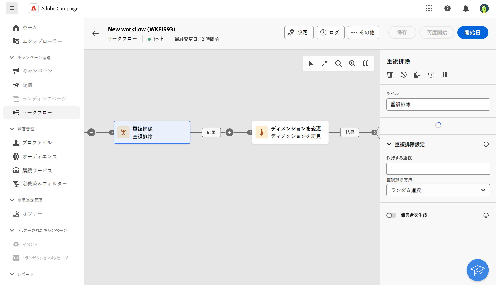
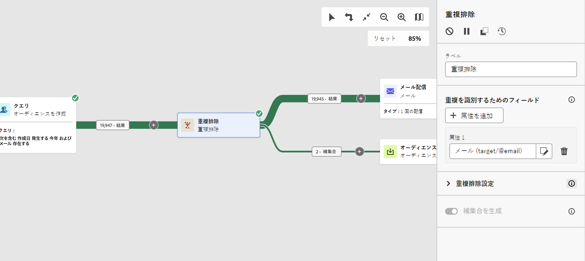

# 重複の除外 {#deduplication}

>[!CONTEXTUALHELP]
>id="acw_orchestration_deduplication_fields"
>title="重複を識別するためのフィールド"
>abstract="「**重複を識別するフィールド**」セクションで、「**属性を追加**」ボタンをクリックして、メールアドレス、名、姓など、同一の値を使用して重複を識別できるフィールドを指定します。 フィールドの順序は、最初に処理するフィールドを指定します。"

>[!CONTEXTUALHELP]
>id="acw_orchestration_deduplication"
>title="重複排除 - 重複アクティビティ"
>abstract="**重複排除** アクティビティは、インバウンドアクティビティの結果にある重複を削除します。 ほとんどの場合、ターゲティングアクティビティの後、およびターゲットデータを使用するアクティビティの前に使用されます。"

>[!CONTEXTUALHELP]
>id="acw_orchestration_deduplication_complement"
>title="補集合を生成"
>abstract="追加のアウトバウンドトランジションを生成し、残りの母集団を重複として除外することができます。 これを行うには、「**補集合を生成**」オプションの切替スイッチをオンにします。"

>[!CONTEXTUALHELP]
>id="acw_orchestration_deduplication_settings"
>title="重複排除設定"
>abstract="受信データ内の重複を削除するには、以下のフィールドで「重複排除 - 重複」メソッドを定義します。デフォルトでは、1 つのレコードのみが保持されます。式または属性に基づいて重複排除モードを選択します。 デフォルトでは、重複から除外するレコードはランダムに選択されます。"

**重複排除 - 重複**&#x200B;アクティビティは、**ターゲティング**&#x200B;アクティビティです。このアクティビティは、受信者リストでのプロファイルの重複など、インバウンドアクティビティの結果における重複を削除します。 **重複排除** アクティビティは、通常、ターゲティングアクティビティの後、ターゲットデータを使用するアクティビティの前に使用されます。

## 重複排除 - 重複アクティビティの設定 {#deduplication-configuration}

**重複排除 - 重複**&#x200B;アクティビティを設定するには、次の手順に従います。

1. **重複排除 - 重複**&#x200B;アクティビティをワークフローに追加します。

1. 「**重複を識別するフィールド**」セクションで、「**属性を追加**」ボタンをクリックして、メールアドレス、名、姓など、同一の値を使用して重複を識別できるフィールドを指定します。 フィールドの順序は、最初に処理するフィールドを指定します。 [ 属性を選択してお気に入りに追加する方法を説明します ](../../get-started/attributes.md)。

1. 「**重複排除設定**」セクションで、一意の&#x200B;**保持する重複**&#x200B;の数を選択します。このフィールドのデフォルト値は 1 です。値 0 を指定すると、すべての重複が保持されます。

   例えば、レコード A とレコード B がレコード Y の重複と見なされ、レコード C がレコード Z の重複と見なされる場合は、次のようになります。

   * このフィールドの値が 1 の場合：Y レコードと Z レコードのみが保持されます。
   * このフィールドの値が 0 の場合：すべてのレコードが保持されます。
   * フィールドの値が 2 の場合、レコード C と Z が保持され、選択した重複排除方法に応じて、A、B、Y の 2 つのレコードが偶発的または強制的に保持されます。

1. 使用する&#x200B;**重複排除 - 重複メソッド**&#x200B;を選択します。

   * **ランダム選択**：重複から除外するレコードをランダムに選択します。
   * **式の使用**：入力した式の値が最小または最大であるレコードを保持します。
   * **空でない値**：式が空でないレコードを保持します。
   * **値のリストの使用**:1 つ以上のフィールドの値の優先度を定義します。 値を定義するには、「**属性**」をクリックしてフィールドを選択するか、式を作成してから、適切なテーブルに値を追加します。 新しいフィールドを定義するには、値のリストの上の「**新規**」ボタンをクリックします。

1. 「**補集合を生成**」オプションをオンにして、残りの母集団を活用します。 補集合はすべての重複から構成されます。次に、追加のトランジションがアクティビティに追加されます。

## 例 {#deduplication-example}

次の例では、重複排除 - 重複アクティビティを使用して、配信を送信する前にターゲットから重複を除外します。特定された重複プロファイルは、必要に応じて再利用できる専用のオーディエンスに追加されます。**メール**&#x200B;アドレスを選択して重複を特定します。1 つのエントリを保持し、**ランダム**&#x200B;重複排除 - 重複メソッドを選択します。

