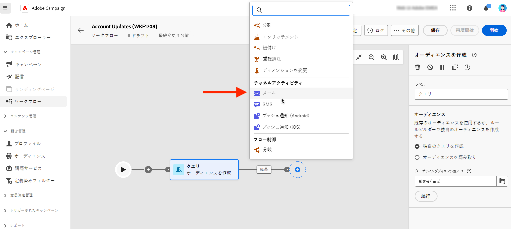

# メール、SMS、プッシュ {#channel}

Adobe Campaign Web を使用すると、電子メール、SMS、プッシュなど複数のチャネルにわたるマーケティングキャンペーンを自動化し、実行できます。 チャネルアクティビティをキャンバスに組み合わせて、顧客の行動に基づいてアクションをトリガー化できるクロスチャネルワークフローを作成できます。

例えば、メール、SMS、プッシュなど、様々なチャネルをまたいだ一連のメッセージを含むようこそメールキャンペーンを作成できます。また、顧客が購入を完了した後や、SMS を使用してパーソナライズされた誕生日メッセージを顧客に送信した後に、フォローアップメールを送信することもできます。

チャネルアクティビティを使用すると、複数のタッチポイントをまたいで顧客を惹きつけ、コンバージョンを促進する、包括的でパーソナライズされたキャンペーンを作成できます。

次に、 **チャネル** ワークフロー内の「 」アクティビティ：

1. 必ず **オーディエンスの構築** アクティビティ。 オーディエンスは、配信のメインターゲットです。メッセージを受信した受信者。 キャンペーンワークフローのコンテキストでメッセージを送信する場合、メッセージオーディエンスは、チャネルアクティビティではなく、 **オーディエンスの構築** アクティビティ。 詳しくは、[この節](build-audience.md)を参照してください。

   

1. 配信アクティビティ（**[!UICONTROL メール]**、**[!UICONTROL SMS]**、**[!UICONTROL プッシュ通知（Android）]**&#x200B;または&#x200B;**[!UICONTROL プッシュ通知（iOS）]**）を選択します。

1. を選択します。 **テンプレート**. テンプレートは、後で使用するために保存された、事前設定済みの配信設定です。[詳細情報](../../msg/delivery-template.md)

1. クリック **配信を作成** スタンドアロン配信を作成する場合と同じ方法で、メッセージを定義します。 また、配信設定の定義、コンテンツのスケジュール設定、シミュレーションをおこなう場所もあります。 [詳細情報](../../msg/gs-messages.md)

1. ワークフローに戻り、「 **開始** をクリックして、ワークフローを起動します。

   デフォルトでは、配信ワークフローを開始すると、トリガーは直ちに送信されず、メッセージの準備ステージに移動します。

1. クリック **確認して送信** チャネルアクティビティから送信を確定します。

1. 配信ダッシュボードで、 **送信**.

## 例

<!--
description, which use case you can perform (common other activities that you can link before of after the activity)

how to add and configure the activity

example of a configured activity within a workflow
The Email delivery activity allows you to configure the sending an email in a workflow. 

-->

<!-- Scheduled emails available?

This can be a single send email and sent just once, or it can be a recurring email.
* Single send emails are standard emails, sent once.
* Recurring emails allow you to send the same email multiple times to different targets over a defined period. You can aggregate the deliveries per period in order to get reports that correspond to your needs.

When linked to a scheduler, you can define recurring emails.-->

メール受信者は、オーディエンスのターゲティングアクティビティを通じて、同じワークフロー内のアクティビティの上流で定義されます。

<!--The message preparation is triggered according to the workflow execution parameters. From the message dashboard, you can select whether to request or not a manual confirmation to send the message (required by default). You can start the workflow manually or place a scheduler activity in the workflow to automate execution.-->
