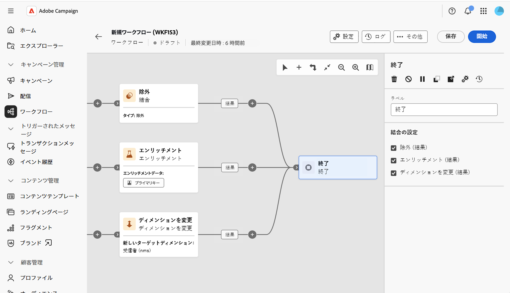

# 終了 {#end}

>[!CONTEXTUALHELP]
>id="acw_orchestration_end"
>title="終了アクティビティ"
>abstract="**終了**&#x200B;アクティビティを使用すると、ワークフローの終了を視覚的に示すことができます。 複数のインバウンドトランジションが使用可能な場合は、「**結合の設定**」セクションを使用して、アクティビティに接続するトランジションを選択します。"

>[!CONTEXTUALHELP]
>id="acw_orchestration_end_sets"
>title="結合の設定"
>abstract="**終了**&#x200B;アクティビティのインバウンドトランジションとして接続する、以前のアクティビティをオンにします。 オンにしたアクティビティが&#x200B;**終了**&#x200B;に接続されます。 このセクションは、アクティビティに接続できるインバウンドトランジションが複数存在する場合にのみ表示されます。"

>[!CONTEXTUALHELP]
>id="acw_orchestration_signal"
>title="外部シグナル"
>abstract="終了アクティビティパラメーターにおける、外部信号セクションのプレースホルダー。 オーケストレーションキャンペーンでのみ使用できます。 削除しない"

**終了**&#x200B;アクティビティは&#x200B;**フロー制御**&#x200B;アクティビティです。 ワークフローの終了をグラフィカルにマークできます。 このアクティビティはオプションです。

アクティビティは、複数のインバウンドトランジションが使用可能な場合にサポートします。

「**結合の設定**」セクションで、**終了**&#x200B;アクティビティのインバウンドトランジションとして接続する、以前のアクティビティをオンにします。 オンにしたアクティビティがワークフローキャンバスの&#x200B;**終了**&#x200B;にリンクされます。

