# エンリッチメント {#enrichment}

>[!CONTEXTUALHELP]
>id="acw_orchestration_enrichment"
>title="エンリッチメントアクティビティ"
>abstract="**エンリッチメント**&#x200B;アクティビティでは、データベースからの追加情報を使用してターゲットデータを強化できます。一般的に、セグメント化アクティビティの後のワークフローで使用されます。"

**エンリッチメント**&#x200B;アクティビティは、**ターゲティング**&#x200B;アクティビティです。データベースからの追加情報を使用してターゲットデータを強化します。一般的に、セグメント化アクティビティの後のワークフローで使用されます。

エンリッチメントデータは次のいずれかから取得できます。

* ワークフローのターゲットと&#x200B;**同じワークテーブル**：
   * 顧客のグループをターゲットに設定し、「生年月日」フィールドを現在のワークテーブルに追加します。

* **別のワークテーブル**：
   * 顧客のグループをターゲットにし、「購入」テーブルから「金額」フィールドと「製品のタイプ」フィールドを追加します。

エンリッチメントデータをワークフローに追加したら、後続のアクティビティで使用して、行動、好みおよびニーズに基づいて顧客を個別のグループにセグメント化できます。また、ターゲットオーディエンスの共感を呼ぶパーソナライズされたマーケティングメッセージやキャンペーンを作成するためにも使用できます。

例えば、顧客の購入に関する情報をワークフローテーブルに追加し、このデータを使用して、最新の購入や購入金額に応じてメールをパーソナライズできます。

## エンリッチメントアクティビティの追加 {#enrichment-configuration}

次の手順に従って、**エンリッチメント**&#x200B;アクティビティを設定します。

1. **オーディエンスを作成**&#x200B;および&#x200B;**結合**&#x200B;アクティビティを追加します。
1. **エンリッチメント**&#x200B;アクティビティを追加します。
1. ワークフローで複数のトランジションが設定されている場合は、「**[!UICONTROL プライマリセット]**」フィールドを使用して、エンリッチメントに対してプライマリセットとして使用するトランジションを定義します。

## エンリッチメントデータの追加 {#enrichment-add}

>[!CONTEXTUALHELP]
>id="acw_targetdata_personalization_enrichmentdata"
>title="エンリッチメントデータ"
>abstract="ワークフローの強化に使用するデータを選択します。ターゲットディメンションから単一エンリッチメント属性、またはテーブル間の基数が 1～N を持つリンクの 2 種類のエンリッチメントデータから選択できます。"

>[!CONTEXTUALHELP]
>id="acw_orchestration_enrichment_data"
>title="エンリッチメントアクティビティ"
>abstract="エンリッチメントデータをワークフローに追加すると、後続のアクティビティで使用して、行動、好み、ニーズに基づいて顧客を個別のグループにセグメント化したり、ターゲットオーディエンスの共感を呼ぶパーソナライズされたマーケティングメッセージやキャンペーンを作成したりできます。"

<!-- /NEO-92684 -->

>[!CONTEXTUALHELP]
>id="acw_orchestration_enrichment_settings"
>title="エンリッチメント設定"
>abstract="エンリッチメント設定：ターゲティングディメンション、追加の属性およびオプション。"

1. 「**エンリッチメントデータを追加**」をクリックし、エンリッチメントに対して使用する属性を選択します。[詳しくは、属性を選択してお気に入りに追加する方法を参照してください](../../get-started/attributes.md)。

   選択できるエンリッチメントデータには、ターゲットディメンションからの単一エンリッチメント属性と、コレクションリンクの 2 つのタイプがあります。各タイプについて詳しくは、以下の例を参照してください。
   * [単一エンリッチメント属性](#single-attribute)
   * [コレクションリンク](#collection-link)

   >[!NOTE]
   >
   >属性選択画面の「**式を編集**」ボタンを使用すると、属性を選択する高度な式を作成できます。[詳しくは、式エディターの操作方法を参照してください](../../query/expression-editor.md)。

   

## テーブル間のリンクの作成 {#create-links}

>[!CONTEXTUALHELP]
>id="acw_orchestration_enrichment_simplejoin"
>title="リンクの定義"
>abstract="作業用テーブルデータと Adobe Campaign データベース間のリンクを作成します。例えば、受信者のアカウント番号、国およびメールが含まれるファイルからデータを読み込む場合、プロファイル内の情報を更新するために国テーブルへのリンクを作成する必要があります。"

「**[!UICONTROL リンクの定義]**」セクションでは、作業用テーブルデータと Adobe Campaign データベース間のリンクを作成できます。例えば、受信者のアカウント番号、国およびメールが含まれるファイルからデータを読み込む場合、プロファイル内の情報を更新するために国テーブルへのリンクを作成する必要があります。

使用可能なリンクには、いくつかのタイプがあります。

* **[!UICONTROL カーディナリティ 1 のシンプルリンク]**：プライマリセットの各レコードは、リンクされたデータの 1 個のレコードにのみ関連付けます。
* **[!UICONTROL カーディナリティ 0 または 1 のシンプルリンク]**：プライマリセットのレコードは、リンクされたデータの 0 または 1 個のレコードに関連付けますが、複数のレコードに関連付けることはありません。
* **[!UICONTROL カーディナリティ N のコレクションリンク]**：プライマリセットの各レコードは、リンクされたデータの 0、1、または（N）個以上 のレコードに関連付けます。

リンクを作成するには、次の手順に従います。

1. 「**[!UICONTROL リンクの定義]**」セクションで、「**[!UICONTROL リンクを追加]**」ボタンをクリックします。

   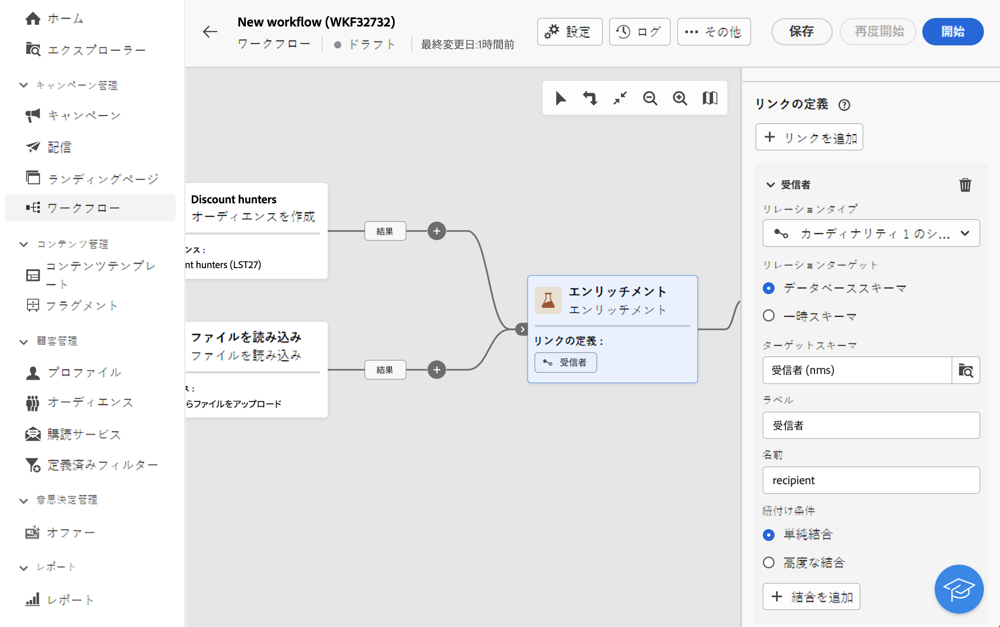

1. **リレーションタイプ**&#x200B;ドロップダウンリストで、作成するリンクのタイプを選択します。

1. プライマリセットをリンクするターゲットを次のように識別します。

   * データベース内の既存のテーブルをリンクするには、「**[!UICONTROL データベーススキーマ]**」を選択し、「**[!UICONTROL ターゲットスキーマ]**」フィールドから目的のテーブルを選択します。
   * 入力トランジションからのデータとリンクするには、「**一時スキーマ**」を選択し、データを使用するトランジションを選択します。

1. プライマリセットのデータとリンクされたスキーマを一致させるための紐付け条件を定義します。使用可能な結合には、次の 2 つのタイプがあります。

   * **単純結合**：2 つのスキーマのデータを一致させるには、特定の属性を選択します。「**結合を追加**」をクリックし、紐付け条件として使用する&#x200B;**ソース**&#x200B;属性と&#x200B;**宛先**&#x200B;属性を選択します。
   * **高度な結合**：高度な条件を使用して結合を作成します。「**結合を追加**」をクリックし、「**条件を作成**」ボタンをクリックしてクエリモデラーを開きます。

リンクを使用したワークフローの例は、[例](#link-example)の節にあります。

## データの紐付け {#reconciliation}

>[!CONTEXTUALHELP]
>id="acw_orchestration_enrichment_reconciliation"
>title="紐付け"
>abstract="**エンリッチメント**&#x200B;アクティビティを使用すると、Campaign データベーススキーマのデータを、別のスキーマのデータや、一時スキーマのデータ（ファイルの読み込みアクティビティを使用してアップロードされたデータなど）と紐付けることができます。このタイプのリンクは、一意のレコードに対する紐付けを定義します。Adobe Campaign は、一意のレコードへの参照を格納するターゲットテーブルに外部キーを追加する方法で、ターゲットテーブルへのリンクを作成します。"

**エンリッチメント**&#x200B;アクティビティを使用すると、Campaign データベーススキーマのデータを、別のスキーマのデータや、一時スキーマのデータ（ファイルの読み込みアクティビティを使用してアップロードされたデータなど）と紐付けることができます。このタイプのリンクは、一意のレコードに対する紐付けを定義します。Adobe Campaign は、一意のレコードへの参照を格納するターゲットテーブルに外部キーを追加する方法で、ターゲットテーブルへのリンクを作成します。

例えば、このオプションを使用すると、アップロードされたファイルで指定したプロファイルの国を、Campaign データベースの専用テーブルで使用可能な国のいずれかと紐付けることができます。

紐付けリンクを使用して&#x200B;**エンリッチメント**&#x200B;アクティビティを設定するには、以下の手順に従います。

1. 「**紐付け**」セクションの「**リンクを追加**」ボタンをクリックします。
1. 紐付けリンクの作成対象となるデータを特定します。

   * Campaign データベースのデータと紐付けリンクを作成するには、「**データベーススキーマ**」を選択し、ターゲットが保存されているスキーマを選択します。
   * 入力トランジションのデータを使用して紐付けリンクを作成するには、「**一時スキーマ**」を選択し、ターゲットデータが保存されているワークフロートランジションを選択します。

1. 「**ラベル**」フィールドと「**名前**」フィールドは、選択したターゲットスキーマに基づいて自動的に入力されます。これらの値は必要に応じて変更できます。

1. 「**紐付け条件**」セクションで、ソーステーブルと宛先テーブルのデータを紐付けする方法を指定します。

   * **単純結合**：ソーステーブルの特定のフィールドを宛先テーブルの別のフィールドに紐付けます。これを行うには、「**結合を追加**」ボタンをクリックし、紐付けに使用する「**ソース**」フィールドと「**宛先**」フィールドを指定します。

     >[!NOTE]
     >
     >1 つ以上の&#x200B;**単純結合**&#x200B;条件を使用する場合、データを相互にリンクさせるには、すべての条件を検証する必要があります。

   * **高度な結合**：クエリモデラーを使用して、紐付け条件を設定します。これを行うには、「**条件を作成**」ボタンをクリックし、AND および OR 操作を使用して独自のルールを作成して、紐付け条件を定義します。

以下の例は、Adobe Campaign データベースの受信者テーブルと、**ファイルを読み込み**&#x200B;アクティビティを生成した一時テーブルの間にリンクを作成するように設定されたワークフローを示しています。この例では、エンリッチメントアクティビティが、メールアドレスを紐付け条件として使用して両方のテーブルを紐付けします。

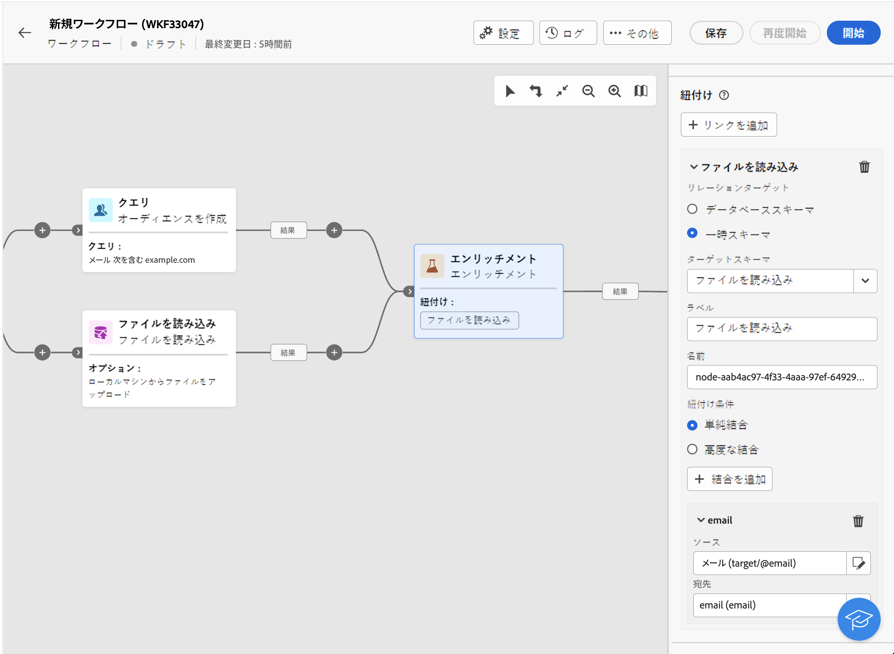

## オファーの追加 {#add-offers}

>[!CONTEXTUALHELP]
>id="acw_orchestration_enrichment_offer_proposition"
>title="オファーの提案"
>abstract="エンリッチメントアクティビティを使用すると、各プロファイルのオファーを追加できます。"

**[!UICONTROL エンリッチメント]**&#x200B;アクティビティを使用すると、プロファイルごとにオファーを追加できます。

これを行うには、次の手順に従って、オファーを含む&#x200B;**[!UICONTROL エンリッチメント]**&#x200B;アクティビティを設定します。

1. **[!UICONTROL エンリッチメント]**&#x200B;アクティビティの「**[!UICONTROL オファーの提案]**」セクションで、「**[!UICONTROL オファーを追加]**」ボタンをクリックします。

   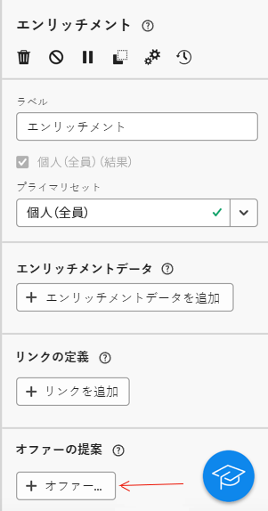

1. オファーの選択には、次の 2 つの選択肢があります。

   * **[!UICONTROL カテゴリ内で最適なオファーを検索]**：このオプションをオンにする場合は、オファーエンジン呼び出しのパラメーター（オファースペース、カテゴリまたはテーマ、連絡日、保持するオファーの数）を指定します。エンジンは、これらのパラメーターに従って、追加する最適なオファーを計算します。「カテゴリ」フィールドと「テーマ」フィールドは、両方同時には使用せず、どちらか一方のみ入力することをお勧めします。

     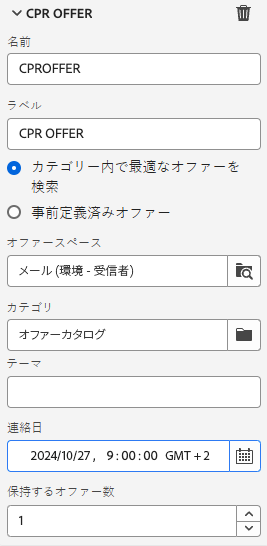

   * **[!UICONTROL 事前定義済みオファー]**：このオプションをオンにして、オファースペース、特定のオファーおよび連絡日を指定し、オファーエンジンを呼び出すことなく、追加するオファーを直接設定します。

     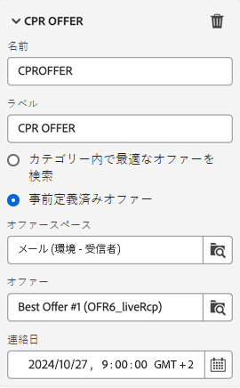

1. オファーを選択したら、「**[!UICONTROL 確認]**」ボタンをクリックします。

これで、配信アクティビティでオファーを使用できるようになりました。

### エンリッチメントアクティビティからのオファーの使用

ワークフロー内で、エンリッチメントアクティビティから取得したオファーを配信で使用する場合は、次の手順に従います。

1. 配信アクティビティを開き、コンテンツ編集に移動します。「**[!UICONTROL オファー設定]**」ボタンをクリックし、ドロップダウンリストでオファーに対応する&#x200B;**[!UICONTROL オファースペース]**&#x200B;を選択します。
エンリッチメントアクティビティからのオファーのみを表示する場合は、**[!UICONTROL 提案]**&#x200B;の数を 0 に設定し、変更を保存します。

   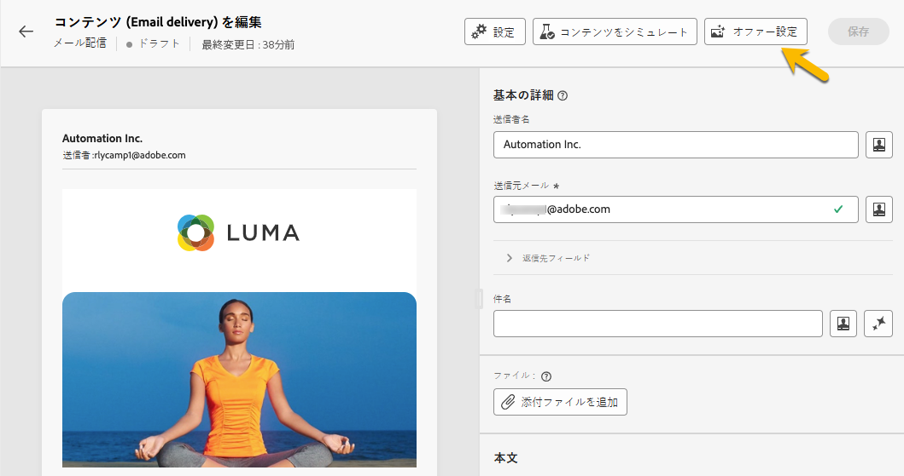

1. E メールデザイナーで、オファーを含むパーソナライゼーションを追加する際に、「**[!UICONTROL 提案]**」アイコンをクリックすると、**[!UICONTROL エンリッチメント]**&#x200B;アクティビティから取得したオファーが表示されます。選択するオファーをクリックして開きます。

   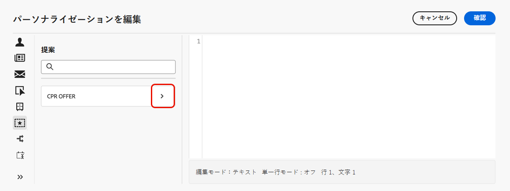

   **[!UICONTROL レンダリング関数]**&#x200B;に移動し、必要に応じて「**[!UICONTROL HTML レンダリング]**」または「**[!UICONTROL テキストレンダリング]**」を選択します。

   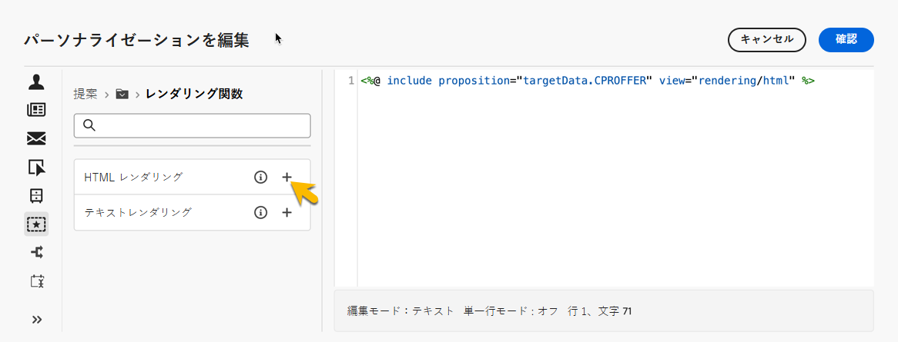

>[!NOTE]
>
>「**[!UICONTROL 保持するオファー数]**」オプションで&#x200B;**[!UICONTROL エンリッチメント]**&#x200B;アクティビティに複数のオファーを含めることを選択した場合、「**[!UICONTROL 提案]**」アイコンをクリックすると、すべてのオファーが表示されます。

## 例 {#example}

### 単一エンリッチメント属性 {#single-attribute}

ここでは、生年月日など、単一エンリッチメント属性を追加します。次の手順に従います。

1. 「**属性**」フィールド内をクリックします。
1. ターゲティングディメンションからシンプルなフィールド（この例では生年月日）を選択します。
1. 「**確認**」をクリックします。

### コレクションリンク {#collection-link}

この、より複雑なユースケースでは、テーブル間で 1-N の基数を持つリンクであるコレクションリンクを選択します。100 ドル未満の、最新 3 回の購入を取得します。そのためには、次を定義する必要があります。

* エンリッチメント属性：「**価格**」フィールド
* 取得する行の数：3
* フィルター：100 ドルを超える項目を除外
* 並べ替え：「**注文日付**」フィールドを降順で並び替えます。

#### 属性を追加 {#add-attribute}

エンリッチメントデータとして使用するコレクションリンクを選択する場所です。

1. 「**属性**」フィールド内をクリックします。
1. 「**詳細属性を表示**」をクリックします。
1. **購入**&#x200B;テーブルから「**価格**」フィールドを選択します。

<!--  -->

#### コレクション設定の定義{#collection-settings}

次に、データの収集方法と取得するレコード数を定義します。

1. **データの収集方法を選択**&#x200B;ドロップダウンで「**データを収集**」を選択します。
1. 「**取得する行（作成する列）**」フィールドに「3」と入力します。

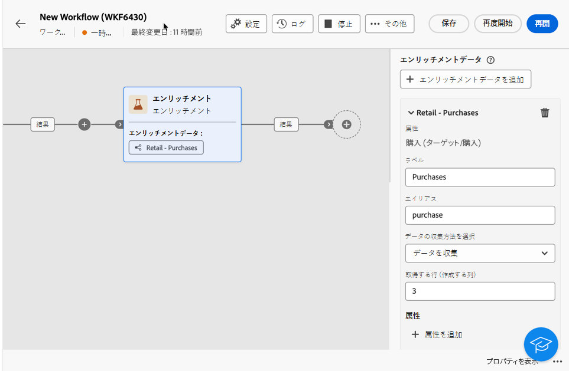

例えば、顧客の平均購入額を取得する場合は、代わりに「**集計データ**」を選択し、「**集計関数**」ドロップダウンで「**平均**」を選択します。

次に示すように、属性をわかりやすくするには、属性の「**ラベル**」フィールドと「**エイリアス**」フィールドを使用します。

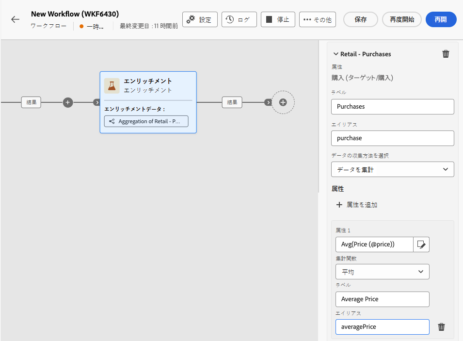

#### フィルターの定義{#collection-filters}

ここでは、エンリッチメント属性の最大値を定義します。100 を超える項目は除外します。[詳しくは、クエリモデラーの操作方法を参照してください](../../query/query-modeler-overview.md)

1. 「**フィルターを作成**」をクリックします。
1. **価格**&#x200B;が存在し、かつ&#x200B;**価格**&#x200B;が 100 未満である、という 2 つのフィルターを追加します。最初のフィルターでは、NULL 値が最大値として表示されるようにフィルタリングします。
1. 「**確認**」をクリックします。

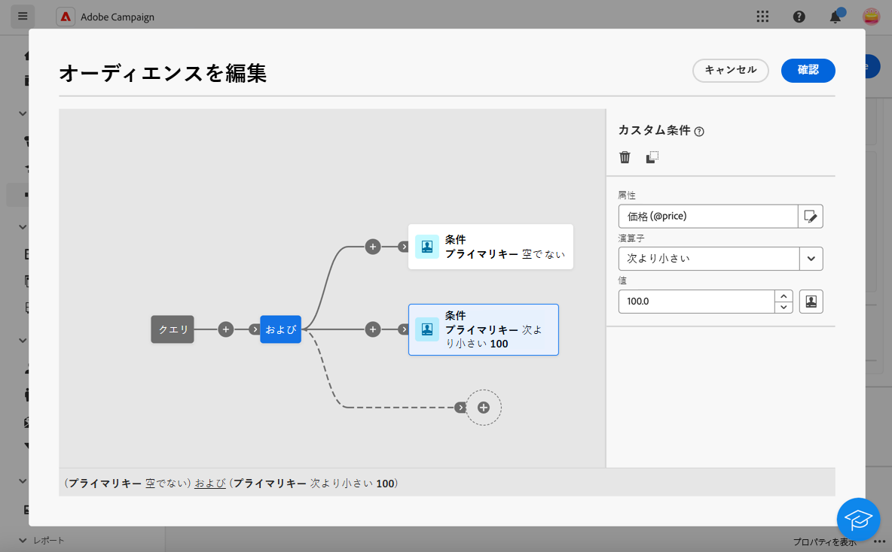

#### 並べ替えを定義{#collection-sorting}

**最新**&#x200B;の 3 つの購入を取得するには、並べ替えを適用する必要があります。

1. 「**並べ替えを有効にする**」オプションをアクティブ化します。
1. 「**属性**」フィールド内をクリックします。
1. 「**オーダー日**」フィールドを選択します。
1. 「**確認**」をクリックします。
1. **並べ替え**&#x200B;ドロップダウンから「**降順**」を選択します。

### リンク済みデータによるエンリッチメント {#link-example}

次の例に、2 つのトランジション間にリンクを作成するように設定されたワークフローを示します。最初のトランジションは「**クエリ**」アクティビティを使用してプロファイルデータをターゲットにし、2 番目のトランジションには「ファイルを読み込み」アクティビティを通じて読み込んだファイルに保存された購入データが含まれます。

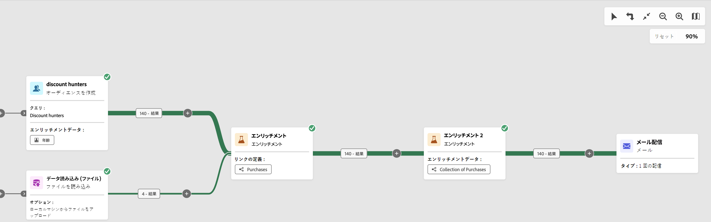

* 最初の「**エンリッチメント**」アクティビティでは、プライマリセット（「**クエリ**」アクティビティのデータ）を「**ファイルを読み込み**」アクティビティのスキーマにリンクします。これにより、クエリのターゲットになる各プロファイルを、対応する購入データと一致させられるようになります。

  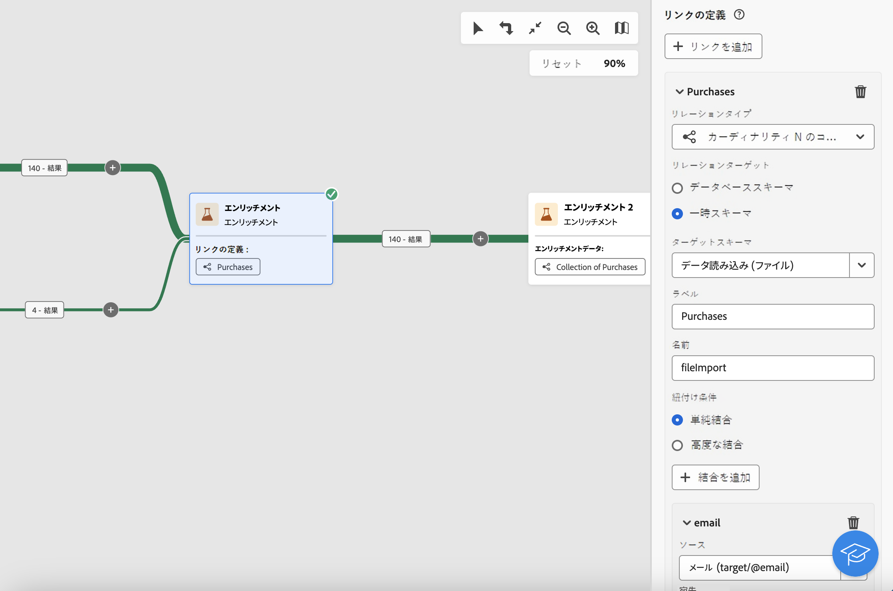

* 2 番目の「**エンリッチメント**」アクティビティは、「**ファイルを読み込み**」アクティビティからの購入データを使用してワークフローテーブルのデータをエンリッチメントするために追加されます。これにより、これらのデータを追加のアクティビティに使用でき、例えば、購入に関する情報をお客様に送信するメッセージをパーソナライズできます。

  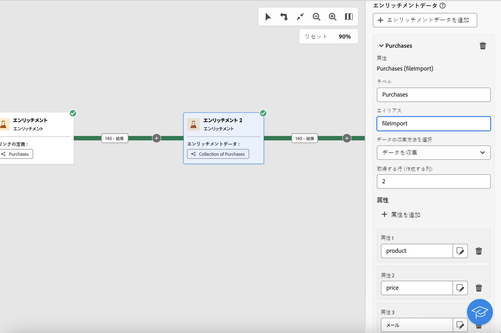

