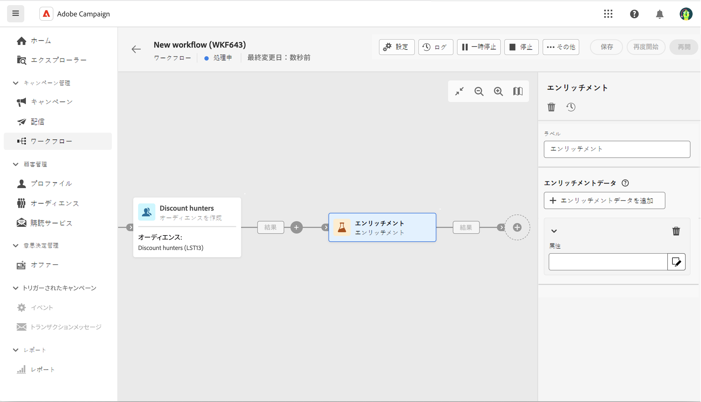
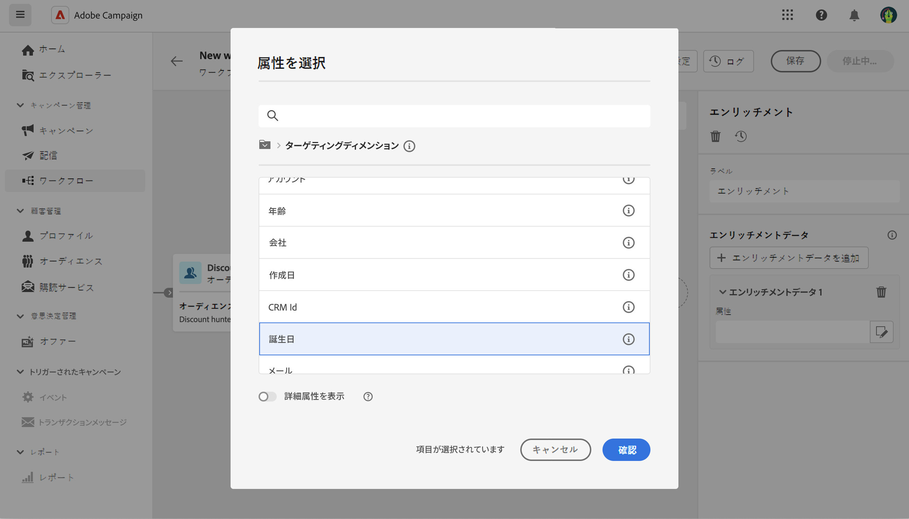
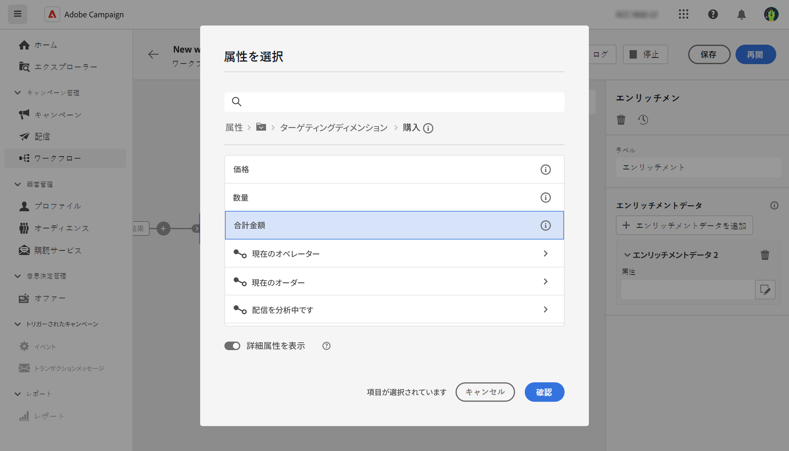
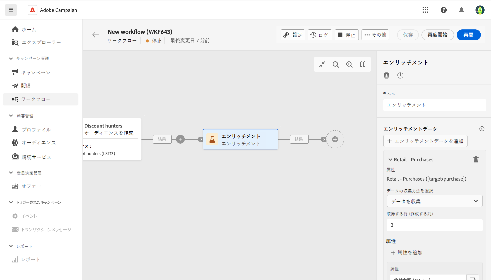
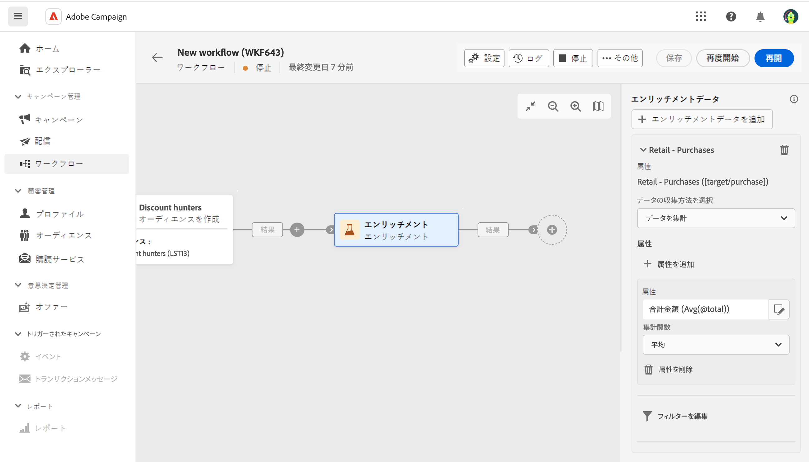
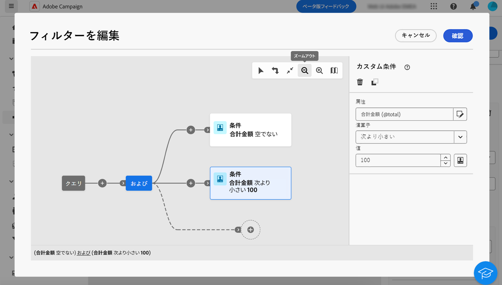
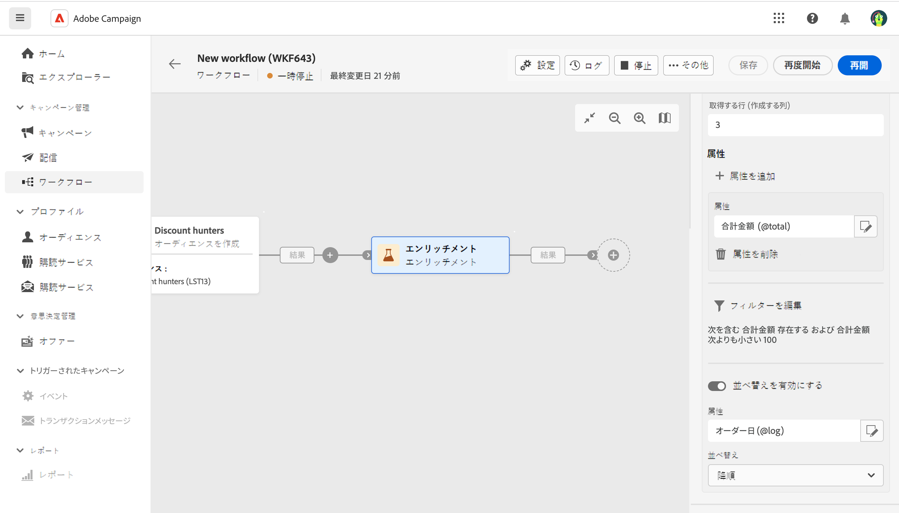

# エンリッチメント {#enrichment}

>[!CONTEXTUALHELP]
>id="acw_orchestration_enrichment_data"
>title="エンリッチメント アクティビティ"
>abstract="エンリッチメントアクティビティでは、データベースからの追加情報を使用してターゲットデータを強化できます。これは、一般的に、アクティビティのターゲティング後のワークフローで使用されます。 エンリッチメントデータをワークフローに追加すると、エンリッチメントアクティビティ後に追加されたアクティビティで使用して、行動、好み、ニーズに基づいて顧客を個別のグループにセグメント化したり、ターゲットオーディエンスの共感を呼ぶ可能性が高いパーソナライズされたマーケティングメッセージとキャンペーンを作成したりできます。"

この **エンリッチメント** アクティビティは **ターゲット設定** アクティビティ。 データベースの追加情報を使用して、ターゲットデータを拡張できます。 これは、一般的に、セグメント化アクティビティの後のワークフローで使用されます。

エンリッチメントデータは次のいずれかを実行できます。

* ワークフローのターゲットと&#x200B;**同じ作業用テーブルから**：

  *顧客のグループをターゲットにし、「生年月日」フィールドを現在の作業用テーブルに追加します*

* **別の作業用テーブルから**：

  *顧客のグループをターゲットにし、「購入」テーブルから取得した「金額」フィールドと「製品のタイプ」フィールドを追加します*。

エンリッチメントデータをワークフローに追加したら、追加したエンリッチメントデータを、「 **エンリッチメント** アクティビティを使用して、顧客の行動、好みおよびニーズに基づいて個別のグループに顧客をセグメント化したり、ターゲットオーディエンスの共感を呼ぶ可能性の高い、パーソナライズされたマーケティングメッセージやキャンペーンを作成したりします。

例えば、顧客の購入に関する情報をワークフローの作業用テーブルに追加し、このデータを使用して、最新の購入または購入金額に応じてメールをパーソナライズできます。

## 一般設定 {#general}

次の手順に従って、 **エンリッチメント** アクティビティ：

1. 次のようなアクティビティを追加します。 **オーディエンスの構築** および **結合** アクティビティ。
1. を追加します。 **エンリッチメント** アクティビティ。
1. クリック **エンリッチメントデータを追加**.

次の 2 種類のエンリッチメントデータを選択できます。a [単一エンリッチメント属性](#single-attribute) ターゲットディメンションから、または [コレクションリンク](#collection-link).

## 単一のエンリッチメント属性 {#single-attribute}

ここでは、生年月日など、単一のエンリッチメント属性を追加します。 次の手順に従います。

1. 内側をクリック **属性** フィールドに入力します。
1. ターゲティングディメンションからシンプルなフィールド（この例では生年月日）を選択します。
1. 「**確認**」をクリックします。

## コレクションリンク {#collection-link}

このより複雑な使用例では、テーブル間で 1-N の基数を持つリンクであるコレクションリンクを選択します。 100$未満の 3 回の最新の購入を取得します。 そのためには、次を定義する必要があります。

* エンリッチメント属性：の **合計金額** フィールド
* 取得するライン数：3
* フィルター：100$を超える項目を除外
* 並べ替え：下位の分類 **注文日** フィールドに入力します。

### 属性を追加

エンリッチメントデータとして使用するコレクションリンクを選択する場所です。

1. 内側をクリック **属性** フィールドに入力します。
1. クリック **詳細属性の表示**.
1. を選択します。 **合計金額** フィールド **購入** 表。

### コレクション設定の定義

次に、データの収集方法と取得するレコード数を定義します。

1. 選択 **データを収集** 内 **データの収集方法を選択** 」ドロップダウンリストから選択できます。
1. に「3」と入力します。 **取得する行（作成する列）** フィールドに入力します。

例えば、顧客の平均購入額を取得する場合は、 **集計データ** 代わりに、を選択します。 **平均** 内 **集計関数** 」ドロップダウンリストから選択できます。

### フィルターの定義

ここでは、エンリッチメント属性の最大値を定義します。 100$を超える項目は除外されます。

1. クリック **フィルターを編集**.
1. 次の 2 つのフィルターを追加します。 **合計金額** が存在し、 **合計金額** が 100 未満の場合は除外されます。 最初の 1 つは、最大値として表示される NULL 値をフィルタリングします。
1. 「**確認**」をクリックします。

### 並べ替えの定義

次に、3 つの **latest** 購入。

1. をアクティブにする **並べ替えを有効にする** オプション。
1. 内側をクリック **属性** フィールドに入力します。
1. を選択します。 **注文日** フィールドに入力します。
1. 「**確認**」をクリックします。
1. 選択 **降順** から **並べ替え** 」ドロップダウンリストから選択できます。

<!--

Add other fields
use it in delivery

cardinality between the tables (1-N)
1. select attribute to use as enrichment data

    display advanced fields option
    i button

    note: attributes from the target dimension

1. Select how the data is collected
1. number of records to retrieve if want to retrieve a collection of multiple records
1. Apply filters and build rule

    select an existing filter
    save the filter for reuse
    view results of the filter visually or in code view

1. sort records using an attribute

leverage enrichment data in campaign

where we can use the enrichment data: personalize email, other use cases?

## Example

-->