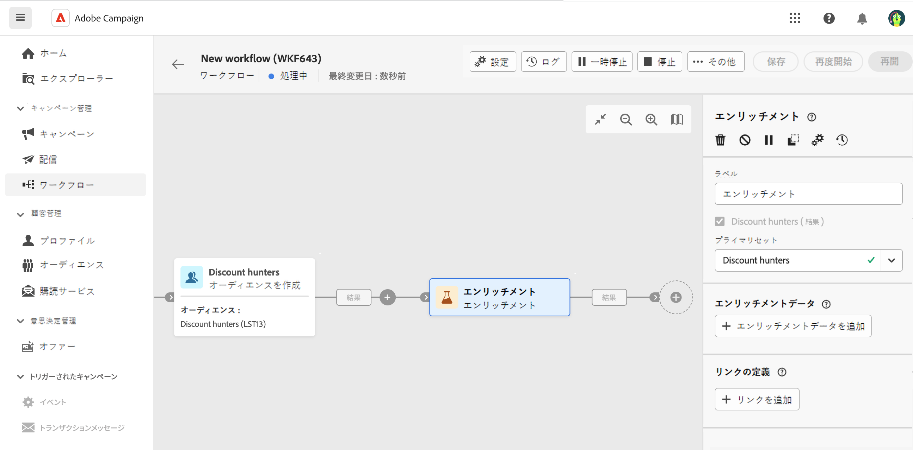

# エンリッチメント {#enrichment}

>[!CONTEXTUALHELP]
>id="acw_orchestration_enrichment"
>title="エンリッチメントアクティビティ"
>abstract="The **エンリッチメント** 「 」アクティビティを使用すると、データベースの追加情報でターゲットデータを拡張できます。 一般的に、セグメント化アクティビティ後のワークフローで使用されます。"

>[!CONTEXTUALHELP]
>id="acw_orchestration_enrichment_data"
>title="エンリッチメントアクティビティ"
>abstract="エンリッチメントデータをワークフローに追加すると、エンリッチメントアクティビティ後に追加されたアクティビティで使用して、行動、好み、ニーズに基づいて顧客を個別のグループにセグメント化したり、ターゲットオーディエンスの共感を呼ぶ可能性が高いパーソナライズされたマーケティングメッセージとキャンペーンを作成したりできます。"

>[!CONTEXTUALHELP]
>id="acw_targetdata_personalization_enrichmentdata"
>title="エンリッチメントデータ"
>abstract="ワークフローのエンリッチメントに使用するデータを選択します。 ターゲットディメンションから 1 つのエンリッチメント属性を選択することも、テーブル間で 1 対 N の基数を持つリンクを指定するコレクションリンクを選択することもできます。"

**エンリッチメント**&#x200B;アクティビティは、**ターゲティング**&#x200B;アクティビティです。データベースからの追加情報を使用してターゲットデータを強化できます。一般的に、セグメント化アクティビティ後のワークフローで使用されます。

エンリッチメントデータは次のいずれかを実行できます。

* ワークフローのターゲットと&#x200B;**同じ作業用テーブルから**：

  *顧客のグループをターゲットにし、「生年月日」フィールドを現在の作業用テーブルに追加します*

* **別の作業用テーブルから**：

  *顧客のグループをターゲットにし、「購入」テーブルから取得した「金額」フィールドと「製品のタイプ」フィールドを追加します*。

ワークフローに追加されたエンリッチメントデータは、**エンリッチメント**&#x200B;アクティビティ後に追加されたアクティビティで使用して、行動、好み、ニーズに基づいて顧客を個別のグループにセグメント化したり、ターゲットオーディエンスの共感を呼ぶ可能性が高いパーソナライズされたマーケティングメッセージやキャンペーンを作成したりできます。

例えば、顧客の購入に関する情報をワークフローの作業用テーブルに追加し、このデータを使用して、最新の購入または購入金額に応じてメールをパーソナライズできます。

## 一般設定 {#general}

次の手順に従って、**エンリッチメント**&#x200B;アクティビティを設定します。

1. **オーディエンスを作成**&#x200B;および&#x200B;**結合**&#x200B;アクティビティを追加します。
1. **エンリッチメント**&#x200B;アクティビティを追加します。
1. 「**エンリッチメントデータを追加**」をクリックします。

ターゲットディメンションから[単一エンリッチメント属性](#single-attribute)または[コレクションリンク](#collection-link)の 2 種類のエンリッチメントデータを選択できます。

## 単一エンリッチメント属性 {#single-attribute}

ここでは、生年月日など、単一エンリッチメント属性を追加します。次の手順に従います。

1. 「**属性**」フィールド内をクリックします。
1. ターゲティングディメンションからシンプルなフィールド（この例では生年月日）を選択します。
1. 「**確認**」をクリックします。

## コレクションリンク {#collection-link}

この、より複雑なユースケースでは、テーブル間で 1-N の基数を持つリンクであるコレクションリンクを選択します。100 ドル未満の、最新 3 回の購入を取得します。そのためには、次を定義する必要があります。

* エンリッチメント属性：「**合計金額**」フィールド
* 取得する行の数：3
* フィルター：100 ドルを超える項目を除外
* 並べ替え：「**注文日付**」フィールドを降順で並び替え。

### 属性を追加

エンリッチメントデータとして使用するコレクションリンクを選択する場所です。

1. 「**属性**」フィールド内をクリックします。
1. 「**詳細属性を表示**」をクリックします。
1. **購入**&#x200B;テーブルから「**合計金額**」フィールドを選択します。

### コレクション設定の定義

次に、データの収集方法と取得するレコード数を定義します。

1. **データの収集方法を選択**&#x200B;ドロップダウンで「**データを収集**」を選択します。
1. 「**取得する行（作成する列）**」フィールドに「3」と入力します。

例えば、顧客の平均購入額を取得する場合は、代わりに「**集計データ**」を選択し、「**集計関数**」ドロップダウンで「**平均**」を選択します。

### フィルターの定義

ここでは、エンリッチメント属性の最大値を定義します。100 を超える項目は除外します。

1. 「**フィルターを編集**」をクリックします。
1. **合計金額**&#x200B;が存在し、かつ&#x200B;**合計金額**&#x200B;が 100 未満である、という 2 つのフィルターを追加します。最初のフィルターでは、NULL 値が最大値として表示されるようにフィルタリングします。
1. 「**確認**」をクリックします。

### 並べ替えを定義

**最新**&#x200B;の 3 つの購入を取得するには、並べ替えを適用する必要があります。

1. 「**並べ替えを有効にする**」オプションをアクティブ化します。
1. 「**属性**」フィールド内をクリックします。
1. 「**オーダー日**」フィールドを選択します。
1. 「**確認**」をクリックします。
1. **並べ替え**&#x200B;ドロップダウンから「**降順**」を選択します。

<!--

Add other fields
use it in delivery

cardinality between the tables (1-N)
1. select attribute to use as enrichment data

    display advanced fields option
    i button

    note: attributes from the target dimension

1. Select how the data is collected
1. number of records to retrieve if want to retrieve a collection of multiple records
1. Apply filters and build rule

    select an existing filter
    save the filter for reuse
    view results of the filter visually or in code view

1. sort records using an attribute

leverage enrichment data in campaign

where we can use the enrichment data: personalize email, other use cases?

## Example

-->