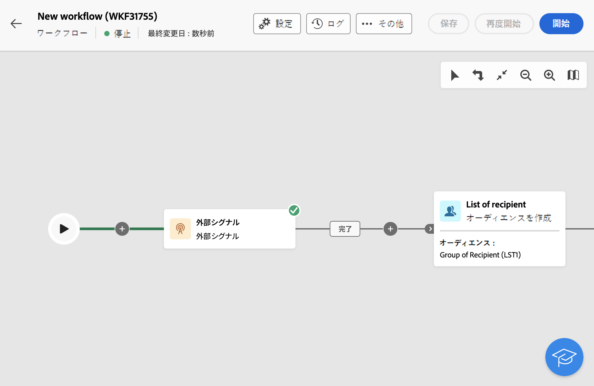
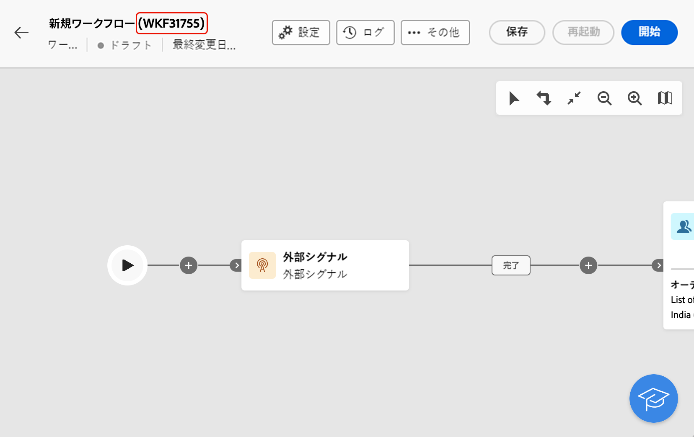
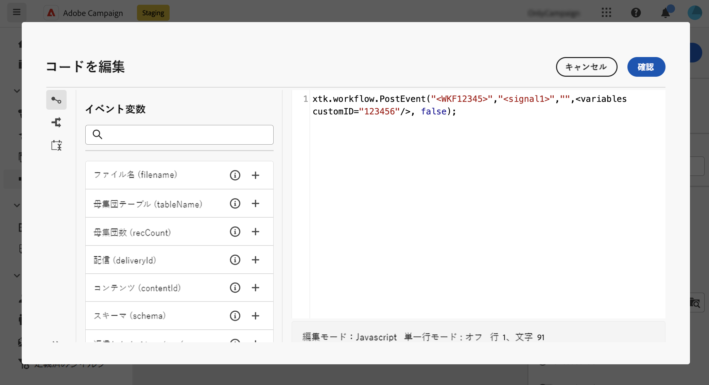

# 外部シグナル {#external-signal}

<!--External Signal End-->

>[!CONTEXTUALHELP]
>id="acw_orchestration_externalsignal"
>title="外部シグナル"
>abstract="**外部シグナル** アクティビティでは、別のワークフローまたは API 呼び出しからワークフローの実行をトリガーできます。"

>[!CONTEXTUALHELP]
>id="acw_orchestration_externalsignal_parameters"
>title="外部信号パラメーター"
>abstract="外部信号パラメーター"

>[!CONTEXTUALHELP]
>id="acw_orchestration_end_trigger"
>title="トリガーを終了"
>abstract="トリガーを終了"

**外部シグナル**&#x200B;アクティビティは&#x200B;**フロー制御**&#x200B;アクティビティであり、別のワークフローまたは API 呼び出しからワークフローの実行をトリガーできます。

>[!NOTE]
>
>このページでは、Campaign web ユーザーインターフェイスで&#x200B;**[!UICONTROL 外部シグナル]**&#x200B;を設定し、別のワークフローまたは API 呼び出しからトリガーする主な手順について説明します。ワークフローをトリガーする方法、ベストプラクティスおよび Campaign API で使用する方法について詳しくは、[Campaign v8（クライアントコンソール）ドキュメント](https://experienceleague.adobe.com/ja/docs/campaign/automation/workflows/advanced-management/javascript-in-workflows#trigger-example)を参照してください。

次の手順に従って、**外部シグナル**&#x200B;アクティビティを設定し、その実行をトリガーします。

1. ワークフローに&#x200B;**外部シグナル**&#x200B;アクティビティを追加します。

1. ワークフローの設定を完了し、実行を開始します。トリガーされるのを待機している&#x200B;**[!UICONTROL 外部シグナル]**&#x200B;アクティビティには「保留中」と表示されます。

   

1. 次の情報を取得します。

   * ラベルの横に表示される&#x200B;**ワークフローの内部名**。

     +++例の表示

     

     +++

   * ワークフローの&#x200B;**[!UICONTROL 実行オプション]**&#x200B;に表示される&#x200B;**外部シグナルアクティビティの名前**。

     +++例の表示

     

     +++

1. ワークフローをトリガーするには、`PostEvent` JavaScript 関数を実行します。この関数を使用すると、選択した値で変数を渡し、それらをトリガーされたワークフローで使用できます。

   `PostEvent` 関数は、別のワークフローまたは API 呼び出しから実行できます。

   * **[!UICONTROL 外部シグナル]**&#x200B;アクティビティをワークフローからトリガーにするには、アクティビティの&#x200B;**[!UICONTROL 実行オプション]**&#x200B;からアクセスできる&#x200B;**[!UICONTROL 初期化スクリプト]**&#x200B;パネルで PostEvent 関数を実行します。**[!UICONTROL JavaScript コード]**&#x200B;アクティビティの場合は、アクティビティのスクリプトから関数を実行します。

     構文は以下のようになります。

     ```
     xtk.workflow.PostEvent("<workflow-internal-name>","<signal-activity-name>","",<variables <variable-name>="<value>"/>, false);
     ```

   +++例の表示

   この例では、「signal1」外部シグナルアクティビティをトリガーします。内部名が「WKF12345」のワークフローに追加されました。「customID」という名前の変数が、値「123456」と共に渡されます。

   

   +++

   * **[!UICONTROL 外部シグナル]**&#x200B;アクティビティを API 呼び出しからトリガーにするには、Campaign API ドキュメントで説明されている手順に従ってください。[詳しくは、静的な `PostEvent` メソッドの使用方法を参照してください](https://experienceleague.adobe.com/developer/campaign-api/api/sm-workflow-PostEvent.html?lang=ja)。