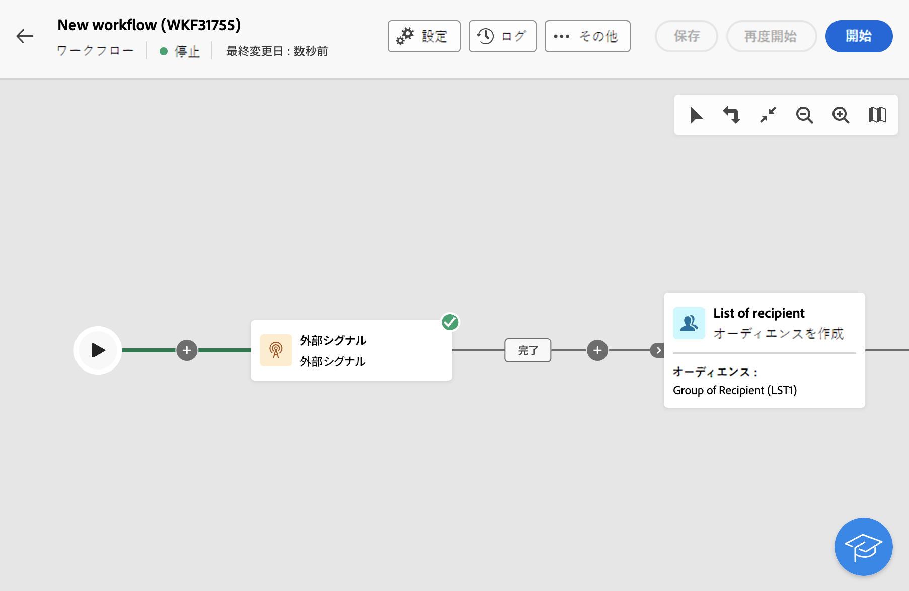
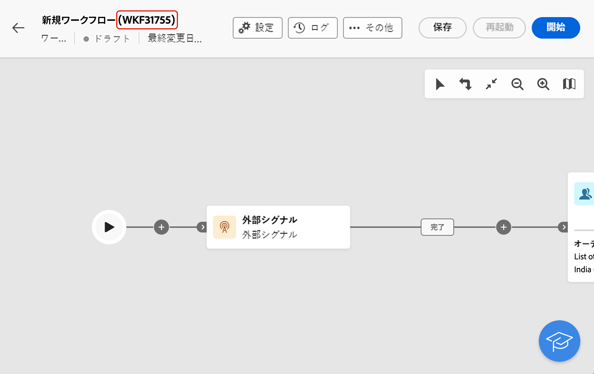
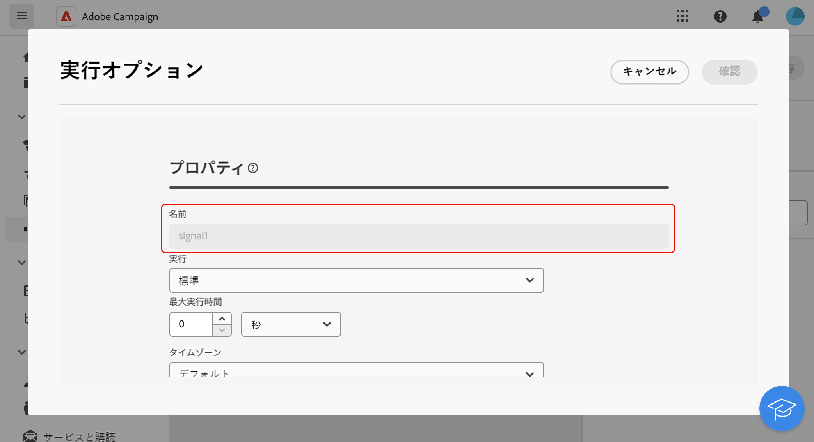
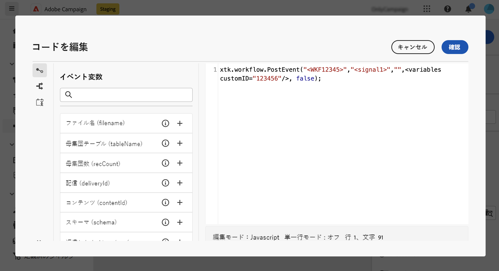

<?xml version="1.0" encoding="UTF-8"?>
<xliff xmlns="urn:oasis:names:tc:xliff:document:1.2" xmlns:okp="okapi-framework:xliff-extensions" xmlns:its="http://www.w3.org/2005/11/its" xmlns:itsxlf="http://www.w3.org/ns/its-xliff/" version="1.2" its:version="2.0">
<file original="help/v8/workflows/activities/external-signal.md.mdsc" source-language="en-US" target-language="en-XX" datatype="x-text/markdown">
<body>
<trans-unit id="tu13" xml:space="preserve">
<source xml:lang="en-US">https://experienceleague.adobe.com/ja/docs/campaign/automation/workflows/advanced-management/javascript-in-workflows#trigger-example</source>
<target xml:lang="en-XX">https://experienceleague.adobe.com/ja/docs/campaign/automation/workflows/advanced-management/javascript-in-workflows#trigger-example</target>
</trans-unit>
<trans-unit id="tu33" xml:space="preserve">
<source xml:lang="en-US">https://experienceleague.adobe.com/ja/tools/campaign-api</source>
<target xml:lang="en-XX">https://experienceleague.adobe.com/ja/tools/campaign-api</target>
</trans-unit>
<trans-unit id="tu1" restype="x-YAML_METADATA_HEADER_VALUE" xml:space="preserve">
<source xml:lang="en-US">Use the External signal activity</source>
<target xml:lang="en-XX">外部シグナル アクティビティの使用</target>
</trans-unit>
<trans-unit id="tu2" restype="x-YAML_METADATA_HEADER_VALUE" xml:space="preserve">
<source xml:lang="en-US">Learn how to use the External signal workflow activity</source>
<target xml:lang="en-XX">外部シグナルワークフローアクティビティの使用方法を学ぶ</target>
</trans-unit>
<trans-unit id="tu3" xml:space="preserve">
<source xml:lang="en-US">External signal</source>
<target xml:lang="en-XX">外部シグナル</target>
</trans-unit>
<trans-unit id="tu4" xml:space="preserve">
<source xml:lang="en-US">External Signal</source>
<target xml:lang="en-XX">外部シグナル</target>
</trans-unit>
<trans-unit id="tu5" xml:space="preserve">
<source xml:lang="en-US">The <ph id="1" ctype="x-STRONG_EMPHASIS">**</ph>External signal<ph id="2" ctype="x-STRONG_EMPHASIS">**</ph> activity lets you trigger the execution of a workflow from another workflow or an API call.</source>
<target xml:lang="en-XX"><ph id="1" ctype="x-STRONG_EMPHASIS">**</ph>外部シグナル<ph id="2" ctype="x-STRONG_EMPHASIS">**</ph> アクティビティでは、別のワークフローまたは API 呼び出しからワークフローの実行をトリガーできます。</target>
</trans-unit>
<trans-unit id="tu6" xml:space="preserve">
<source xml:lang="en-US">External Signal Parameters</source>
<target xml:lang="en-XX">外部信号パラメーター</target>
</trans-unit>
<trans-unit id="tu7" xml:space="preserve">
<source xml:lang="en-US">External Signal Parameters</source>
<target xml:lang="en-XX">外部信号パラメーター</target>
</trans-unit>
<trans-unit id="tu8" xml:space="preserve">
<source xml:lang="en-US">End triggers</source>
<target xml:lang="en-XX">トリガーを終了</target>
</trans-unit>
<trans-unit id="tu9" xml:space="preserve">
<source xml:lang="en-US">End triggers</source>
<target xml:lang="en-XX">トリガーを終了</target>
</trans-unit>
<trans-unit id="tu10" xml:space="preserve">
<source xml:lang="en-US">The <ph id="1" ctype="x-STRONG_EMPHASIS">**</ph>External signal<ph id="2" ctype="x-STRONG_EMPHASIS">**</ph> activity is a <ph id="3" ctype="x-STRONG_EMPHASIS">**</ph>Flow control<ph id="4" ctype="x-STRONG_EMPHASIS">**</ph> activity. It lets you trigger the execution of a workflow from another workflow or an API call.</source>
<target xml:lang="en-XX"><ph id="1" ctype="x-STRONG_EMPHASIS">**</ph>外部シグナル<ph id="2" ctype="x-STRONG_EMPHASIS">**</ph>アクティビティは<ph id="3" ctype="x-STRONG_EMPHASIS">**</ph>フロー制御<ph id="4" ctype="x-STRONG_EMPHASIS">**</ph>アクティビティであり、 別のワークフローまたは API 呼び出しからワークフローの実行をトリガーできます。</target>
</trans-unit>
<trans-unit id="tu11" xml:space="preserve">
<source xml:lang="en-US"><ph id="1" ctype="x-regxph" equiv-text="&lbrack;!NOTE">[!NOTE]</ph></source>
<target xml:lang="en-XX"><ph id="1" ctype="x-regxph" equiv-text="&lbrack;!NOTE">[!NOTE]</ph></target>
</trans-unit>
<trans-unit id="tu12" xml:space="preserve">
<source xml:lang="en-US">This page explains the main steps to configure an <ph id="1" ctype="x-STRONG_EMPHASIS">**[!UICONTROL </ph>External Signal<ph id="3" ctype="x-LINK_REF">]**</ph> activity in Campaign Web User Interface and trigger it from another workflow or an API call. Detailed information on how to trigger a workflow, best practices, and how to work with Campaign APIs is available in the <ph id="5" ctype="x-LINK">&lbrack;</ph>Campaign v8 (client console) documentation<ph id="6" ctype="x-LINK">[#$tu13]</ph>.</source>
<target xml:lang="en-XX">このページでは、Campaign web ユーザーインターフェイスで<ph id="1" ctype="x-STRONG_EMPHASIS">**[!UICONTROL </ph>外部シグナル<ph id="3" ctype="x-LINK_REF">]**</ph>を設定し、別のワークフローまたは API 呼び出しからトリガーする主な手順について説明します。 ワークフローをトリガーする方法、ベストプラクティスおよび Campaign API で使用する方法について詳しくは、<ph id="5" ctype="x-LINK">&lbrack;</ph>Campaign v8（クライアントコンソール）ドキュメント<ph id="6" ctype="x-LINK">[#$tu13]</ph>を参照してください。</target>
</trans-unit>
<trans-unit id="tu14" xml:space="preserve">
<source xml:lang="en-US">Follow these steps to configure the <ph id="1" ctype="x-STRONG_EMPHASIS">**</ph>External signal<ph id="2" ctype="x-STRONG_EMPHASIS">**</ph> activity and trigger its execution:</source>
<target xml:lang="en-XX">次の手順に従って、<ph id="1" ctype="x-STRONG_EMPHASIS">**</ph>外部シグナル<ph id="2" ctype="x-STRONG_EMPHASIS">**</ph>アクティビティを設定し、その実行をトリガーします。</target>
</trans-unit>
<trans-unit id="tu15" xml:space="preserve">
<source xml:lang="en-US">Add an <ph id="1" ctype="x-STRONG_EMPHASIS">**</ph>External signal<ph id="2" ctype="x-STRONG_EMPHASIS">**</ph> activity into your workflow.</source>
<target xml:lang="en-XX">ワークフローに<ph id="1" ctype="x-STRONG_EMPHASIS">**</ph>外部シグナル<ph id="2" ctype="x-STRONG_EMPHASIS">**</ph>アクティビティを追加します。</target>
</trans-unit>
<trans-unit id="tu16" xml:space="preserve">
<source xml:lang="en-US">Complete the configuration of your workflow, and start its execution. The <ph id="1" ctype="x-STRONG_EMPHASIS">**[!UICONTROL </ph>External Signal<ph id="3" ctype="x-LINK_REF">]**</ph> activity displays as "Pending," waiting to be triggered.</source>
<target xml:lang="en-XX">ワークフローの設定を完了し、実行を開始します。 トリガーされるのを待機している<ph id="1" ctype="x-STRONG_EMPHASIS">**[!UICONTROL </ph>外部シグナル<ph id="3" ctype="x-LINK_REF">]**</ph>アクティビティには「保留中」と表示されます。</target>
</trans-unit>
<trans-unit id="tu17" xml:space="preserve">
<source xml:lang="en-US"><ph id="1" ctype="x-IMAGE"></ph></source>
<target xml:lang="en-XX"><ph id="1" ctype="x-IMAGE"></ph></target>
</trans-unit>
<trans-unit id="tu18" xml:space="preserve">
<source xml:lang="en-US">Retrieve the following information:</source>
<target xml:lang="en-XX">次の情報を取得します。</target>
</trans-unit>
<trans-unit id="tu19" xml:space="preserve">
<source xml:lang="en-US">The <ph id="1" ctype="x-STRONG_EMPHASIS">**</ph>workflow's internal name<ph id="2" ctype="x-STRONG_EMPHASIS">**</ph>, which displays next to its label.</source>
<target xml:lang="en-XX">ラベルの横に表示される<ph id="1" ctype="x-STRONG_EMPHASIS">**</ph>ワークフローの内部名<ph id="2" ctype="x-STRONG_EMPHASIS">**</ph>。</target>
</trans-unit>
<trans-unit id="tu20" xml:space="preserve">
<source xml:lang="en-US">View example</source>
<target xml:lang="en-XX">例を表示</target>
</trans-unit>
<trans-unit id="tu21" xml:space="preserve">
<source xml:lang="en-US"><ph id="1" ctype="x-IMAGE"></ph></source>
<target xml:lang="en-XX"><ph id="1" ctype="x-IMAGE"></ph></target>
</trans-unit>
<trans-unit id="tu22" xml:space="preserve">
<source xml:lang="en-US">The <ph id="1" ctype="x-STRONG_EMPHASIS">**</ph>External signal activity's name<ph id="2" ctype="x-STRONG_EMPHASIS">**</ph>, which displays in the workflow's <ph id="3" ctype="x-STRONG_EMPHASIS">**[!UICONTROL </ph>Execution options<ph id="5" ctype="x-LINK_REF">]**</ph>.</source>
<target xml:lang="en-XX">ワークフローの<ph id="3" ctype="x-STRONG_EMPHASIS">**[!UICONTROL </ph>実行オプション<ph id="5" ctype="x-LINK_REF">]**</ph>に表示される<ph id="1" ctype="x-STRONG_EMPHASIS">**</ph>外部シグナルアクティビティの名前<ph id="2" ctype="x-STRONG_EMPHASIS">**</ph>。</target>
</trans-unit>
<trans-unit id="tu23" xml:space="preserve">
<source xml:lang="en-US">View example</source>
<target xml:lang="en-XX">例を表示</target>
</trans-unit>
<trans-unit id="tu24" xml:space="preserve">
<source xml:lang="en-US"><ph id="1" ctype="x-IMAGE"></ph></source>
<target xml:lang="en-XX"><ph id="1" ctype="x-IMAGE"></ph></target>
</trans-unit>
<trans-unit id="tu25" xml:space="preserve">
<source xml:lang="en-US">To trigger the workflow, execute the <ph id="1" ctype="x-CODE">`PostEvent`</ph> JavaScript function. This function lets you pass variables with the values of your choice and use them in the triggered workflow.</source>
<target xml:lang="en-XX">ワークフローをトリガーするには、<ph id="1" ctype="x-CODE">`PostEvent`</ph> JavaScript 関数を実行します。 この関数を使用すると、選択した値で変数を渡し、それらをトリガーされたワークフローで使用できます。</target>
</trans-unit>
<trans-unit id="tu26" xml:space="preserve">
<source xml:lang="en-US">The <ph id="1" ctype="x-CODE">`PostEvent`</ph> function can be executed either from another workflow or from an API call.</source>
<target xml:lang="en-XX"><ph id="1" ctype="x-CODE">`PostEvent`</ph> 関数は、別のワークフローまたは API 呼び出しから実行できます。</target>
</trans-unit>
<trans-unit id="tu27" xml:space="preserve">
<source xml:lang="en-US">To trigger an <ph id="1" ctype="x-STRONG_EMPHASIS">**[!UICONTROL </ph>External signal<ph id="3" ctype="x-LINK_REF">]**</ph> activity from a workflow, execute the PostEvent function from the <ph id="5" ctype="x-STRONG_EMPHASIS">**[!UICONTROL </ph>Initialization script<ph id="7" ctype="x-LINK_REF">]**</ph> pane, accessible from the activity's <ph id="9" ctype="x-STRONG_EMPHASIS">**[!UICONTROL </ph>Execution options<ph id="11" ctype="x-LINK_REF">]**</ph>. For the <ph id="13" ctype="x-STRONG_EMPHASIS">**[!UICONTROL </ph>JavaScript code<ph id="15" ctype="x-LINK_REF">]**</ph> activity, execute the function from the activity's script.</source>
<target xml:lang="en-XX"><ph id="1" ctype="x-STRONG_EMPHASIS">**[!UICONTROL </ph>外部シグナル<ph id="3" ctype="x-LINK_REF">]**</ph>アクティビティをワークフローからトリガーにするには、アクティビティの<ph id="9" ctype="x-STRONG_EMPHASIS">**[!UICONTROL </ph>実行オプション<ph id="11" ctype="x-LINK_REF">]**</ph>からアクセスできる<ph id="5" ctype="x-STRONG_EMPHASIS">**[!UICONTROL </ph>初期化スクリプト<ph id="7" ctype="x-LINK_REF">]**</ph>パネルで PostEvent 関数を実行します。 <ph id="13" ctype="x-STRONG_EMPHASIS">**[!UICONTROL </ph>JavaScript コード<ph id="15" ctype="x-LINK_REF">]**</ph>アクティビティの場合は、アクティビティのスクリプトから関数を実行します。</target>
</trans-unit>
<trans-unit id="tu28" xml:space="preserve">
<source xml:lang="en-US">The syntax is as follows:</source>
<target xml:lang="en-XX">構文は以下のようになります。</target>
</trans-unit>
<trans-unit id="tu29" xml:space="preserve">
<source xml:lang="en-US">View example</source>
<target xml:lang="en-XX">例を表示</target>
</trans-unit>
<trans-unit id="tu30" xml:space="preserve">
<source xml:lang="en-US">In this example, the "signal1" External signal activity is triggered. It has been added to the workflow whose internal name is "WKF12345." A variable named "customID" is passed with the value "123456."</source>
<target xml:lang="en-XX">この例では、「signal1」外部シグナルアクティビティをトリガーします。 内部名が「WKF12345」のワークフローに追加されました。 「customID」という名前の変数が、値「123456」と共に渡されます。</target>
</trans-unit>
<trans-unit id="tu31" xml:space="preserve">
<source xml:lang="en-US"><ph id="1" ctype="x-IMAGE"></ph></source>
<target xml:lang="en-XX"><ph id="1" ctype="x-IMAGE"></ph></target>
</trans-unit>
<trans-unit id="tu32" xml:space="preserve">
<source xml:lang="en-US">To trigger an <ph id="1" ctype="x-STRONG_EMPHASIS">**[!UICONTROL </ph>External signal<ph id="3" ctype="x-LINK_REF">]**</ph> activity from an API call, follow the steps detailed in the Campaign API documentation. <ph id="5" ctype="x-LINK">&lbrack;</ph>Learn how to use the static <ph id="6" ctype="x-CODE">`PostEvent`</ph> method<ph id="7" ctype="x-LINK">[#$tu33]</ph>.</source>
<target xml:lang="en-XX"><ph id="1" ctype="x-STRONG_EMPHASIS">**[!UICONTROL </ph>外部シグナル<ph id="3" ctype="x-LINK_REF">]**</ph>アクティビティを API 呼び出しからトリガーにするには、Campaign API ドキュメントで説明されている手順に従ってください。 <ph id="5" ctype="x-LINK">&lbrack;</ph>詳しくは、静的な <ph id="6" ctype="x-CODE">`PostEvent`</ph> メソッドの使用方法を参照してください<ph id="7" ctype="x-LINK">[#$tu33]</ph>。</target>
</trans-unit>
</body>
</file>
</xliff>