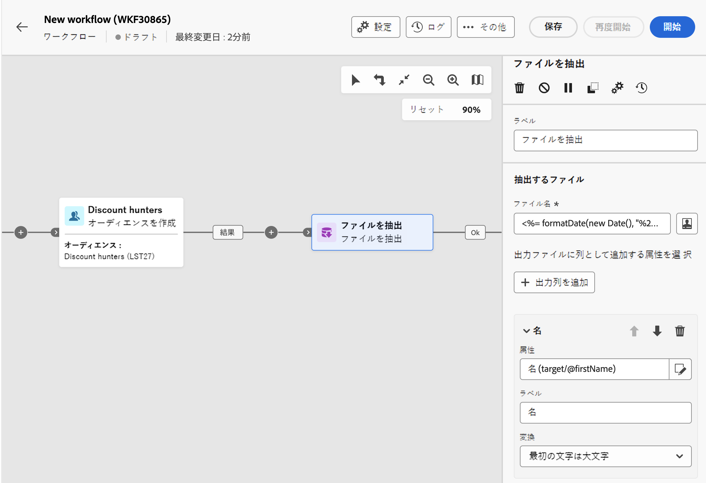
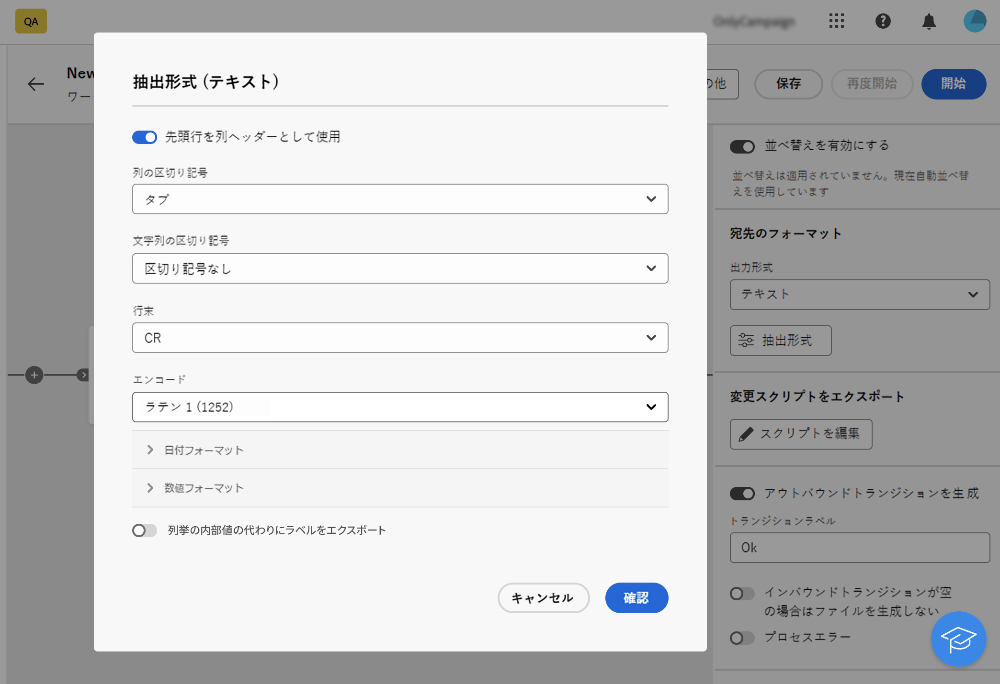
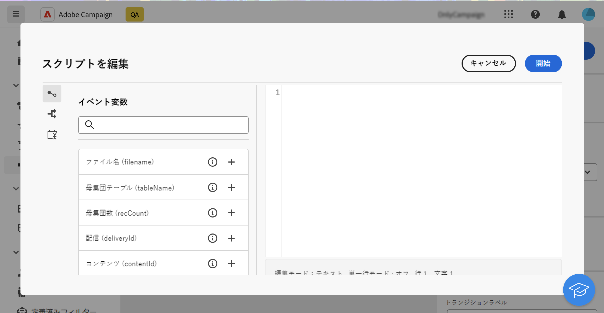
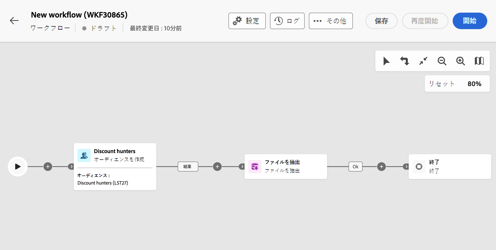
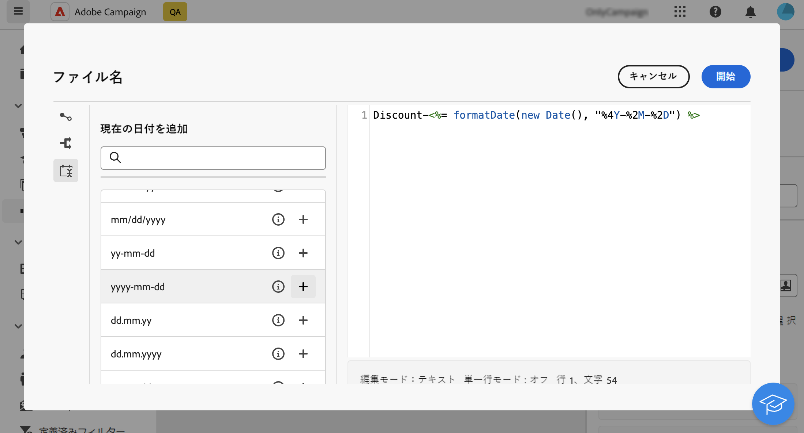
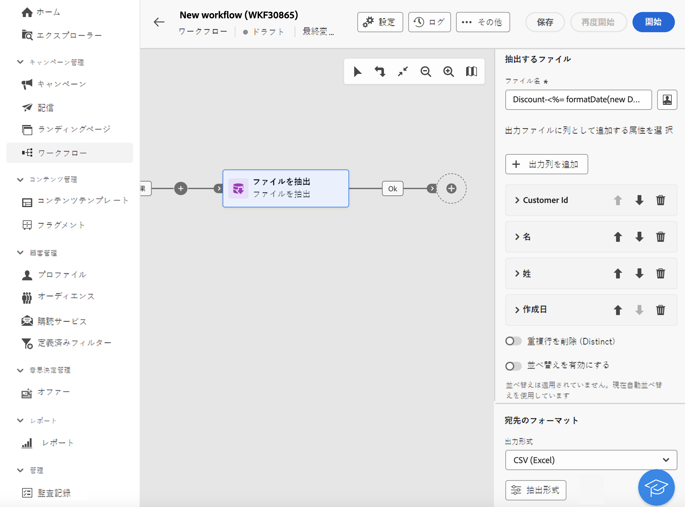

# ファイルを抽出 {#extract-file}

>[!CONTEXTUALHELP]
>id="acw_orchestration_extractfile"
>title="ファイルを抽出"
>abstract="**ファイルを抽出**&#x200B;アクティビティを使用すると、Adobe Campaign から外部ファイルの形式でデータを書き出すことができます。その後、ファイル転送アクティビティを使用して、データを SFTP、クラウドストレージ、キャンペーンサーバーなどのサーバーの場所に書き出すことができます。"

**ファイルを抽出**&#x200B;アクティビティは、**データ管理**&#x200B;アクティビティです。このアクティビティを使用すると、Adobe Campaign から外部ファイルの形式でデータを書き出すことができます。その後、ファイル転送アクティビティを使用して、データを SFTP、クラウドストレージ、キャンペーンサーバーなどのサーバーの場所に書き出すことができます。

**ファイルを抽出**&#x200B;アクティビティを設定するには、**ファイルを抽出**&#x200B;アクティビティをワークフローに追加し、次の手順に従います。

## 抽出するファイルの設定 {#extract-configuration}

>[!CONTEXTUALHELP]
>id="acw_orchestration_extractfile_file"
>title="抽出するファイル"
>abstract="抽出するファイルを選択します。"

「**[!UICONTROL 抽出するファイル]**」セクションでは、ファイルのプロパティと組み込むデータを設定できます。

1. 「**[!UICONTROL ファイル名]**」フィールドで、抽出するファイルの名前を入力します。

   イベント変数、条件、日付／時刻関数を使用すると、ファイル名をパーソナライズできます。これを行うには、**[!UICONTROL パーソナライゼーションダイアログを開く]**&#x200B;アイコンをクリックして、式エディターを開きます。[詳しくは、イベント変数と式エディターの操作方法を参照してください](../event-variables.md)

1. 抽出したファイルに存在する列を指定します。これを行うには、次の手順に従います。

   1. 「**[!UICONTROL 出力列を追加]**」をクリックします。
   1. 列に表示する属性を選択し、確定します。使用できる属性は、ワークフローのターゲティングディメンションによって異なります。
   1. 列を追加したら、その&#x200B;**[!UICONTROL ラベル]**&#x200B;を変更し、関連する&#x200B;**[!UICONTROL 属性]**&#x200B;を変更できます。
   1. 列の値に変換を適用する場合は、ドロップダウンリストから変換を選択します。例えば、選択した列内のすべての値を大文字に切り替えることができます。

1. これらの手順を繰り返して、抽出ファイルに必要な数の列を追加します。列の位置を変更するには、上下の矢印を使用します。

1. 抽出したファイルからすべての重複行を削除するには、「**[!UICONTROL 重複行を削除（リスト）]**」オプションをオンに切り替えます。

1. 抽出したファイルを属性に基づいて並べ替えるには、「**[!UICONTROL 並べ替えを有効にする]**」オプションをオンに切り替えて、ファイルを並べ替える属性と並べ替えの基準（昇順または降順）を選択します。ファイルの列に追加されているかどうかに関係なく、現在のターゲティングディメンションの任意の属性で並べ替えることができます。

## 抽出したファイル形式の設定 {#file}

>[!CONTEXTUALHELP]
>id="acw_orchestration_extractfile_destinationformat"
>title="宛先のフォーマット"
>abstract="様々なオプションを選択して、抽出したファイルの形式を設定します。"

「**[!UICONTROL 宛先]**&#x200B;形式」セクションでは、抽出したファイルの形式を設定できます。

1. 抽出したファイルの「**[!UICONTROL 出力形式]**」（**テキスト**、**列で固定を使用したテキスト**、**CSV（Excel）**&#x200B;または **XML**）を選択します。

1. 「**[!UICONTROL 抽出形式]**」ボタンをクリックして、選択した形式に関連する特定のオプションにアクセスします。詳しくは、節を展開して以下を参照してください。

+++ 使用可能な抽出形式オプション

   * **[!UICONTROL 最初の行を列ヘッダーとして使用]**（テキスト／CSV（Excel）形式）：最初の列をヘッダーとして使用するように、このオプションをオンに切り替えます。
   * **[!UICONTROL 列区切り記号]**（テキスト形式）：出力ファイルで列区切り記号として使用する文字を指定します。
   * **[!UICONTROL 文字列の区切り]**（テキスト形式）：出力ファイルの文字列を区切る方法を指定します。
   * **[!UICONTROL 行末]**（テキスト形式）：出力ファイルで行末を区切る方法を指定します。
   * **[!UICONTROL エンコード]**：出力ファイルのエンコーディングを選択します。
   * **[!UICONTROL 日付形式と区切り記号]**：出力ファイルでの日付の書式設定方法を指定します。
   * **[!UICONTROL 数値の形式]**：出力ファイルでの数値の形式設定方法を指定します。
   * **[!UICONTROL 列挙の内部値の代わりにラベルを書き出す]**：列挙値を書き出し、内部 ID ではなく、わかりやすい列ラベルを取得する場合は、このオプションをオンに切り替えます。

+++

   

## 後処理ステージの追加 {#script}

>[!CONTEXTUALHELP]
>id="acw_orchestration_extractfile_postprocessing"
>title="後処理"
>abstract="圧縮または暗号化など、適用する後処理ステップを定義します。"

**[!UICONTROL 変更スクリプトを書き出す]**&#x200B;では、圧縮や暗号化など、データ抽出中に実行する処理ステージを適用できます。それには、「**[!UICONTROL スクリプトを編集]**」ボタンをクリックします。

式エディターが開き、ファイルに適用するコマンドを入力できます。左側のパネルには、スクリプトの作成に利用できる定義済みの構文が表示されます。[詳しくは、イベント変数と式エディターの操作方法を参照してください](../event-variables.md)

## 追加のオプション {#additiona-options}

>[!CONTEXTUALHELP]
>id="acw_orchestration_extractfile_outbound"
>title="アウトバウンドトランジション"
>abstract="「**アウトバウンドトランジションを生成**」オプションを切り替えて、現在のアクティビティの後にアウトバウンドトランジションを追加します。"

>[!CONTEXTUALHELP]
>id="acw_orchestration_extractfile_error"
>title="エラーを処理"
>abstract="「**エラーを処理**」オプションを切り替えて、エラーを含むアウトバウンドトランジションを追加します。"

出力ファイルの抽出を設定すると、トランジションとエラー管理に関連する追加のオプションが使用可能になります。

* **[!UICONTROL アウトバウンドトランジションを生成]**：アウトバウンドトランジションを追加し、そのラベルを設定するには、このオプションをオンに切り替えます。
* **[!UICONTROL インバウンドトランジションが空の場合はファイルを生成しない]**：インバウンドトランジションにデータが含まれていない場合にファイル抽出をスキップするには、このオプションをオンに切り替えます。
* **[!UICONTROL プロセスエラー]**：ファイルの抽出中にエラーが発生した場合にアウトバウンドトランジションを追加するには、このオプションをオンに切り替えます。

## 例 {#example}

次の例では、**オーディエンスを作成**&#x200B;アクティビティに続いて、**ファイルを抽出**&#x200B;アクティビティを使用して、すべてのターゲットプロファイルを CSV ファイルに抽出します。

* 「**[!UICONTROL ファイル名]**」フィールドには、抽出の日付が含まれるように設定されます。

  

* データベースにプロファイルの姓名、顧客 ID、作成日を表示する列が追加されます。

  
