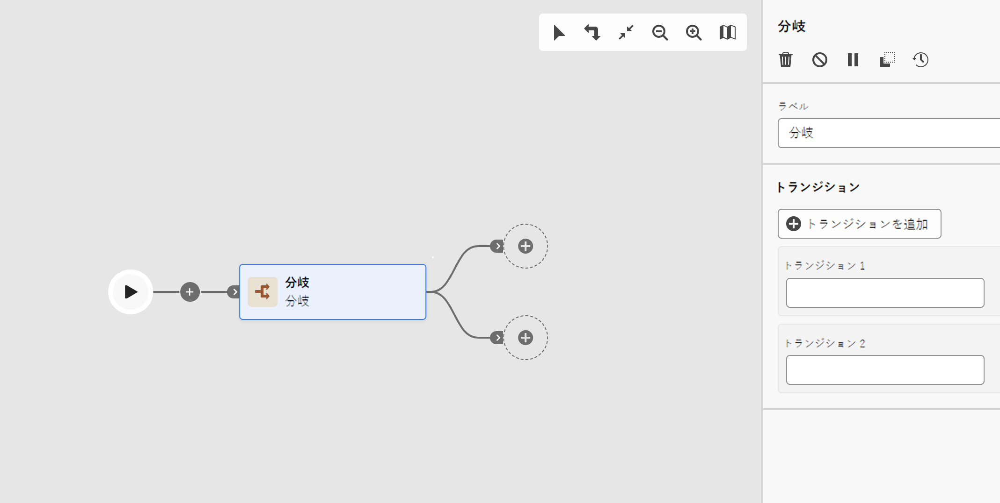

# 分岐 {#fork}

>[!CONTEXTUALHELP]
>id="acw_orchestration_fork"
>title="「分岐」アクティビティ"
>abstract="**分岐**&#x200B;アクティビティを使用すると、アウトバウンドトランジションを作成して、複数のアクティビティを同時に開始できます。"

>[!CONTEXTUALHELP]
>id="acw_orchestration_fork_transitions"
>title="分岐アクティビティのトランジション"
>abstract="デフォルトでは、**分岐**&#x200B;アクティビティで 2 つのトランジションが作成されます。「**トランジションを追加**」ボタンをクリックして追加のアウトバウンドトランジションを定義し、そのラベルを入力します。"

**分岐**&#x200B;アクティビティは&#x200B;**フロー制御**&#x200B;アクティビティです。アウトバウンドトランジションを作成して、複数のアクティビティを同時に開始できます。

## 分岐アクティビティの設定 {#fork-configuration}

次の手順に従って、**分岐**&#x200B;アクティビティを設定します。

1. **分岐**&#x200B;アクティビティをワークフローに追加します。
1. **トランジションを追加**&#x200B;をクリックし、新しいアウトバウンドトランジションを追加します。デフォルトでは、2 つのトランジションが定義されています。
1. 各トランジションにラベルを追加します。

## 例 {#fork-example}

次の例では、2 つの&#x200B;**分岐**&#x200B;アクティビティを使用しています。

* 2 つのクエリの前にある 1 つのクエリは、同時に実行されます。
* 積集合の後の 1 つは、ターゲット母集団にメールと SMS を同時に送信します。

