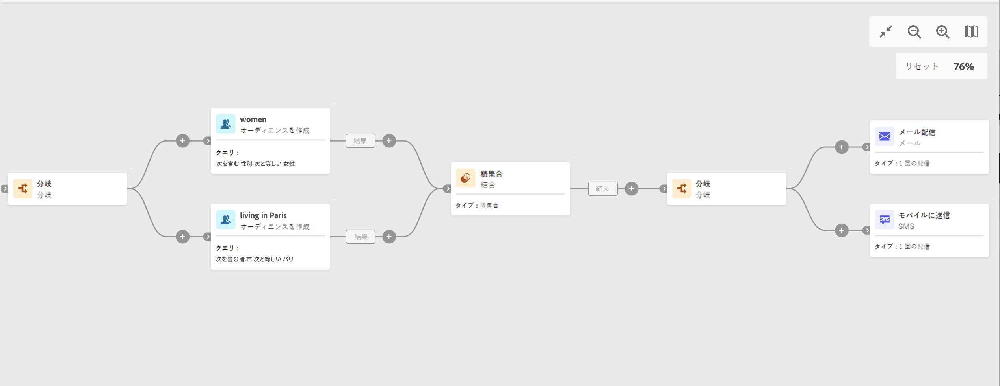

# 分岐 {#fork}

>[!CONTEXTUALHELP]
>id="acw_orchestration_fork_transitions"
>title="分岐アクティビティ"
>abstract="分岐アクティビティを使用すると、アウトバウンドトランジションを作成して、複数のアクティビティを同時に開始できます。"

## 設定

次の手順に従って、**分岐**&#x200B;アクティビティを設定します。

1. **分岐**&#x200B;アクティビティをワークフローに追加します。
1. **トランジションを追加**&#x200B;をクリックし、新しいアウトバウンドトランジションを追加します。デフォルトでは、2 つのトランジションが定義されています。
1. 各トランジションにラベルを追加します。

## 例

次の例では、2 つの&#x200B;**分岐**&#x200B;アクティビティを使用しています。

* 2 つのクエリの前にある 1 つのクエリは、同時に実行されます。
* 積集合の後の 1 つは、ターゲット母集団にメールと SMS を同時に送信します。

