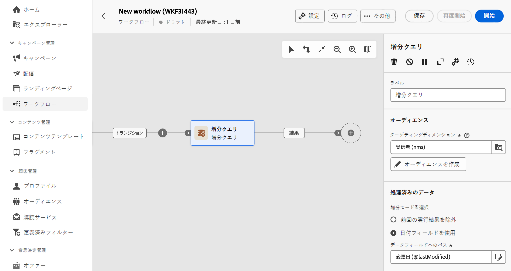
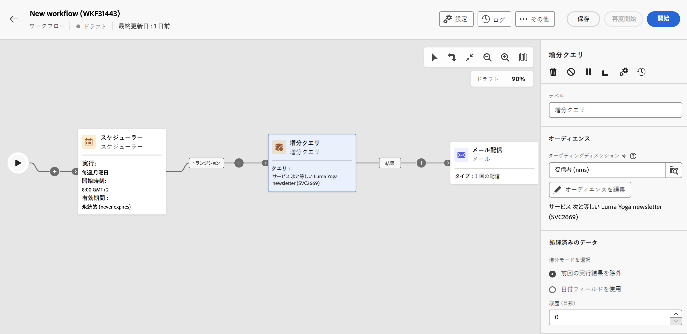

# 増分クエリ {#incremental-query}

<!--
>[!CONTEXTUALHELP]
>id="acw_homepage_welcome_rn5"
>title="Incremental Query activity"
>abstract="Use the new Incremental Query activity to query the database on a scheduled basis. Each time this activity is executed, the results from the previous executions are excluded. This allows you to target only new elements."
>additional-url="https://experienceleague.adobe.com/docs/campaign-web/v8/release-notes/release-notes.html" text="See release notes"
-->

>[!CONTEXTUALHELP]
>id="acw_orchestration_incrementalquery"
>title="増分クエリ"
>abstract="**増分クエリ**&#x200B;アクティビティとは、クエリモデラーを使用してデータベースでクエリを実行できる&#x200B;**ターゲティング**&#x200B;アクティビティを意味します。このアクティビティが実行されるたびに、以前の実行結果が除外されます。これにより、新しい要素だけをターゲットにすることができます。"

>[!CONTEXTUALHELP]
>id="acw_orchestration_incrementalquery_history"
>title="増分処理クエリ履歴"
>abstract="増分処理クエリ履歴"

>[!CONTEXTUALHELP]
>id="acw_orchestration_incrementalquery_processeddata"
>title="増分クエリの処理済みデータ"
>abstract="増分クエリの処理済みデータ"

**増分クエリ**&#x200B;アクティビティとは、定期的にデータベースでクエリを実行できる&#x200B;**ターゲティング**&#x200B;アクティビティを意味します。このアクティビティが実行されるたびに、以前の実行結果が除外されます。これにより、新しい要素だけをターゲットにすることができます。

>[!NOTE]
>
>Campaign クライアントコンソールでは、**[!UICONTROL 増分クエリ]**&#x200B;アクティビティがビルトインのスケジューラーと統合されている一方、Campaign Web ユーザーインターフェイスではこの機能が個別に扱われます。増分クエリの実行をスケジュールするには、**[!UICONTROL 増分クエリ]**&#x200B;アクティビティを実行する前に、ワークフローに&#x200B;**[!UICONTROL スケジューラー]**&#x200B;アクティビティを追加する必要があります。[スケジューラーアクティビティの設定方法を学ぶ](scheduler.md)

**[!UICONTROL 増分クエリ]**&#x200B;アクティビティは、次のような様々な用途に使用できます。

* 個人をセグメント化して、メッセージやオーディエンスなどのターゲットを定義する。
* データをエクスポートする。例えば、アクティビティを使用して、定期的にファイルに新規ログをエクスポートできます。この機能は、外部レポートや BI ツールでログデータを使用する場合に役に立ちます。

以前の実行で既にターゲットになっている母集団は、ワークフローに保存されます。つまり、同じテンプレートから開始された 2 つのワークフローは同じログを共有しません。一方、同じワークフローの同じ増分クエリに基づく 2 つのタスクは、同じログを使用します。

実行中のいずれかの増分クエリの結果が 0 と等しい場合、プログラムされた次回のクエリの実行まで、ワークフローは一時停止されます。このため、増分処理クエリに続くトランザクションとアクティビティが、次回の実行前に処理されることはありません。

## 増分クエリアクティビティの設定 {#incremental-query-configuration}

**増分クエリ**&#x200B;アクティビティを設定するには、次の手順に従います。

1. ワークフローに&#x200B;**増分クエリ**&#x200B;アクティビティを追加します。

1. 「**[!UICONTROL オーディエンス]**」セクションで「**ターゲティングディメンション**」を選択し、「**[!UICONTROL 続行]**」をクリックします。

   ターゲティングディメンションは、受信者、契約の受益者、オペレーター、サブスクライバーなど、ターゲットされる母集団を操作ごとに定義します。デフォルトでは、ターゲットが受信者から選択されます。[ターゲティングディメンションについての詳細を学ぶ](../../audience/about-recipients.md#targeting-dimensions)

1. 新しいメールをデザインする際にオーディエンスを作成するのと同じ方法で、クエリモデラーを使用してクエリを定義します。[クエリモデラーの操作方法の詳細を学ぶ](../../query/query-modeler-overview.md)

1. 「**[!UICONTROL 処理済みのデータ]**」セクションで、使用する増分モードを選択します。

   * **[!UICONTROL 以前の実行結果を除外]**：アクティビティを実行するたびに、前回の実行結果が除外されます。

     以前の実行でターゲットになった受信者は、ターゲットとなった日からの経過日数が最大に達するまでログに記録することができます。これを行うには、「**[!UICONTROL 履歴（日数）]**」フィールドを使用します。値がゼロの場合、受信者がログからパージされることはありません。

   * **[!UICONTROL 日付フィールドを使用]**：このオプションを使用すると、特定の日付フィールドに基づいて、以前の実行の結果を除外できます。それには、選択したターゲティングディメンションで使用できる属性のリストから目的の日付フィールドを選択します。ワークフローの次回の実行時には、最後の実行日より後に変更または作成されたデータのみが取得されます。

     ワークフローを最初に実行した後、「**[!UICONTROL 最終実行日]**」フィールドが使用可能になります。このフィールドで次の実行の日付が指定され、ワークフローを実行するたびに自動的に更新されます。それでも、必要に応じて手動で別の値を入力すれば、この値を上書きすることはできます。

   >[!NOTE]
   >
   >**[!UICONTROL 日付フィールドを使用]**&#x200B;モードでは、選択された日付フィールドに応じて、より柔軟な指定が可能です。例えば、指定したフィールドが変更日に対応している場合、日付フィールドモードでは、最後に更新されたデータを取得できます。一方、他のモードでは、ワークフローの最後の実行以降に変更があった場合でも、前回の実行でターゲットになったレコードは単純に除外されます。

## 例 {#incremental-query-example}

次の例は、「ヨガのニュースレター」サービスを購読しているプロファイルを Adobe Campaign データベース内で毎週フィルタリングして、ウェルカムメールをそれらのプロファイルに送信するワークフローの設定を示しています。

ワークフローは、次の要素で構成されています。

* **[!UICONTROL スケジューラー]**&#x200B;アクティビティ：毎週月曜日午前 6 時にワークフローを実行します。
* **[!UICONTROL 増分クエリ]**&#x200B;アクティビティ：初回実行時には、その時点の全購読者をターゲットにし、それ以降の実行ではその週の新規購読者だけをターゲットにします。
* **[!UICONTROL メール配信]**&#x200B;アクティビティ
