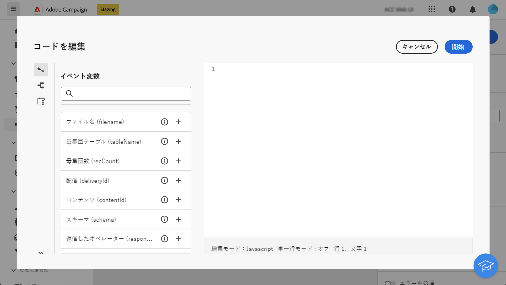
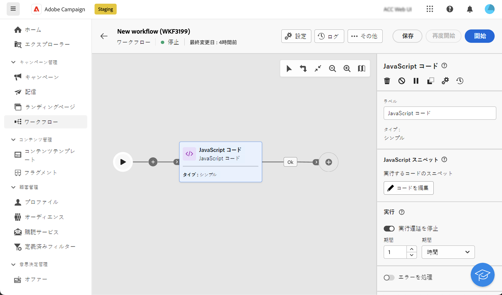
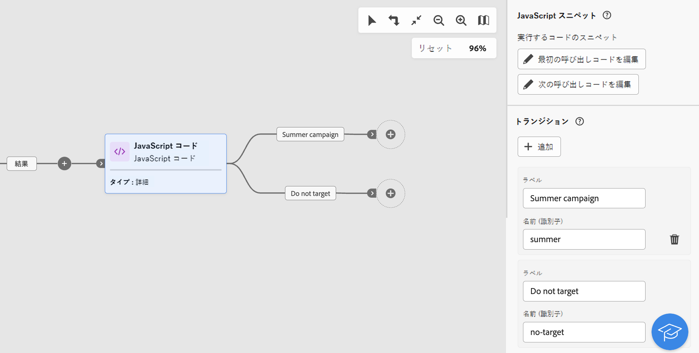
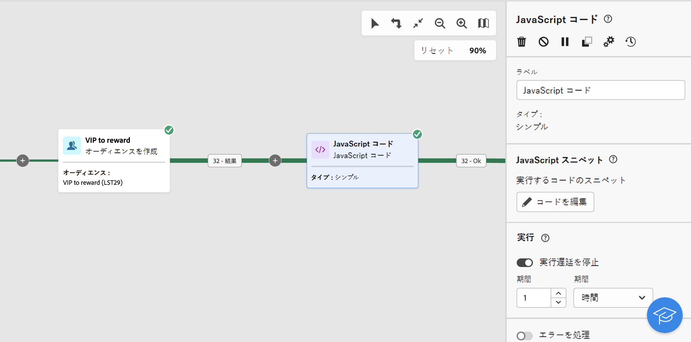
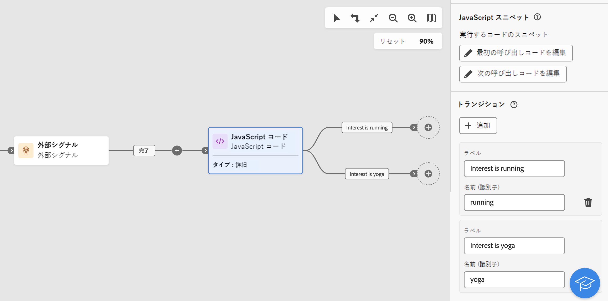

# JavaScript コード {#javascript-code}

>[!CONTEXTUALHELP]
>id="acw_orchestration_javascript"
>title="JavaScript コード"
>abstract="この **JavaScript コード** アクティビティを使用すると、ワークフローのコンテキストで JavaScript スクリプトを実行できます。 これにより、アクションを実行したり、データベースから情報を収集したりできます。 使用方法 **シンプル** ワークフローの実行時に 1 つのコードスニペットを実行する JavaScript コードアクティビティ。 **詳細** Javascript コードアクティビティを使用すると、2 つの異なるコードスニペットを順番に実行することで、より複雑な操作を実行できます。 ワークフローを初めて開始すると、最初の呼び出しが実行されます。 ワークフローが再実行されるたびに、2 回目の呼び出しで定義されたコードが実行されます。"

>[!CONTEXTUALHELP]
>id="acw_orchestration_javascript_snippet"
>title="JavaScript スニペット"
>abstract="アクティビティの実行時に実行するスクリプトを定義します。 を設定する場合 **詳細** JavaScript アクティビティでは、2 つのコードスニペットを編集する必要があります。ワークフローの最初の実行時に実行する最初の呼び出しコードと、ワークフローの次の呼び出し時に実行する次の呼び出しコードです。"

>[!CONTEXTUALHELP]
>id="acw_orchestration_javascript_execution"
>title="JavaScript の実行"
>abstract="実行遅延を設定して、実行期間の後にアクティビティを停止します。 デフォルトでは、実行フェーズは 1 時間を超えることはできません。この遅延の後、エラーメッセージが表示されてプロセスが中止され、アクティビティの実行が失敗します。この制限を無視するには、値を 0 に設定します。"

>[!CONTEXTUALHELP]
>id="acw_orchestration_javascript_transition"
>title="JavaScript トランジション"
>abstract="複数の出力トランジションを追加する場合、 **[!UICONTROL トランジションを追加]** ボタン。 これにより、例えば、JavaScript コード アクティビティで定義された特定の条件に基づいて、特定のトランジションをトリガー設定できます。 このオプションは、 **詳細** JavaScript コードアクティビティのみ。"

この **JavaScript コード** アクティビティはです **データ管理** アクティビティ。 ワークフローのコンテキストで JavaScript スクリプトを実行するには、このアクティビティを使用します。 これにより、データベースから情報を収集したり、その他の複雑な操作を実行したりできます。

## 「JavaScript コード」アクティビティを設定する {#javascript-code-configuration}

次の手順に従って、 **JavaScript コード** アクティビティ：

1. を追加 **JavaScript コード** ワークフローへのアクティビティ。

1. 作成するアクティビティのタイプを選択します。

   * **シンプル**:1 つのコードスニペットを実行します。
   * **詳細**：このオプションを使用すると、2 つの異なるコードスニペットを実行することで、より高度な操作を実行できます。 [高度な JavaScript アクティビティの設定方法を学ぶ](#advanced)

   >[!NOTE]
   >
   >Campaign web ユーザーインターフェイスでは、次の 2 つのアクティビティを結合して 1 つにまとめました **シンプル** および **詳細** JavaScript コード機能。 この統合は、アクティビティの機能に何の影響も与えません。

1. を確認し、 **[!UICONTROL コードを編集]** ボタンをクリックして、式エディターを開きます。 左側のパネルには、イベント変数を含む、コードの作成に利用できる定義済みの構文が表示されます。 [イベント変数と式エディターの操作方法を説明します](../event-variables.md)

   

1. が含まれる **[!UICONTROL 実行]** 「」セクションでは、実行期間の後にアクティビティを停止する遅延を設定します。 デフォルトでは、実行フェーズは 1 時間を超えることはできません。この遅延の後、エラーメッセージが表示されてプロセスが中止され、アクティビティの実行が失敗します。この制限を無視するには、値を 0 に設定します。

   

1. をオンにします **[!UICONTROL エラーを処理]** スクリプトの実行中に発生したエラーを、追加の出力トランジションに保持するオプション。

## 高度な JavaScript コードアクティビティ {#advanced}

高度な JavaScript アクティビティを使用すると、複雑な操作を実行できます。 次の操作が可能です。

* 2 つの異なるコードスニペットを実行します。 最初のコードスニペットは、ワークフローの初回起動時に実行されます。 ワークフローが再度実行されるたびに、2 回目の呼び出しで定義されたコードスニペットが実行されます。
* スクリプトを使用して動的にやり取りできる複数の出力トランジションを追加します。

高度な JavaScript コード アクティビティを設定するには、次の手順に従います。

1. 「」を選択します **詳細** を入力し、実行するコードスニペットを設定します。

   * クリック **[!UICONTROL 最初の通話コードを編集]** 最初の呼び出し時に実行するスクリプトを定義する
   * クリック **[!UICONTROL 次の通話コードを編集]** ワークフローの次回の呼び出し時に実行するスクリプトを定義します。 （オプション）

1. 1 つまたは複数の出力トランジションを追加するには、 **[!UICONTROL トランジションを追加]** ボタンをクリックし、トランジションごとにラベルと内部名を指定します。

   この例では、特定の条件に基づいて、コードスニペット内のスクリプトでアクティブ化される 2 つのトランジションを設定しました。

   

1. アクティビティの設定を完了し、ワークフローを開始します。

## 例 {#javascript-code-example}

### 入力母集団に基づいて変数を初期化 {#example1}

この例では、ワークフローがターゲットとするプロファイルの数に基づいて変数を初期化する方法を示しています。



ここでは、データベースからVIP プロファイルをターゲットにしています。 オーディエンスを作成アクティビティがターゲットとするプロファイルの数に応じた値を持つ「channel」という変数を作成します。

* 1000 個を超えるプロファイルをターゲットにする場合は、「email」の値を使用して変数を初期化します。
* それ以外の場合は、「sms」の値で初期化します。

これを行うには、次の手順に従います。

1. を追加 **JavaScript コード** タイプのアクティビティ **シンプル** 後 **オーディエンスを作成** アクティビティ。

1. クリック **コードを編集** コードスニペットを次のように設定します。

   ```
   if (vars.recCount > 1000)
       vars.channel ="email"
   else
       vars.channel = "sms"
   ```

1. ワークフローを開始します。「channel」変数は、ターゲットとするプロファイルの数に応じて、「email」または「sms」の値で作成されます **オーディエンスを作成** アクティビティ。

### 変数の値に基づくトリガートランジション {#example2}

この例では、変数の値に基づいてトランジションのトリガーを設定する方法を示します。



ここでは、ワークフローはで始まります。 **外部シグナル** アクティビティ。このアクティビティに対して、変数（`interest`）が別のワークフローから渡されます。 変数の値は、最初のワークフローで実行されるフィルタリング操作に応じて、「running」または「yoga」になります。

変数の値に基づいて、ワークフロー内の様々なトランジションにトリガーを設定します。

これを行うには、次の手順に従います。

1. を追加 **JavaScript コード** タイプの「外部シグナル」アクティビティの後のアクティビティ **詳細**.

1. 2 つのトランジションを追加します。設定可能な各変数値（「running」、「yoga」）に 1 つ追加します。

1. クリック **最初の通話コードを編集** コードスニペットを次のように設定します。

   ```
   if (vars.interest=="running")
       task.postEvent(task.transitionByName("running"));
   else
       task.postEvent(task.transitionByName("yoga"));
   ```

1. ニーズに合わせて各トランジションの設定を完了し、ワークフローを開始します。 2 つの出力トランジションの 1 つが、 `interest` を通じて渡された変数 **外部シグナル** アクティビティ。
