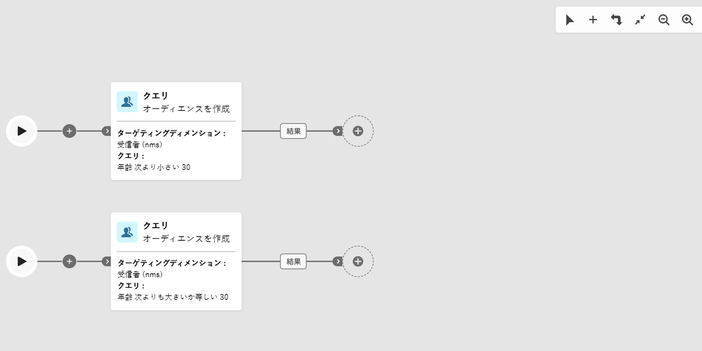
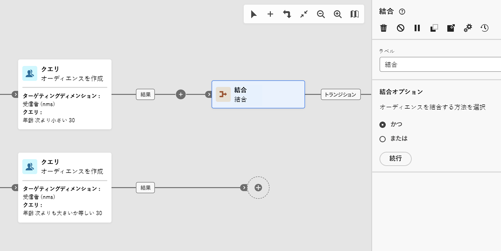
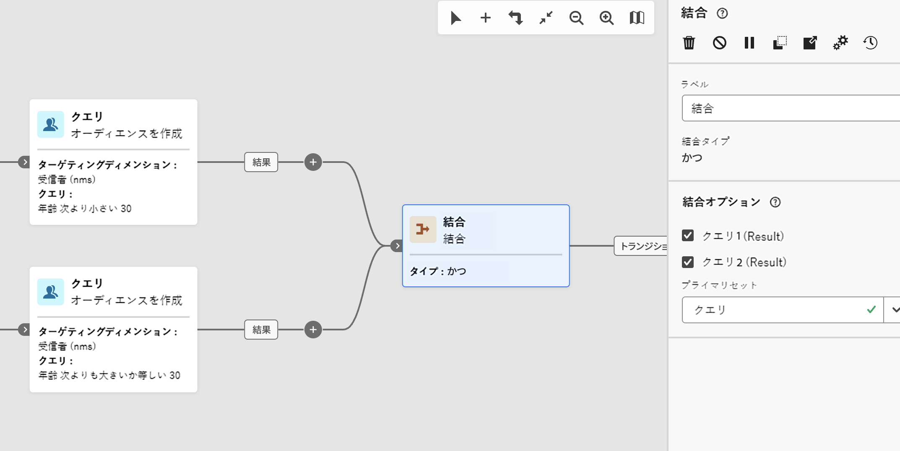
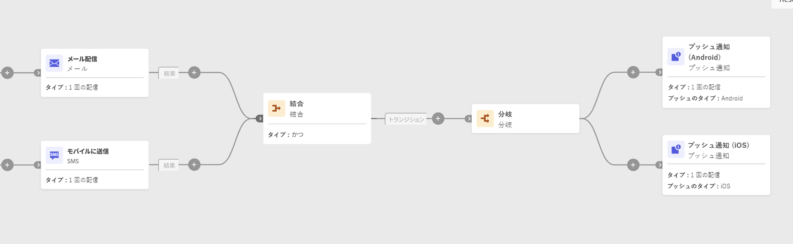

# 結合 {#join}

>[!CONTEXTUALHELP]
>id="acw_homepage_welcome_rn5"
>title="複数のワークフローブランチと結合アクティビティ"
>abstract="複数のブランチがサポートされるようになりました。 フォークを使用する代わりに、ツールバーの「分岐を追加」をクリックできます。 AND結合アクティビティも改善されました。 これは、ANDとORの結合オプションを選択できる汎用的な結合アクティビティです。"
>additional-url="https://experienceleague.adobe.com/docs/campaign-web/v8/release-notes/release-notes.html?lang=ja" text="リリースノートを参照してください"

>[!CONTEXTUALHELP]
>id="acw_orchestration_and-join"
>title="「AND 結合」アクティビティ"
>abstract="**AND 結合**&#x200B;アクティビティを使用すると、ワークフローの複数の実行分岐を同期できます。前のアクティビティがすべて完了するとトリガーされます。これにより、ワークフローを続行する前に、特定のアクティビティを確実に完了させるようにできます。"

>[!CONTEXTUALHELP]
>id="acw_orchestration_join"
>title="結合アクティビティ"
>abstract="**結合** アクティビティを使用すると、複数のインバウンドトランジションを結合できます。 すべてのインバウンドトランジションが完了（AND）した場合と、任意のインバウンドトランジションが完了した場合（OR）に続行するかどうかを選択します。"

**結合** アクティビティは&#x200B;**フロー制御** アクティビティです。 ワークフローの複数の実行ブランチを同期します。
インバウンドトランジションの評価方法を選択できます。

* **AND**：選択したすべてのインバウンドトランジションがアクティブ化された後にのみ続行されます。
* **または**：選択した1つのインバウンドトランジションがアクティブ化されるとすぐに続行します。

**AND**&#x200B;が選択されている場合、このアクティビティは、すべてのインバウンドトランジションがアクティブ化された後にのみ、アウトバウンドトランジションをトリガーします。 つまり、前のアクティビティがすべて完了すると、アクティブ化されます。これにより、ワークフローを続行する前に、特定のアクティビティを確実に完了させるようにできます。

**OR**&#x200B;が選択されると、選択したインバウンドトランジションのいずれかがアクティブ化されるとすぐに実行が続行されます。 すべてのブランチを待つわけではありません。

## 結合アクティビティの設定 {#join-configuration}

>[!CONTEXTUALHELP]
>id="acw_orchestration_and-join_merging"
>title="結合オプション"
>abstract="結合するアクティビティを選択します。**プライマリセット**&#x200B;ドロップダウンで、保持するインバウンドトランジションの母集団を選択します。"

次の手順に従って、**Join** アクティビティを設定します。

1. チャネルアクティビティなどの複数のアクティビティを追加して、少なくとも2つの異なる実行ブランチを形成します。 **分岐**&#x200B;を使用するか、**分岐を追加** （+） ツールバーボタンを使用して別の分岐を追加できます。 [&#x200B; アクティビティの調整](../orchestrate-activities.md#toolbar)を参照してください。

   

1. いずれかの分岐に&#x200B;**参加** アクティビティを追加します。

   

1. 結合オプションで、**AND**&#x200B;または&#x200B;**OR**&#x200B;を選択し、**続行**&#x200B;をクリックします。
1. 「**結合オプション**」セクションで、結合する以前のアクティビティをすべて確認します。
1. **プライマリセット**&#x200B;ドロップダウンで、保持するインバウンドトランジションの母集団を選択します。アウトバウンドトランジションには、インバウンドトランジションの母集団の 1 つのみを含むことができます。

   >[!NOTE]
   >
   >**プライマリセット** フィールドは、**AND**&#x200B;結合オプションでのみ使用できます。

   結合が設定されていることを示す

## 例 {#join-example}

次の例は、メールと SMS 配信を含む 2 つのワークフロー分岐を示しています。両方のインバウンドトランジションが有効になっている場合、**Join** アクティビティは&#x200B;**AND**&#x200B;に設定され、トリガーされます。 プッシュ通知は、両方の配信が完了した後にのみ送信されます。 結合オプションを&#x200B;**OR**&#x200B;に設定すると、最初のインバウンド配信アクティビティが完了するとすぐにプッシュメッセージが送信されます。

{zoomable="yes"}