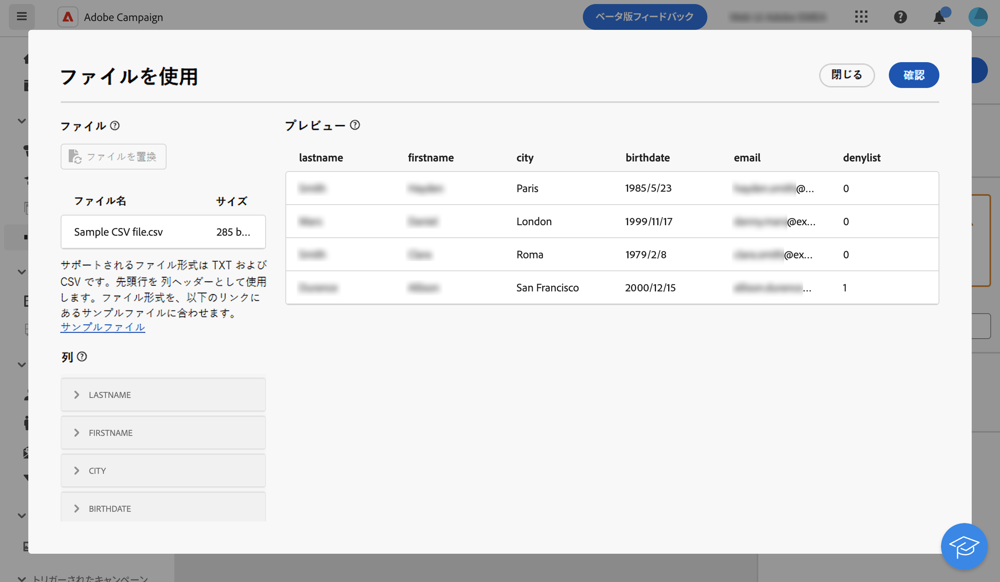

# ファイルを読み込み {#load-file}

>[!CONTEXTUALHELP]
>id="acw_orchestration_loadfile"
>title="ファイルを読み込みアクティビティ"
>abstract="The **ファイルを読み込み** アクティビティは **データ管理** アクティビティ。 このアクティビティを使用して、外部ファイルに保存されたデータを操作します。"

>[!CONTEXTUALHELP]
>id="acw_orchestration_loadfile_samplefile"
>title="サンプルファイル"
>abstract="サンプルファイル"

>[!CONTEXTUALHELP]
>id="acw_orchestration_loadfile_nameofthefile"
>title="ファイルの名前"
>abstract="ファイルの名前"

>[!CONTEXTUALHELP]
>id="acw_orchestration_loadfile_targetdb"
>title="ターゲットデータベース"
>abstract="ターゲットデータベース"

>[!CONTEXTUALHELP]
>id="acw_orchestration_loadfile_rejectmgt"
>title="「ファイルを読み込み」アクティビティの管理を却下"
>abstract="「ファイルを読み込み」アクティビティの管理を却下"

>[!CONTEXTUALHELP]
>id="acw_orchestration_loadfile_outboundtransition"
>title="管理のアウトバウンドトランジションを却下"
>abstract="管理のアウトバウンドトランジションを却下"

>[!CONTEXTUALHELP]
>id="acw_orchestration_loadfile_outboundtransition_reject"
>title="却下に対する管理のアウトバウンドトランジションを却下"
>abstract="却下に対する管理のアウトバウンドトランジションを却下"

>[!CONTEXTUALHELP]
>id="acw_orchestration_loadfile_formatting"
>title="「ファイルを読み込み」アクティビティの書式設定"
>abstract="「ファイルを読み込み」アクティビティの書式設定"

The **ファイルを読み込み** アクティビティは **データ管理** アクティビティ。 このアクティビティを使用して、外部ファイルに保存されたプロファイルとデータを操作します。 プロファイルとデータはデータベースに追加されませんが、入力ファイル内のすべてのフィールドは [パーソナライゼーション](../../personalization/gs-personalization.md)またはを使用して、プロファイルやその他のテーブルを更新します。

>[!NOTE]
>サポートされるファイル形式は、テキスト（TXT）とコンマ区切り値（CSV）です。

このアクティビティは、 [紐づけ](reconciliation.md) 「 」アクティビティを使用して、識別されていないデータを既存のリソースにリンクします。 例えば、 **ファイルを読み込み** アクティビティは、 **紐づけ** アクティビティを設定します。

## 「ファイル読み込み」アクティビティの設定 {#load-configuration}

次の手順に従って、 **ファイルを読み込み** アクティビティ：

1. 次をドラッグ&amp;ドロップ： **ファイルを読み込み** アクティビティをワークフローに追加します。 次をクリック： **ファイルから選択** 」ボタンをクリックします。

1. 使用するローカルファイルを選択します。形式は、次のように整列する必要があります。 [サンプルファイル](../../audience/file-audience.md#sample-file).

1. 画面の中央のセクションで、データがどのようにマッピングされるかをプレビューして確認します。

   

1. 以下を使用します。 **列** 」セクションを使用して、各列のデータタイプと幅を調整します。

1. Adobe Analytics の **書式設定** 「列」設定の下の「 」セクションで、データが正しくインポートされるように外部ファイルのフォーマット方法を指定します。

1. 設定が正しければ、「**確認**」をクリックします。

## 例{#load-example}

外部ファイルの読み込みで **紐づけ** アクティビティは、 [この節](reconciliation.md#example).