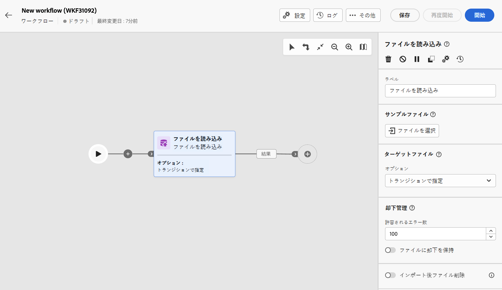
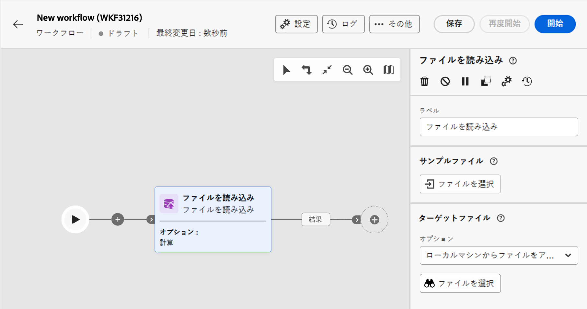
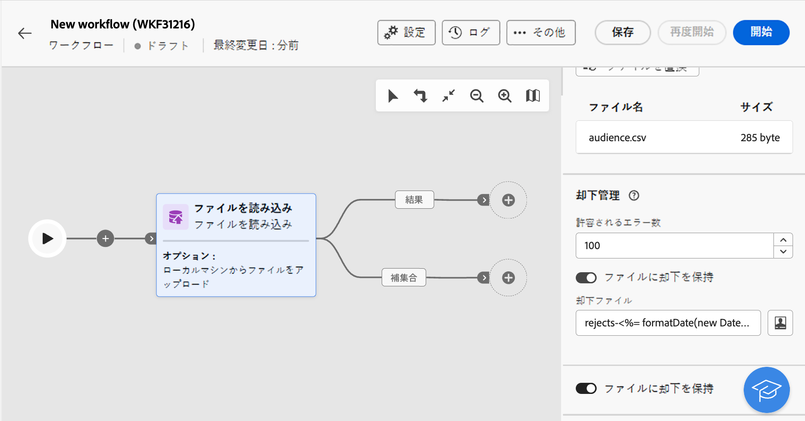

# ファイルを読み込み {#load-file}

>[!CONTEXTUALHELP]
>id="acw_orchestration_loadfile"
>title="ファイルを読み込みアクティビティ"
>abstract="「**ファイルを読み込み**」アクティビティは、「**データ管理**」アクティビティです。このアクティビティを使用して、外部ファイルに保存されるデータを操作します。プロファイルとデータはデータベースに追加されませんが、入力ファイル内のすべてのフィールドをパーソナライゼーションや、プロファイルまたは他のテーブルの更新に使用できます。 "

>[!CONTEXTUALHELP]
>id="acw_orchestration_loadfile_outboundtransition"
>title="管理のアウトバウンドトランジションを却下"
>abstract="管理のアウトバウンドトランジションを却下"

>[!CONTEXTUALHELP]
>id="acw_orchestration_loadfile_outboundtransition_reject"
>title="却下に対する管理のアウトバウンドトランジションを却下"
>abstract="却下に対する管理のアウトバウンドトランジションを却下"

「**ファイルを読み込み**」アクティビティは、「**データ管理**」アクティビティです。このアクティビティを使用して、外部ファイルに保存されるプロファイルとデータを操作します。プロファイルとデータはデータベースに追加されませんが、入力ファイル内のすべてのフィールドを[パーソナライゼーション](../../personalization/gs-personalization.md)や、プロファイルまたは他のテーブルの更新に使用できます。

>[!NOTE]
>サポートされるファイル形式は、テキスト（TXT）とコンマ区切り値（CSV）です。最大サイズが 50 MB のファイルを読み込むことができます。

このアクティビティを「[紐付け](reconciliation.md)」アクティビティと使用すると、識別されていないデータを既存のリソースにリンクできます。例えば、非標準のデータをデータベースにインポートする場合は、「**紐付け**」アクティビティの前に「**ファイルを読み込み**」アクティビティを配置できます。

## 「ファイルを読み込み」アクティビティの設定 {#load-configuration}

「**ファイルを読み込み**」アクティビティの設定には、2 つの手順があります。まず、サンプルファイルをアップロードして、目的のファイル構造を定義する必要があります。この処理が完了したら、データをインポートするファイルのインポート元を指定します。アクティビティを設定するには、次の手順に従います。

### サンプルファイルの設定 {#sample}

>[!CONTEXTUALHELP]
>id="acw_orchestration_loadfile_samplefile"
>title="サンプルファイル"
>abstract="サンプルファイルをアップロードして、目的のファイル構造を選択します。"

>[!CONTEXTUALHELP]
>id="acw_orchestration_loadfile_formatting"
>title="「ファイルを読み込み」アクティビティの書式設定"
>abstract="「**書式設定**」セクションで、データが正しくインポートされるようにファイルを書式設定する方法を指定します。"

>[!CONTEXTUALHELP]
>id="acw_orchestration_loadfile_valueremapping"
>title="「ファイルを読み込み」アクティビティの値の再マッピング"
>abstract="読み込んだファイルの特定の値を新しい値にマッピングするには、このオプションを使用します。例えば、列に「True」/「False」の値が含まれる場合、マッピングを追加して、それらの値を「0」/「1」の文字に自動的に置き換えることができます。"

目的のファイル構造の定義に使用するサンプルファイルを設定するには、次の手順に従います。

1. 「**ファイルを読み込み**」アクティビティをワークフローに追加します。

1. 目的のファイル構造を定義するために使用するサンプルファイルを選択します。これを行うには、「**[!UICONTROL サンプルファイル]**」セクションの「**ファイルを選択**」ボタンをクリックし、使用するローカルファイルを選択します。

   >[!NOTE]
   >
   >サンプルファイルのデータはアクティビティの設定に使用されますが、インポートはされません。データの少ないサンプルファイルを使用することをお勧めします。ファイル形式は、この[サンプルファイル](../../audience/file-audience.md#sample-file)と一致させる必要があります。

1. サンプルファイルのプレビューが表示され、最大 30 行が表示されます。

1. **[!UICONTROL ファイルタイプ]**&#x200B;ドロップダウンリストで、ファイルで区切り列を使用するか、固定幅の列を使用するかを指定します。

   

1. 区切り列ファイルタイプの場合は、「**列**」セクションを使用して、各列のプロパティを設定します。

   +++ファイル列に使用可能なオプション

   * **[!UICONTROL ラベル]**：列に表示するラベル。
   * **[!UICONTROL データタイプ]**：列に含まれるデータのタイプ。
   * **[!UICONTROL 幅]**（文字列データタイプ）：列に表示する最大文字数。
   * **[!UICONTROL データ変換]**（文字列データタイプ）：列に含まれる値に変換を適用します。
   * **[!UICONTROL スペースの管理]**（文字列データタイプ）：列に含まれるスペースの管理方法を指定します。
   * **[!UICONTROL 区切り記号]**（日付、時刻、整数、数値のデータタイプ）*：区切り記号として使用する文字を指定します。
   * **[!UICONTROL NULL を許可]**：列の空の値の管理方法を指定します。空の値が存在する場合、「Adobe Campaign のデフォルト」オプションはエラーをスローします。
   * **[!UICONTROL エラー処理]**（文字列データタイプ）：いずれかの行にエラーが発生した場合の動作を指定します。
   * **[!UICONTROL 値の再マッピング]**：このオプションを使用すると、特定の値を新しい値にマッピングできます。例えば、列に「True」/「False」の値が含まれる場合、マッピングを追加して、それらの値を「0」/「1」の文字に自動的に置き換えることができます。

+++

1. 「**書式設定**」セクションで、データが正しくインポートされるようにファイルの書式設定方法を指定します。

### アップロードするターゲットファイルを定義します。 {#target}

>[!CONTEXTUALHELP]
>id="acw_orchestration_loadfile_targetfile"
>title="「ファイルを読み込み」アクティビティのターゲットファイル"
>abstract="「**[!UICONTROL ターゲットファイル]**」セクションで、サーバーにアップロードするファイルの取得方法を指定します。"

>[!CONTEXTUALHELP]
>id="acw_orchestration_loadfile_nameofthefile"
>title="ファイルの名前"
>abstract="サーバーにアップロードするフィールドの名前を指定します。「**[!UICONTROL パーソナライゼーションダイアログを開く]**」アイコンをクリックして、イベント変数を含む式エディターを活用してファイル名を計算します。"

>[!CONTEXTUALHELP]
>id="acw_orchestration_loadfile_targetdb"
>title="ターゲットデータベース"
>abstract="クライアントコンソールで既に設定されている「**[!UICONTROL ファイルを読み込み]**」アクティビティにアクセスしている場合、アクティビティを設定して、ファイルを外部データベースにアップロードすると、追加の「**[!UICONTROL ターゲットデータベース]**」セクションが使用可能になります。"

>[!CONTEXTUALHELP]
>id="acw_orchestration_loadfile_command"
>title="「ファイルを読み込み」コマンド"
>abstract="前処理に任意のコマンドを許可するとセキュリティ上の問題があるので、セキュリティオプション XtkSecurity_Disable_Preproc を無効にして、コマンドの定義済みリストの使用を適用します。"

>[!CAUTION]
>
>ターゲットファイルを読み込む前に、サンプルファイルの書式設定に従っていることを確認します。ファイルの書式設定、列の構造、列の数に不一致があると、ワークフローの実行中にエラーが発生する場合があります。

アップロードするターゲットファイルを定義するには、次の手順に従います。

1. 「**[!UICONTROL ターゲットファイル]**」セクションで、サーバーにアップロードするファイルを取得する際に実行するアクションを指定します。

   * **[!UICONTROL ローカルマシンからファイルをアップロード]**：マシンからアップロードするファイルを選択します。

   * **[!UICONTROL トランジションで指定]**：「**[!UICONTROL ファイルを転送]**」など、以前のアクティビティからのインバウンドトランジションで指定されたファイルをアップロードします。

   * **[!UICONTROL ファイルを前処理]**：以前のトランジションで指定したファイルをアップロードし、「**[!UICONTROL 解凍]**」や「**[!UICONTROL 復号]**」などの前処理コマンドを適用します。

   * **[!UICONTROL 計算]**：「**[!UICONTROL ファイル名]**」フィールドに指定した名前のファイルをアップロードします。「**[!UICONTROL パーソナライゼーションダイアログを開く]**」アイコンをクリックして、イベント変数を含む式エディターを活用してファイル名を計算します。

   

   >[!NOTE]
   >
   >クライアントコンソールで既に設定されている「**[!UICONTROL ファイルを読み込み]**」アクティビティにアクセスしている場合、アクティビティを設定して、ファイルを外部データベースにアップロードすると、追加の「**[!UICONTROL ターゲットデータベース]**」セクションが表示されます。これにより、ファイルを Campaign サーバーにアップロードするか、外部データベースにアップロードするかを指定できます。

### 追加のオプション {#options}

>[!CONTEXTUALHELP]
>id="acw_orchestration_loadfile_rejectmgt"
>title="「ファイルを読み込み」アクティビティの却下管理"
>abstract="「**却下管理**」セクションでは、エラーが発生した場合のアクティビティの動作を指定します。許可するエラーの最大数を定義し、「**[!UICONTROL ファイルに却下を保持]**」オプションを切り替えて、インポート中に発生したエラーを含むファイルをサーバーにダウンロードできます。"

>[!CONTEXTUALHELP]
>id="acw_orchestration_loadfile_delete"
>title="読み込み後にファイルを削除"
>abstract="「**読み込み後にファイルを削除**」を切り替えて、ファイルの読み込み後に元のファイルをサーバーから削除します。"

1. 「**却下管理**」セクションで、エラーが発生した場合のアクティビティの動作を指定します。

   * 「**[!UICONTROL 許容されるエラー数]**」フィールドに、読み込むファイルの処理時に許可されるエラーの最大数を指定します。例えば、値が「20」に設定されている場合、ファイルの読み込み時に 20 を超えるエラーが発生すると、ワークフローの実行は失敗します。

   * ファイルの読み込み時に発生したエラーを保持するには、「**[!UICONTROL ファイルに却下を保持]**」オプションをオンに切り替え、「**[!UICONTROL 却下ファイル]**」フィールドにファイルの目的の名前を指定します。

     このオプションをアクティブにすると、「補集合」という名前の追加の出力トランジションがアクティビティの後に追加されます。インポート中に発生するエラーは、サーバー上の指定したファイルに保存されます。

1. ワークフローの実行後にアップロードしたファイルをサーバーから削除するには、「**[!UICONTROL インポート後にファイルを削除]**」オプションを切り替えます。

   

1. 設定が正しければ、「**確認**」をクリックします。

## 例 {#load-example}

「**紐付け**」アクティビティで使用する外部ファイルの読み込みのサンプルについては、[このセクション](reconciliation.md#reconciliation-example)を参照してください。
