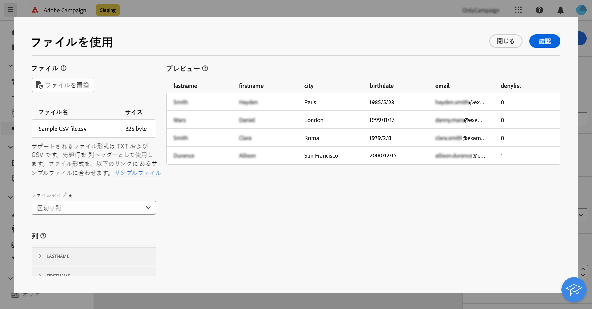

# ファイルを読み込み {#load-file}

>[!CONTEXTUALHELP]
>id="acw_orchestration_loadfile"
>title="ファイルを読み込みアクティビティ"
>abstract="「**ファイルを読み込み**」アクティビティは、「**データ管理**」アクティビティです。このアクティビティを使用すると、外部ファイルに保存されたデータを操作できます。 プロファイルとデータはデータベースに追加されませんが、入力ファイル内のすべてのフィールドをパーソナライゼーションに使用したり、プロファイルまたはその他のテーブルを更新したりできます。 "

>[!CONTEXTUALHELP]
>id="acw_orchestration_loadfile_outboundtransition"
>title="管理のアウトバウンドトランジションを却下"
>abstract="管理のアウトバウンドトランジションを却下"

>[!CONTEXTUALHELP]
>id="acw_orchestration_loadfile_outboundtransition_reject"
>title="却下に対する管理のアウトバウンドトランジションを却下"
>abstract="却下に対する管理のアウトバウンドトランジションを却下"

「**ファイルを読み込み**」アクティビティは、「**データ管理**」アクティビティです。このアクティビティを使用して、外部ファイルに保存されるプロファイルとデータを操作します。プロファイルとデータはデータベースに追加されませんが、入力ファイル内のすべてのフィールドを[パーソナライゼーション](../../personalization/gs-personalization.md)や、プロファイルまたは他のテーブルの更新に使用できます。

>[!NOTE]
>サポートされるファイル形式は、テキスト（TXT）とコンマ区切り値（CSV）です。最大サイズが 50 MB のファイルを読み込むことができます。

このアクティビティを「[紐付け](reconciliation.md)」アクティビティと使用すると、識別されていないデータを既存のリソースにリンクできます。例えば、非標準のデータをデータベースにインポートする場合は、「**紐付け**」アクティビティの前に「**ファイルを読み込み**」アクティビティを配置できます。

## 「ファイルを読み込み」アクティビティの設定 {#load-configuration}

この **ファイルをロード** アクティビティの設定には、2 つのステップがあります。 まず、サンプルファイルをアップロードして、目的のファイル構造を定義する必要があります。この操作が完了したら、データをインポートするファイルのオリジンを指定できます。 アクティビティを設定するには、次の手順に従います。

### サンプルファイルの設定 {#sample}

>[!AVAILABILITY]
>
>この機能は、限定提供（LA）で提供されています。 Campaign サーバー v8.7 で実行しているお客様に限定され、他の環境にデプロイすることはできません。

>[!CONTEXTUALHELP]
>id="acw_orchestration_loadfile_samplefile"
>title="サンプルファイル"
>abstract="サンプルファイルをアップロードして、目的のファイル構造を選択します。"

>[!CONTEXTUALHELP]
>id="acw_orchestration_loadfile_formatting"
>title="「ファイルを読み込み」アクティビティの書式設定"
>abstract="が含まれる **書式設定** セクションでは、データが正しくインポートされるようにファイルをフォーマットする方法を指定します。"

>[!CONTEXTUALHELP]
>id="acw_orchestration_loadfile_valueremapping"
>title="「ファイルを読み込み」アクティビティの値の再マッピング"
>abstract="読み込んだファイルの特定の値を新しい値にマッピングするには、このオプションを使用します。 例えば、列に「True」/「False」の値が含まれる場合、マッピングを追加して、それらの値を「0」/「1」の文字に自動的に置き換えることができます。"

想定されるファイル構造を定義するためのサンプルファイルを設定するには、次の手順に従います。

1. を追加 **ファイルをロード** ワークフローへのアクティビティ。

1. 目的のファイル構造を定義するために使用するサンプルファイルを選択します。 それには、 **ファイルを選択** のボタン **[!UICONTROL サンプルファイル]** を選択し、使用するローカルファイルを選択します。

   >[!NOTE]
   >
   >サンプルファイルのデータはアクティビティの設定に使用されますが、インポートされません。データがほとんど含まれていないサンプルファイルを使用することをお勧めします。 ファイル形式は、これに合わせる必要があります [サンプルファイル](../../audience/file-audience.md#sample-file).

1. サンプルファイルのプレビューが表示され、最大 30 行が表示されます。

1. が含まれる **[!UICONTROL ファイルタイプ]** ドロップダウンリストで、ファイルで区切り列を使用するか、固定幅の列を使用するかを指定します。

   

1. 区切り列のファイルタイプの場合は、を使用します **列** 各列のプロパティを設定する「」セクション。

   +++ファイル列に使用可能なオプション

   * **[!UICONTROL ラベル]**：列に表示するラベル。
   * **[!UICONTROL データタイプ]**：列に含まれるデータのタイプ。
   * **[!UICONTROL 幅]** （文字列データタイプ）：列に表示する最大文字数。
   * **[!UICONTROL データ変換]** （文字列データタイプ）：列に含まれる値に変換を適用します。
   * **[!UICONTROL 空白の管理]** （文字列データタイプ）：列に含まれるスペースの管理方法を指定します。
   * **[!UICONTROL 区切り]** （日付、時刻、整数、数値のデータ型）*：区切り文字として使用する文字を指定します。
   * **[!UICONTROL NULL を許可]**：列の空の値の管理方法を指定します。 空の値が存在する場合、「Adobe Campaignのデフォルト」オプションはエラーをスローします。
   * **[!UICONTROL エラー処理]** （文字列データタイプ）：いずれかの行にエラーが発生した場合の動作を指定します。
   * **[!UICONTROL 値の再マッピング]**：このオプションを使用すると、特定の値を新しい値にマッピングできます。 例えば、列に「True」/「False」の値が含まれる場合、マッピングを追加して、それらの値を「0」/「1」の文字に自動的に置き換えることができます。

+++

1. が含まれる **書式設定** セクションでは、データが正しくインポートされるようにファイルをフォーマットする方法を指定します。

### アップロードするターゲットファイルを定義 {#target}

>[!CONTEXTUALHELP]
>id="acw_orchestration_loadfile_targetfile"
>title="「ファイルを読み込み」アクティビティのターゲットファイル"
>abstract="が含まれる **[!UICONTROL ターゲットファイル]** セクションでは、サーバーにアップロードするファイルを取得する方法を指定します。"

>[!CONTEXTUALHELP]
>id="acw_orchestration_loadfile_nameofthefile"
>title="ファイルの名前"
>abstract="サーバーにアップロードするフィールドの名前を指定します。 「」をクリックします **[!UICONTROL パーソナライズ機能ダイアログを開く]** アイコン：式エディター（イベント変数を含む）を利用してファイル名を計算します。"

>[!CONTEXTUALHELP]
>id="acw_orchestration_loadfile_targetdb"
>title="ターゲットデータベース"
>abstract="アクセスする場合 **[!UICONTROL ファイルをロード]** クライアントコンソールで既に設定されているアクティビティ（追加） **[!UICONTROL ターゲットデータベース]** セクションは、ファイルを外部データベースにアップロードするようにアクティビティを設定した場合に使用できます。"

>[!CONTEXTUALHELP]
>id="acw_orchestration_loadfile_command"
>title="「ファイルを読み込み」コマンド"
>abstract="前処理に任意のコマンドを許可するとセキュリティ上の問題があるので、セキュリティオプション XtkSecurity_Disable_Preproc を無効にして、コマンドの定義済みリストの使用を適用します。"

>[!CAUTION]
>
>ターゲットファイルを読み込む前に、サンプルファイル形式に従っていることを確認します。 ファイル形式、列の構造、列の数に不一致があると、ワークフローの実行中にエラーが発生する場合があります。

1. が含まれる **[!UICONTROL ターゲットファイル]** セクションでは、サーバーにアップロードするファイルを取得する際に実行するアクションを指定します。

   * **[!UICONTROL ローカルマシンからファイルをアップロード]**：お使いのマシンからアップロードするファイルを選択します。

   * **[!UICONTROL トランジションで指定]**：次のような以前のアクティビティから今後のインバウンドトランジションで指定されたファイルをアップロードします **[!UICONTROL ファイルを転送]**.

   * **[!UICONTROL ファイルを前処理]**：前のトランジションで指定したファイルをアップロードし、次のような前処理コマンドを適用します **[!UICONTROL 解凍]** または **[!UICONTROL 復号]**.

   * **[!UICONTROL 計算日時]**：で名前が指定されているファイルをアップロードします **[!UICONTROL ファイル名]** フィールド。 「」をクリックします **[!UICONTROL パーソナライズ機能ダイアログを開く]** アイコン：式エディター（イベント変数を含む）を利用してファイル名を計算します。

   

   >[!NOTE]
   >
   >アクセスする場合 **[!UICONTROL ファイルをロード]** クライアントコンソールで既に設定されているアクティビティ（追加） **[!UICONTROL ターゲットデータベース]** 外部データベースにファイルをアップロードするようにアクティビティを設定した場合、「」セクションが表示されます。 これにより、ファイルを Campaign サーバーにアップロードするか、外部データベースにアップロードするかを指定できます。

### 追加のオプション {#options}

>[!CONTEXTUALHELP]
>id="acw_orchestration_loadfile_rejectmgt"
>title="「ファイルを読み込み」アクティビティの却下管理"
>abstract="が含まれる **却下管理** セクションで、エラーが発生した場合のアクティビティの動作を指定します。 許可するエラーの最大数を定義し、を切り替えることができます **[!UICONTROL ファイルに却下を保持]** 読み込み中に発生したエラーを含むファイルをサーバーにダウンロードするオプション。"

>[!CONTEXTUALHELP]
>id="acw_orchestration_loadfile_delete"
>title="読み込み後にファイルを削除"
>abstract="「**読み込み後にファイルを削除**」を切り替えて、ファイルの読み込み後に元のファイルをサーバーから削除します。"

>[!AVAILABILITY]
>
>これらのオプションは、限定提供（LA）です。 Campaign サーバー v8.7 で実行されているお客様に制限され、他の環境にデプロイすることはできません。

1. が含まれる **却下管理** セクションで、エラーが発生した場合のアクティビティの動作を指定します。

   * が含まれる **[!UICONTROL デレ]** フィールド。読み込むファイルを処理する際に許可されるエラーの最大数を指定します。 例えば、値が「20」に設定されている場合、ファイルの読み込み時に 20 を超えるエラーがあると、ワークフローの実行は失敗します。

   * ファイルの読み込み時に発生したエラーを保持するには、 **[!UICONTROL ファイルに却下を保持]** オプションをオンにして、にあるファイルの名前を指定します。 **[!UICONTROL 拒否ファイル]** フィールド。

     このオプションを有効にすると、「補集合」という名前の出力トランジションがアクティビティの後に追加されます。 読み込み中に発生するエラーは、サーバー上の指定したファイルに保存されます。

1. ワークフローの実行後に、アップロードしたファイルをサーバーから削除するには、 **[!UICONTROL インポート後にファイルを削除]** オプション。

   

1. 設定が正しければ、「**確認**」をクリックします。

## 例 {#load-example}

「**紐付け**」アクティビティで使用する外部ファイルの読み込みのサンプルについては、[このセクション](reconciliation.md#reconciliation-example)を参照してください。
