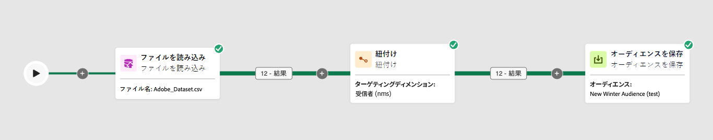
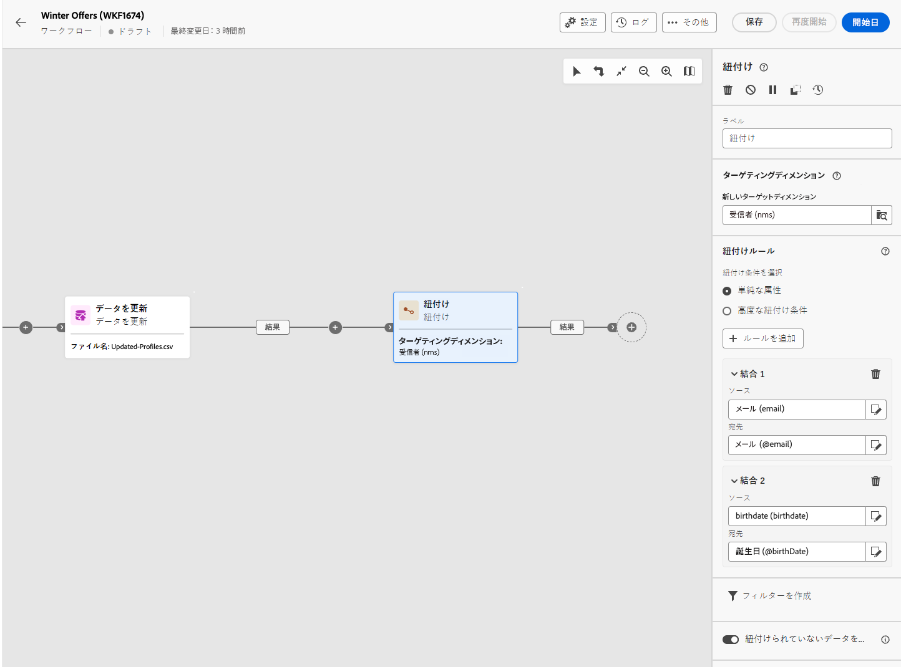

# 紐付け {#reconciliation}

>[!CONTEXTUALHELP]
>id="acw_orchestration_reconciliation"
>title="紐付けアクティビティ"
>abstract="The **紐づけ** アクティビティは **ターゲット設定** 「 」アクティビティを使用して、識別されていないデータを既存の Campaign データにリンクできます。 例えば、 **紐づけ** アクティビティは、 **オーディエンスを読み込み** 「 」アクティビティを使用して、標準以外のデータをデータベースにインポートします。 この場合、 **紐づけ** 「 」アクティビティを使用すると、Adobe Campaignデータベース内のデータと外部テーブル内のデータとの間のリンクを定義できます。"


>[!CONTEXTUALHELP]
>id="acw_orchestration_reconciliation_field"
>title="紐付け選択フィールド"
>abstract="紐付け選択フィールド"


>[!CONTEXTUALHELP]
>id="acw_orchestration_reconciliation_condition"
>title="紐付け作成条件"
>abstract="紐付け作成条件"

>[!CONTEXTUALHELP]
>id="acw_orchestration_reconciliation_complement"
>title="紐付けで補集合を生成"
>abstract="紐付けで補集合を生成"


The **紐づけ** アクティビティは **ターゲット設定** 「 」アクティビティを使用して、識別されていないデータを既存のリソースにリンクできます。 例えば、 **紐づけ** アクティビティは、 **オーディエンスを読み込み** 「 」アクティビティを使用して、標準以外のデータをデータベースにインポートします。 この場合、 **紐づけ** 「 」アクティビティを使用すると、Adobe Campaignデータベースのデータと作業用テーブルのデータとの間のリンクを定義できます。


## ベストプラクティス {#reconciliation-best-practices}

また、 **エンリッチメント** 「 」アクティビティでは、ワークフローで処理する追加のデータを定義できます ( **エンリッチメント** 「 」アクティビティを使用して、複数のセットからのデータを組み合わせたり、一時的なリソースへのリンクを作成したりできます。 **紐づけ** 「 」アクティビティを使用すると、識別されていないデータを既存のリソースにリンクできます。

>[!NOTE]
>紐付け操作は、リンクされたディメンションのデータが既にデータベースに存在することを意味します。  例えば、購入された商品、購入時間、商品を購入したクライアントなどを示す購入ファイルをインポートする場合、商品とクライアントはデータベースに既に存在している必要があります。
>

## 紐付けアクティビティの設定 {#reconciliation-configuration}


>[!CONTEXTUALHELP]
>id="acw_orchestration_reconciliation_targeting"
>title="ターゲティングディメンション"
>abstract="新しいターゲティングディメンションを選択します。 ディメンションを使用して、ターゲット母集団（受信者、アプリの購読者、演算子、購読者など）を定義できます。 デフォルトでは、現在のターゲティングディメンションが選択されています。"

>[!CONTEXTUALHELP]
>id="acw_orchestration_reconciliation_rules"
>title="紐付けルール"
>abstract="重複排除に使用する紐付けフィールドを選択します。 1 つまたは複数の紐付け条件を使用できます。"

>[!CONTEXTUALHELP]
>id="acw_orchestration_reconciliation_targeting_selection"
>title="ターゲティングディメンションの選択"
>abstract="紐付けするインバウンドデータのターゲティングディメンションを選択します。"
>additional-url="https://experienceleague.adobe.com/docs/campaign-web/v8/audiences/about-recipients.html?lang=en#targeting-dimensions" text="ターゲティングディメンション"

>[!CONTEXTUALHELP]
>id="acw_orchestration_keep_unreconciled_data"
>title="紐付けられていないデータを保持"
>abstract="デフォルトでは、紐付けされていないデータは、アウトバウンドトランジションに保持され、将来の使用のために作業用テーブルで使用できます。 紐付けされていないデータを削除するには、 **紐付けされていないデータを保持** オプション。"


>[!CONTEXTUALHELP]
>id="acw_orchestration_reconciliation_attribute"
>title="紐付け属性"
>abstract="データの紐付けに使用する属性を選択し、「確認」をクリックします。"

次の手順に従って、 **紐づけ** アクティビティ：

1. 次をドラッグ&amp;ドロップ： **紐づけ** アクティビティをワークフローに追加します。 このアクティビティは、Adobe Campaignから直接ターゲティングディメンションを受け取らない母集団を含むトランジションの後に追加する必要があります。

1. 新しいターゲティングディメンションを選択します。 ディメンションを使用して、ターゲット母集団（受信者、アプリの購読者、演算子、購読者など）を定義できます。 ターゲティングディメンションの詳細については、 [このページ](../../audience/about-recipients.md#targeting-dimensions).

1. 重複排除に使用する紐付けフィールドを選択します。 1 つまたは複数の紐付け条件を使用できます。

   1. 属性を使用してデータを紐付けするには、 **単純な属性** オプション。 The **ソース** 「 」フィールドに、紐付けされる入力トランジションで使用可能なフィールドが表示されます。 The **宛先** 「 」フィールドは、選択したターゲティングディメンションのフィールドに対応します。 ソースと宛先が等しい場合に、データが紐付けされます。 例えば、 **電子メール** フィールドの重複を除外して、E メールアドレスに基づいてプロファイルの重複を排除します。

      別の紐付け条件を追加するには、 **ルールを追加** 」ボタンをクリックします。 複数の結合条件が指定される場合、データを相互にリンクさせるには、すべての条件が検証される必要があります。

      

   1. 他の属性を使用してデータを紐付けするには、 **詳細な紐付け条件** オプション。 その後、クエリモデラーを使用して独自の紐付け条件を作成できます。 でクエリモデラーを使用する方法を説明します。 [この節](../../query/query-modeler-overview.md).

1. を使用して、紐付けするデータをフィルタリングできます。 **フィルターを作成** 」ボタンをクリックします。 これにより、 [クエリモデラー](../../query/query-modeler-overview.md).

デフォルトでは、紐付けされていないデータは、アウトバウンドトランジションに保持され、将来の使用のために作業用テーブルで使用できます。 紐付けされていないデータを削除するには、 **紐付けされていないデータを保持** オプション。

## 例 {#reconciliation-example}

次の例は、新しいクライアントを含むインポート済みのファイルから直接プロファイルのオーディエンスを作成するワークフローを示しています。このワークフローは、次のアクティビティで構成されています。

ワークフローは、次のように設計されています。




このワークフローは、次のアクティビティを使用して構築されます。

* 「[ファイル読み込み](load-file.md)」アクティビティは、外部ツールから抽出されたプロファイルデータが含まれるファイルをアップロードします。

  次に例を示します。

  ```
  lastname;firstname;email;birthdate;
  JACKMAN;Megan;megan.jackman@testmail.com;07/08/1975;
  PHILLIPS;Edward;phillips@testmail.com;09/03/1986;
  WEAVER;Justin;justin_w@testmail.com;11/15/1990;
  MARTIN;Babe;babeth_martin@testmail.net;11/25/1964;
  REESE;Richard;rreese@testmail.com;02/08/1987;
  ```

* A **紐づけ** を使用して、受信データをプロファイルとして識別する「 」アクティビティ **電子メール** および **生年月日** フィールドを紐付け条件として使用します。

  

* A [オーディエンスを保存](save-audience.md) 「 」アクティビティを選択し、これらの更新に基づいて新しいオーディエンスを作成します。 また、 **オーディエンスを保存** アクティビティ **終了** 特定のオーディエンスを作成または更新する必要がない場合のアクティビティ。 受信者プロファイルは、ワークフローの実行時にいつでも更新されます。


## 互換性 {#reconciliation-compat}

The **紐づけ** アクティビティがクライアントコンソールに存在しません。 すべて **エンリッチメント** 紐付けオプションを有効にしてクライアントコンソールで作成されたアクティビティは、 **紐づけ** アクティビティを参照してください。
