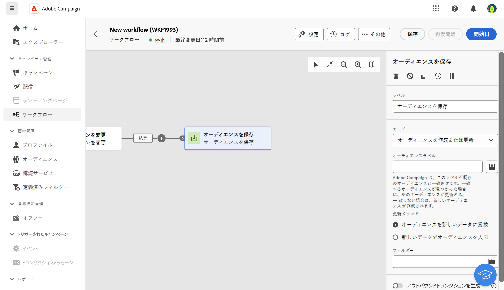

# オーディエンスを保存 {#save-audience}

<!--
>[!CONTEXTUALHELP]
>id="acw_orchestration_saveaudience_activity"
>title="Save an audience"
>abstract="Use this activity to save the workflow audience."
-->

**オーディエンスを保存**&#x200B;アクティビティは、**ターゲティング**&#x200B;アクティビティです。このアクティビティを使用すると、既存のオーディエンスを更新したり、ワークフローの上流で計算された母集団から新しいオーディエンスを作成することができます。作成したオーディエンスはアプリケーションオーディエンスのリストに追加され、**オーディエンス**&#x200B;メニューから使用できるようになります。

このアクティビティは基本的に、同じワークフローで計算された母集団グループを再利用可能なオーディエンスに変換することで、このグループを維持するために使用されます。**オーディエンスを作成**&#x200B;アクティビティや&#x200B;**結合**&#x200B;アクティビティなどの他のターゲティングアクティビティに接続します。

## オーディエンスを保存アクティビティの設定{#save-audience-configuration}

**オーディエンスを保存**&#x200B;アクティビティを設定するには、次の手順に従います。

1. **オーディエンスを保存**&#x200B;アクティビティをワークフローに追加します。

1. **モード**&#x200B;ドロップダウンで、実行するアクションを選択します。

   * **既存のオーディエンスを作成または更新**：**オーディエンスラベル**&#x200B;を定義します。オーディエンスが既に存在する場合は更新されます。存在しない場合は新しいオーディエンスが作成されます。

   * **既存のオーディエンスを更新**：既存のオーディエンスのリストから更新する&#x200B;**オーディエンス**&#x200B;を選択します。

1. 既存のオーディエンスに適用する&#x200B;**更新モード**&#x200B;を選択します。

   * **オーディエンスコンテンツを新しいデータに置換**：すべてのオーディエンスコンテンツを置き換えます。古いデータは失われます。「オーディエンスの保存」アクティビティのインバウンドトランジションからのデータのみが保持されます。このオプションを選択すると、オーディエンスの種類と、更新されたオーディエンスのターゲティングディメンションが削除されます。

   * **新しいデータでオーディエンスを入力**：古いオーディエンスコンテンツは保持され、オーディエンスを保存アクティビティのインバウンドトランジションのデータが追加されます。

1. **オーディエンスを保存**&#x200B;アクティビティの後にトランジションを追加する場合は、「**アウトバウンドトランジションを生成**」オプションをオンにします。

保存したオーディエンスの内容は、そのオーディエンスの詳細表示で利用できます。詳細表示は&#x200B;**オーディエンス**&#x200B;メニューからアクセスできます。この表示で使用できる列は、ワークフローの&#x200B;**オーディエンスを保存**&#x200B;アクティビティのインバウンドトランジションの列に対応します。

## 例{#save-audience-example}

次の例は、ターゲティングからの単純なオーディエンスの更新を示しています。ワークフローを月に 1 回実行するためのスケジューラーが追加されます。クエリを使用すると、使用可能な複数のアプリケーションサービスに登録されているすべてのプロファイルを回復できます。**オーディエンスを保存**&#x200B;アクティビティでは、前回のワークフロー実行以降にサービスから登録解除されたプロファイルを削除し、新たに登録されたプロファイルを追加することで、オーディエンスが更新されます。

