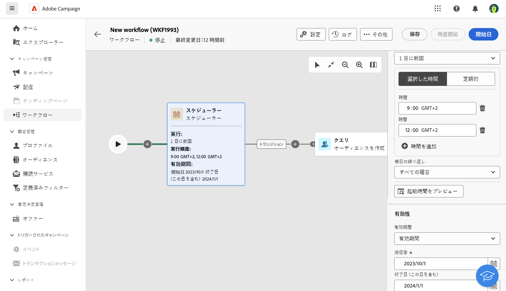

# スケジューラー {#scheduler}

>[!CONTEXTUALHELP]
>id="acw_orchestration_scheduler"
>title="「スケジューラー」アクティビティ"
>abstract="**スケジューラー**&#x200B;アクティビティを使用すると、ワークフローの開始日時をスケジュールできます。このアクティビティは、予約済みの開始とみなされます。ワークフローの最初のアクティビティとしてのみ使用できます。"

**スケジューラー**&#x200B;アクティビティは&#x200B;**フロー制御**&#x200B;アクティビティです。ワークフローの開始日時をスケジュールできます。このアクティビティは、予約済みの開始とみなされます。ワークフローの最初のアクティビティとしてのみ使用できます。

## ベストプラクティス {#scheduler-best-practices}

* システム全体のパフォーマンスが落ちたり、データベースにブロックが作成されたりする可能性があるので、ワークフローの実行スケジュールは 15 分以上の間隔を空けてください。
* ワークフローで 1 回限りの配信を送信するには、スケジューラーアクティビティを追加して、**1 回**&#x200B;だけ実行するように設定します。配信の設定で&#x200B;**スケジュール**&#x200B;を定義します。
* ワークフローで繰り返し配信を送信するには、**スケジューラー**&#x200B;アクティビティを使用して実行頻度を設定します。繰り返し配信アクティビティでは、スケジュールを定義できません。

## 「スケジューラー」アクティビティの設定 {#scheduler-configuration}

>[!CONTEXTUALHELP]
>id="acw_orchestration_schedule_validity"
>title="スケジューラーの有効性"
>abstract="スケジューラーの有効期間を定義できます。永続的（デフォルト）にすることも、特定の日付まで有効にすることもできます。"

>[!CONTEXTUALHELP]
>id="acw_orchestration_schedule_options"
>title="スケジューラーオプション"
>abstract="スケジューラーの頻度を定義します。特定の時点で、1 日、1 週間、1 か月に 1 回または数回実行できます。"

**スケジューラー**&#x200B;アクティビティを設定するには、次の手順に従います。

1. **スケジューラー**&#x200B;アクティビティをワークフローに追加します。

1. **実行頻度**&#x200B;を設定します。

   * **1 回**：ワークフローは 1 回実行されます。
   * **毎日**：ワークフローは、特定の時間（1 日 1 回）に実行されます。
   * **1 日に数回**：ワークフローは、1 日に数回定期的に実行されます。特定の時間を指定するか、定期的に実行されるように設定します。
   * **毎週**：ワークフローは、指定された日時（週に 1 回または数回）に実行されます。
   * **毎月**：ワークフローは、指定された日時（月に 1 回または数回）に実行されます。ワークフローを実行する必要がある月を選択します。月の第 2 火曜日など、月の特定の曜日に実行を設定することもできます。

1. 選択した頻度に従って実行の詳細を定義します。詳細フィールドは、指定する頻度（時間、繰り返し頻度、指定した日数および同様のオプション）に応じて異なる場合があります。

1. 「**起動時間をプレビュー**」をクリックして、ワークフローの次の 10 回の実行スケジュールを確認します。

1. スケジューラーの有効期間を定義します。

   * **永続的（無期限）**：ワークフローは、指定された頻度に従って実行され、時間枠や反復回数に制限はありません。
   * **有効期間**：ワークフローは、指定された頻度に従って、指定された日付まで実行されます。開始日と終了日を指定します。

>[!NOTE]
>ワークフローをすぐに開始する場合は、スケジューラーの上部のアクションバーにある「**保留中のタスクを実行**」をクリックします。このボタンは、ワークフローを開始した場合にのみ使用できます。

## 例 {#scheduler-example}

次の例では、2023年10月1日から 2024年1月1日まで毎日、ワークフローが 1 日に数回（午前 9 時と午前 12 時に）実行されるようにアクティビティが設定されています。

