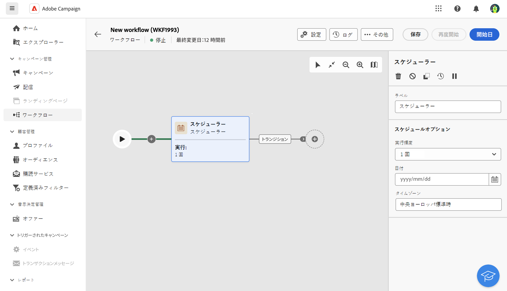

# スケジューラー {#scheduler}

<!--
>[!CONTEXTUALHELP]
>id="acw_orchestration_schedule_options"
>title="Scheduler activity"
>abstract="The Scheduler activity allows you..."
-->

The **スケジューラ** アクティビティは **フロー制御** アクティビティ。 ワークフローを開始するタイミングを指定できます。 このアクティビティは、予定されている開始と見なされます。 ワークフローの最初のアクティビティとしてのみ使用できます。

## ベストプラクティス

システム全体のパフォーマンスが落ちたり、データベースにブロックが作成されたりする可能性があるので、ワークフローの実行スケジュールは 15 分以上の間隔を空けてください。

## 設定

次の手順に従って、 **スケジューラ** アクティビティ：

1. を追加します。 **スケジューラ** アクティビティをワークフローに追加します。

   

1. を設定します。 **実行頻度**:

   * **1 回**：ワークフローは 1 回実行されます。

   * **毎日**：ワークフローは、特定の時間（1 日 1 回）に実行されます。

   * **1 日に数回：** ワークフローは、1 日に数回定期的に実行されます。 特定の時間を指定するか、定期的に実行されるように設定できます。

   * **毎週**：ワークフローは、指定された日時（週に 1 回または数回）に実行されます。

   * **毎月**：ワークフローは、指定された日時（月に 1 回または数回）に実行されます。 ワークフローを実行する月を選択できます。また、月の第 2 火曜日など、月の指定された曜日に実行を設定することもできます。

1. 選択した頻度に従って実行の詳細を定義します。詳細フィールドは、指定する頻度（時間、繰り返し頻度、指定した日数など）に応じて異なります。

1. クリック **起動時間をプレビュー** を使用して、ワークフローの次の 10 回の実行スケジュールを確認します。

1. スケジューラーの有効期間を定義します。

   * **永続（有効期限なし）**：ワークフローは、指定された頻度に従って実行され、時間枠や反復回数に制限はありません。

   * **有効期間**：ワークフローは、指定された頻度に従って、指定された日付まで実行されます。 開始日と終了日を指定する必要があります。

## 例

次の例では、「 」アクティビティは、2023 年 10 月 1 日から 2024 年 1 月 1 日までの週の各曜日の午前 9 時と午前 12 時に、1 日に何回かワークフローを開始するように設定されています。

