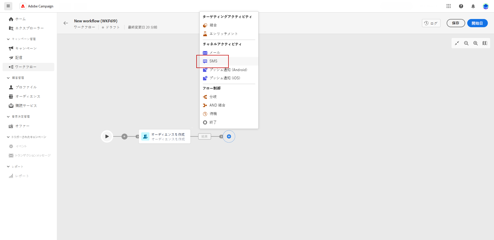

# SMS {#sms}

この **SMS** 「 」アクティビティは、ワークフロー内で SMS メッセージを送信する機能を提供します。 同じワークフロー内で決定された特定のターゲットに対する SMS 送信を自動化できます。

SMS の受信者を定義するには、「オーディエンスをビルド」アクティビティを使用して、ワークフロー内の「 SMS 配信」アクティビティの前に SMS を設定します。 詳細情報。

1. 新しいワークフローを作成および設定した後、「オーディエンスを作成」アクティビティを追加して既存のオーディエンスを選択するか、ルールビルダーを使用して独自のクエリを定義します。

1. ワークフローに SMS チャネルアクティビティを追加します。

   
<!--
1. Select the Type of delivery:

    * Single delivery: Choose this option if you want the SMS to be sent only once. You have the flexibility to choose whether or not to include an outbound transition from this activity.

    * Recurring delivery: Choose this option if you want the SMS to be sent multiple times based on a defined frequency. The frequency can be configured using a Scheduler activity, allowing you to schedule the SMS to be sent at regular intervals.
-->

1. アクティビティを選択します。 配信メニューから、この配信に使用するテンプレートを選択します。 テンプレートの詳細情報

1. 「配信を作成」をクリックして、SMS 配信を設定します。 SMS 配信について詳しくは、このページを参照してください。

1. 配信の送信準備が整ったら、ワークフローに戻り、「開始」をクリックしてワークフローを起動します。

1. デフォルトでは、配信ワークフローを開始すると、トリガーは直ちに送信されず、メッセージの準備ステージに移動します。

   SMS アクティビティの詳細設定メニューで「確認して送信」をクリックし、送信を確定します。

1. SMS 配信ダッシュボードで、「送信」をクリックします。
