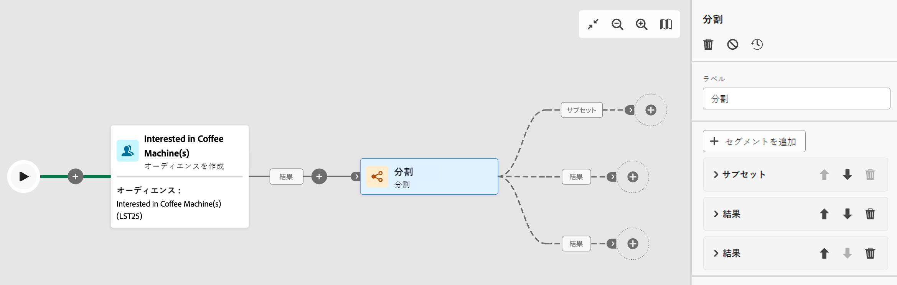
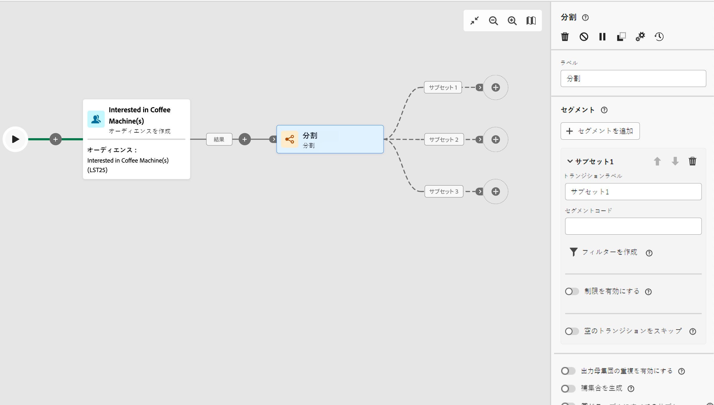

# 分割 {#split}

>[!CONTEXTUALHELP]
>id="acw_orchestration_split"
>title="分割アクティビティ"
>abstract="**分割**&#x200B;アクティビティを使用すると、フィルタリングルールや母集団サイズなどの様々な選択条件に基づいて、流入母集団を複数のサブセットにセグメント化できます。"

**分割**&#x200B;アクティビティは、フィルタリングルールや母集団サイズなどの様々な選択条件に基づいて、流入母集団を複数のサブセットにセグメント化できる&#x200B;**ターゲティング**&#x200B;アクティビティです。

## 分割アクティビティの設定 {#split-configuration}

>[!CONTEXTUALHELP]
>id="acw_orchestration_split_segments"
>title="分割アクティビティのセグメント"
>abstract="入力母集団をセグメント化するのに必要な数のサブセットを追加します。  「**分割**」アクティビティを実行すると、母集団はアクティビティに追加された順序で様々なサブセットに分割されます。ワークフローを開始する前に、矢印ボタンを使用して、必要に応じてサブセットを順番に並べ替えておきます。"

>[!CONTEXTUALHELP]
>id="acw_orchestration_split_filter"
>title="分割アクティビティのフィルター"
>abstract="サブセットにフィルター条件を適用するには、 **[!UICONTROL フィルターを作成]** をクリックし、クエリモデラーを使用して目的のフィルタールールを設定します。 例えば、データベースにメールアドレスが存在する入力母集団のプロファイルを含めます。"
>additional-url="https://experienceleague.adobe.com/en/docs/campaign-web/v8/query-database/query-modeler-overview" text="クエリモデラーの操作"

>[!CONTEXTUALHELP]
>id="acw_orchestration_split_limit"
>title="分割アクティビティの制限"
>abstract="サブセットで選択するプロファイル数を制限するには、「**[!UICONTROL 制限を有効にする]**」オプションの切替スイッチをオンにし、含める母集団の数または割合を指定します。"

>[!CONTEXTUALHELP]
>id="acw_orchestration_split_sorting"
>title="分割アクティビティの並べ替え"
>abstract="サブセットの母集団制限を設定する場合、特定のプロファイル属性に基づいて、選択したプロファイルを昇順または降順にランク付けできます。これを行うには、「**並べ替えを有効にする**」オプションの切替スイッチをオンにします。例えば、購入金額が最も高い上位 50 のプロファイルのみを含むようにサブセットを制限できます。"

>[!CONTEXTUALHELP]
>id="acw_orchestration_split_complement"
>title="分割で補集合を生成"
>abstract="すべてのサブセットを設定したら、どのサブセットにも一致しなかった残りの母集団を選択し、追加のアウトバウンドトランジションに含めることができます。これを行うには、「**補集合を生成**」オプションの切替スイッチをオンにします。"

>[!CONTEXTUALHELP]
>id="acw_orchestration_split_generatesubsets"
>title="同じテーブルにすべてのサブセットを生成"
>abstract="このオプションの切替スイッチをオンにすると、すべてのサブセットが 1 つの出力トランジションにグループ化されます。"

**分割**&#x200B;アクティビティを設定するには、次の手順に従います。

1. **分割**&#x200B;アクティビティをワークフローに追加します。

1. アクティビティ設定パネルが開き、デフォルトのサブセットが表示されます。「**セグメントを追加**」ボタンをクリックして、入力母集団をセグメント化する必要な数のサブセットを追加します。

   

   >[!IMPORTANT]
   >
   >「**分割**」アクティビティを実行すると、母集団はアクティビティに追加された順序で様々なサブセットに分割されます。例えば、最初のサブセットが初期母集団の 70％を回復した場合、次に追加されたサブセットの選択条件は残りの 30％にのみ適用されます。
   >
   >ワークフローを開始する前に、必要に応じてサブセットを順番に並べ替えておきます。これを行うには、矢印ボタンを使用して、サブセットの位置を変更します。

1. サブセットを追加したら、アクティビティにはサブセットと同数の出力トランジションが表示されます。ワークフローキャンバスで簡単に識別できるように、各サブセットのラベルを変更することを強くお勧めします。

1. 各サブセットで入力母集団をフィルタリングする方法を設定します。これを行うには、次の手順に従います。

   1. サブセットを開いて、そのプロパティを表示します。

   1. サブセットにフィルター条件を適用するには、 **[!UICONTROL フィルターを作成]** をクリックし、クエリモデラーを使用して目的のフィルタールールを設定します。 例えば、データベースに E メールアドレスが存在する受信母集団のプロファイルを含めます。 [詳しくは、クエリモデラーの操作方法を参照してください](../../query/query-modeler-overview.md)

   1. サブセットで選択するプロファイル数を制限するには、「**[!UICONTROL 制限を有効にする]**」オプションの切替スイッチをオンにし、含める母集団の数または割合を指定します。

      

      >[!NOTE]
      >
      >サブセットの母集団制限を設定する場合、特定のプロファイル属性に基づいて、選択したプロファイルを昇順または降順にランク付けできます。これを行うには、「**[!UICONTROL 並べ替えを有効にする]**」オプションの切替スイッチをオンにします。例えば、購入金額が最も高い上位 50 のプロファイルのみを含むようにサブセットを制限できます。

1. すべてのサブセットを設定したら、どのサブセットにも一致しなかった残りの母集団を選択し、追加のアウトバウンドトランジションに含めることができます。これを行うには、「**[!UICONTROL 補集合を生成]**」オプションの切替スイッチをオンにします。

   

   >[!NOTE]
   >
   >The **[!UICONTROL 同じテーブルにすべてのサブセットを生成]** 「 」オプションを使用すると、すべてのサブセットを 1 つの出力トランジションにグループ化できます。

これでアクティビティが設定され、ワークフローの実行時に、母集団はアクティビティに追加された順序で、様々なサブセットにセグメント化されます。

## 例{#split-example}

次の例では、**[!UICONTROL 分割]**&#x200B;アクティビティを使用して、使用する通信チャネルに基づいて、オーディエンスを個別のサブセットにセグメント化します。

* **サブセット 1 「プッシュ」**：このサブセットは、モバイルアプリケーションをインストールしたすべてのプロファイルで構成されます。
* **サブセット 2 「sms」**：携帯電話ユーザー：サブセット 1 に該当しなかった残りの母集団については、サブセット 2 がフィルタールールを適用して、データベース内の携帯電話を含むプロファイルを選択します。
* **補集合トランジション**：このトランジションは、サブセット 1 またはサブセット 2 に一致しなかった残りのプロファイルをすべてキャプチャします。特に、モバイルアプリをインストールしていないユーザーや携帯電話番号を登録していないユーザーなど、モバイルアプリケーションをインストールしていないか、携帯電話を持っていないプロファイルが含まれます。

