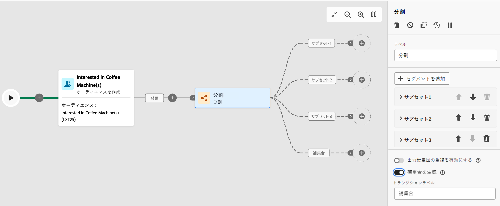

# 分割 {#split}

>[!CONTEXTUALHELP]
>id="acw_orchestration_split"
>title="分割アクティビティ"
>abstract="The **分割** 「 」アクティビティを使用すると、フィルタールールや母集団のサイズなど、様々な選択基準に基づいて、入力母集団を複数のサブセットにセグメント化できます。"

**分割**&#x200B;アクティビティは、フィルタリングルールや母集団サイズなどの様々な選択条件に基づいて、入力母集団を複数のサブセットにセグメント化できる&#x200B;**ターゲティング**&#x200B;アクティビティです。

## 分割アクティビティの設定 {#split-configuration}

>[!CONTEXTUALHELP]
>id="acw_orchestration_split_filter"
>title="分割アクティビティフィルター"
>abstract="サブセットにフィルタリング条件を適用するには、「**[!UICONTROL フィルターを作成]**」をクリックし、目的のフィルタールールを設定します。例えば、データベースにメールアドレスが存在する入力母集団のプロファイルを含めます。"

>[!CONTEXTUALHELP]
>id="acw_orchestration_split_limit"
>title="アクティビティ制限の分割"
>abstract="サブセットで選択するプロファイル数を制限するには、「**[!UICONTROL 制限を有効にする]**」オプションの切替スイッチをオンにし、含める母集団の数または割合を指定します。"

>[!CONTEXTUALHELP]
>id="acw_orchestration_split_sorting"
>title="アクティビティの分割の並べ替え"
>abstract="サブセットの母集団制限を設定する場合、特定のプロファイル属性に基づいて、選択したプロファイルを昇順または降順にランク付けできます。これを行うには、「**並べ替えを有効にする**」オプションの切替スイッチをオンにします。例えば、購入金額が最も高い上位 50 のプロファイルのみを含むようにサブセットを制限できます。"

**分割**&#x200B;アクティビティを設定するには、次の手順に従います。

1. **分割**&#x200B;アクティビティをワークフローに追加します。

1. アクティビティ設定パネルが開き、デフォルトのサブセットが表示されます。「**セグメントを追加**」ボタンをクリックして、入力母集団をセグメント化する必要な数のサブセットを追加します。

   

   >[!IMPORTANT]
   >
   >分割アクティビティを実行すると、母集団はアクティビティに追加された順序で様々なサブセットに分割されます。例えば、最初のサブセットが初期母集団の 70％を回復した場合、次に追加されたサブセットの選択条件は残りの 30％にのみ適用されます。
   >
   > サブセットの位置は変更できないので、サブセットを設定する前に、正しい順序で追加したことを確認します。

1. サブセットを追加したら、アクティビティにはサブセットと同数の出力トランジションが表示されます。各サブセットのラベルを変更して、ワークフローキャンバスで識別しやすくすることを強くお勧めします。

1. 各サブセットで入力母集団をフィルタリングする方法を設定します。これを行うには、次の手順に従います。

   1. サブセットを開いて、そのプロパティを表示します。

   1. サブセットにフィルタリング条件を適用するには、「**[!UICONTROL フィルターを作成]**」をクリックし、目的のフィルタールールを設定します。例えば、データベースにメールアドレスが存在する入力母集団のプロファイルを含めます。

   1. サブセットで選択するプロファイル数を制限するには、「**[!UICONTROL 制限を有効にする]**」オプションの切替スイッチをオンにし、含める母集団の数または割合を指定します。

      

      >[!NOTE]
      >
      >サブセットの母集団制限を設定する場合、特定のプロファイル属性に基づいて、選択したプロファイルを昇順または降順にランク付けできます。これを行うには、「**[!UICONTROL 並べ替えを有効にする]**」オプションの切替スイッチをオンにします。例えば、購入金額が最も高い上位 50 のプロファイルのみを含むようにサブセットを制限できます。

1. すべてのサブセットを設定したら、どのサブセットにも一致しなかった残りの母集団を選択し、追加のアウトバウンドトランジションに含めることができます。これを行うには、「**[!UICONTROL 補集合を生成]**」オプションの切替スイッチをオンにします。

   

これでアクティビティが設定され、ワークフローの実行時に、母集団はアクティビティに追加された順序で、様々なサブセットにセグメント化されます。

## 例{#split-example}

次の例では、**[!UICONTROL 分割]**&#x200B;アクティビティを使用して、使用する通信チャネルに基づいて、オーディエンスを個別のサブセットにセグメント化します。

* **サブセット 1 「プッシュ」**：このサブセットは、モバイルアプリケーションをインストールしたすべてのプロファイルで構成されます。
* **サブセット 2 「sms」**：携帯電話ユーザー：サブセット 1 に該当しなかった残りの母集団については、サブセット 2 がフィルタールールを適用して、データベース内の携帯電話を含むプロファイルを選択します。
* **補集合トランジション**：このトランジションは、サブセット 1 またはサブセット 2 に一致しなかった残りのプロファイルをすべてキャプチャします。特に、モバイルアプリをインストールしていないユーザーや携帯電話番号を登録していないユーザーなど、モバイルアプリケーションをインストールしていないか、携帯電話を持っていないプロファイルが含まれます。

