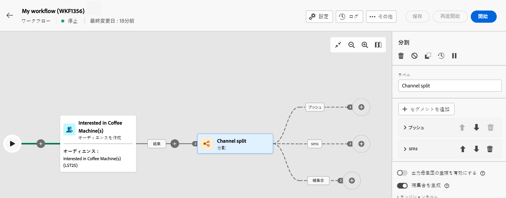

# 分割 {#split}

この **分割** アクティビティは **ターゲット設定** 「 」アクティビティを使用します。

## 設定 {#general}

次の手順に従って、 **分割** アクティビティ：

1. を追加します。 **分割** アクティビティをワークフローに追加します。

1. アクティビティ設定ペインが開き、デフォルトのサブセットが表示されます。 次をクリック： **セグメントを追加** ボタンを使用して、入力母集団をセグメント化する必要な数のサブセットを追加します。

   

   >[!IMPORTANT]
   >
   >分割アクティビティが実行されると、母集団は、アクティビティに追加された順序で、異なるサブセット全体にセグメント化されます。 例えば、最初のサブセットが初期母集団の 70%を取り出す場合、次に追加されるサブセットの選択条件は残りの 30%のみに適用されます。
   >
   > サブセットを設定する前に、サブセットの位置を変更できないので、正しい順序で追加されていることを確認してください。

1. サブセットが追加されると、アクティビティは、サブセットと同数の出力トランジションを表示します。 各サブセットのラベルを変更して、ワークフローキャンバスで容易に識別できるようにすることを強くお勧めします。

1. 各サブセットで受信母集団をフィルタリングする方法を設定します。 これを行うには、次の手順に従います。

   1. サブセットを開いて、そのプロパティを表示します。

   1. サブセットにフィルター条件を適用するには、 **[!UICONTROL フィルターを作成]** をクリックし、目的のフィルタールールを設定します。 例えば、データベースに E メールアドレスが存在する受信母集団のプロファイルを含めます。

   1. サブセットで選択するプロファイル数を制限するには、 **[!UICONTROL 制限を有効にする]** オプションを選択し、含める母集団の数または割合を指定します。

      >[!NOTE]
      >
      >サブセットの母集団制限を設定する場合、特定のプロファイル属性に基づいて、選択したプロファイルを昇順または降順にランク付けできます。 これをおこなうには、 **[!UICONTROL 並べ替えを有効にする]** オプション。 例えば、サブセットに含めるプロファイルの数を上位 50 件（購入額が最も多い）に制限できます。

   

1. すべてのサブセットを設定したら、どのサブセットにも一致しない残りの母集団を選択し、追加のアウトバウンドトランジションに含めることができます。 これをおこなうには、 **[!UICONTROL 補集合を生成]** オプション。

   

これでアクティビティが設定され、ワークフローの実行時に、母集団はアクティビティに追加された順序で、異なるサブセットにセグメント化されます。

## 例

次の例では、 **[!UICONTROL 分割]** 「 」アクティビティは、使用する通信チャネルに基づいて、オーディエンスを個別のサブセットにセグメント化するために使用します。

* **Subset 1 &quot;push&quot;**:このサブセットには、モバイルアプリケーションをインストールしたすべてのプロファイルが含まれます。
* **サブセット 2 &quot;sms&quot;**:携帯電話ユーザ：サブセット 1 に含まれない残りの母集団に対して、サブセット 2 では、データベース内の携帯電話を使用するプロファイルを選択するフィルタールールが適用されます。
* **補集合遷移**:このトランジションは、サブセット 1 またはサブセット 2 に一致しない残りのすべてのプロファイルをキャプチャします。 特に、モバイルアプリをインストールしていないユーザーや、登録されている携帯電話番号を持っていないユーザーなど、モバイルアプリをインストールしていないプロファイルや携帯電話を持っていないプロファイルが含まれます。

