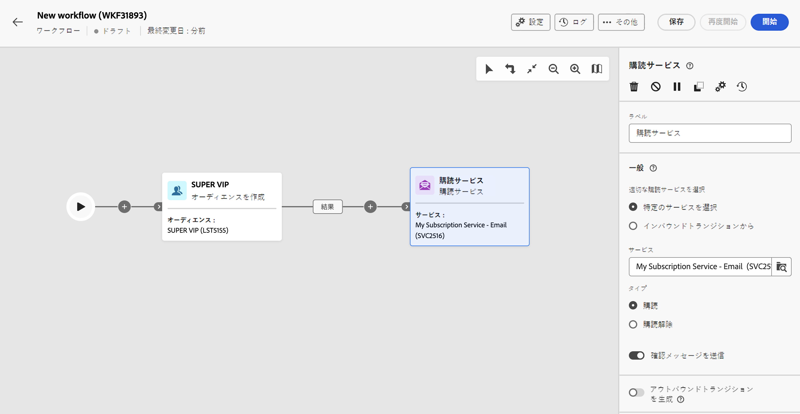
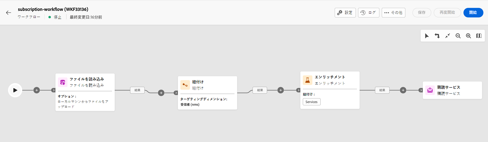

# 購読サービス {#subscription-services}

>[!CONTEXTUALHELP]
>id="acw_orchestration_subscription"
>title="購読サービスアクティビティ"
>abstract="購読サービスアクティビティでは、複数のプロファイルのサービスへの購読登録とサービスからの購読登録解除を 1 つのアクションで実行できます。"

>[!CONTEXTUALHELP]
>id="acw_orchestration_subscription_general"
>title="購読サービスの一般パラメーター"
>abstract="目的のサービスを選択し、実行するアクション（購読または購読解除）を選択します。「**確認メッセージを送信**」オプションをオンにすると、選択したサービスを購読または登録解除したことを母集団に通知できます。"

>[!CONTEXTUALHELP]
>id="acw_orchestration_subscription_outboundtransition"
>title="アウトバウンドトランジションを生成"
>abstract="「**アウトバウンドトランジションを生成**」オプションを切り替えて、アクティビティの後にトランジションを追加します。"

>[!CONTEXTUALHELP]
>id="acw_orchestration_subscription_additionalinfo"
>title="追加情報"
>abstract="追加情報"

**購読サービス**&#x200B;アクティビティは、**データ管理**&#x200B;アクティビティです。このアクティビティでは、トランジションで指定された母集団の情報サービスを購読または購読解除できます。

## 購読サービスアクティビティの設定 {#subscription-services-configuration}

**購読サービス**&#x200B;アクティビティを設定するには、次の手順に従います。

1. **購読サービス**&#x200B;アクティビティをワークフローに追加します。このアクティビティは、プロファイルをターゲティングした後、または識別されたデータを含むファイルを読み込んだ後に使用できます。

1. 次のいずれかのオプションを使用して、サブスクリプション管理の対象にするサービスを選択します。

   * **[!UICONTROL 特定のサービスを選択]**：「**[!UICONTROL サービス]**」フィールドを使用してサービスを手動で選択します。

   * **[!UICONTROL インバウンドトランジションから]**：インバウンドトランジションで指定されたサービスを使用します。例えば、管理対象のサービスを 1 行ごとに指定したファイルを読み込むことができます。この場合、操作の対象になるサービスが、プロファイルごとに動的に選択されます。

   

1. 実行する操作を選択：「**登録**」または「**登録解除**」を選択します。

   インバウンドトランジションでサービスが定義されている場合は、この操作を取得する方法を選択できます。

   * **特定の操作タイプを選択**：実行する操作を手動で選択します（「**購読**」または「**登録解除**」）

   * **インバウンドトランジションのパスから操作タイプを選択**：各レコードに対して実行する操作を指定するインバウンドデータの列を選択します。例えば、「操作」列の行ごとに実行する操作を指定したファイルを読み込むことができます。

     ここで選択できるのは、ブール値フィールドまたは整数フィールドのみです。実行する操作を含むデータが、この形式と一致することを確認します。例えば、ファイルを読み込みアクティビティからデータを読み込む場合は、**[!UICONTROL ファイルを読み込み]**&#x200B;アクティビティで操作を含む列の形式が正しく設定されていることを確認します。例について詳しくは、[この節](#uc2)を参照ください。

     >[!CAUTION]
     >
     >デフォルトでは、このオプションを選択すると、「**購読サービス**」アクティビティには、ワークフローに設定された&#x200B;**サービス（nms）**&#x200B;テーブルへのリンク定義が必要になります。これを行うには、ワークフローの上位の&#x200B;**「エンリッチメント」アクティビティ**&#x200B;で紐付けリンクが設定されていることを確認します。このオプションの使用方法を示す例については、[こちら](#uc2)を参照してください。

   

1. 選択したサービスを購読または登録解除したことを受信者に通知するには、「**[!UICONTROL 確認メッセージを送信]**」オプションをオンにします。このメッセージのコンテンツは、情報サービスに関連付けられた配信テンプレートで定義されます。

1. インバウンドトランジションのデータを使用する場合は「**[!UICONTROL 追加情報]**」セクションが表示され、各レコードの購読のデータと接触チャネルを指定できます。このセクションは空のままにすることができます。その場合、ワークフローの実行時に日付や接触チャネルは設定されません。

   * インバウンドデータに、サービスに対するプロファイルの購読日を示す列が含まれている場合は、「**[!UICONTROL 日付]**」フィールドで購読日を選択できます。

   * 「**[!UICONTROL 接触チャネルパス]**」フィールドで、購読の接触チャネルを定義します。インバウンドデータのフィールドの 1 つに設定するか、「**[!UICONTROL 接触チャネルとして定数を設定]**」オプションをオンにして任意の定数値に設定できます。

   

1. アクティビティの後にアウトバウンドトランジションを追加するには、「**[!UICONTROL アウトバウンドトランジションを生成]**」オプションをオンにします。

## 例 {#example}

### 特定のサービスへのオーディエンスの購読登録 {#uc1}

以下のワークフローは、オーディエンスを既存のサービスに購読登録する方法を示します。



* **[!UICONTROL オーディエンスを作成]**&#x200B;アクティビティでは、既存のオーディエンスを対象にします。

* **[!UICONTROL 購読サービス]**&#x200B;アクティビティでは、プロファイルを購読登録する必要があるサービスを選択できます。

### ファイルからの複数の購読ステータスの更新 {#uc2}

以下のワークフローは、プロファイルを含むファイルを読み込んで、ファイルで指定されたいくつかのサービスにプロファイルの購読登録先を更新する方法を示します。



* **[!UICONTROL ファイルを読み込み]**&#x200B;アクティビティでは、データを含む CSV ファイルを読み込んで、読み込んだ列の構造を定義します。「サービス」列と「操作」列では、更新するサービスと実行する操作（購読または購読解除）を指定します。

  ```
  Lastname,firstname,city,birthdate,email,service,operation
  Smith,Hayden,Paris,23/05/1985,hayden.smith@example.com,yoga,sub
  Mars,Daniel,London,17/11/1999,danny.mars@example.com,running,sub
  Smith,Clara,Roma,08/02/1979,clara.smith@example.com,running,unsub
  Durance,Allison,San Francisco,15/12/2000,allison.durance@example.com,yoga,sub
  Durance,Alison,San Francisco,15/12/2000,allison.durance@example.com,running,unsub
  ```

  この操作は、ファイル内で「sub」または「unsub」と指定されています。実行する操作を認識するために、**ブール値**&#x200B;または&#x200B;**整数**&#x200B;値が必要です。「0」が購読登録解除、「1」が購読登録です。この要件を満たすには：
   * 「操作」列の&#x200B;**データタイプ**&#x200B;は、整数に設定します。
   * 「sub」と「unsub」の値を「1」と「0」の値と一致させるには、**値の再マッピング**&#x200B;を実行する必要があります。

  

  「0」と「1」が既に操作の識別に使用されているファイルでは、再マッピングの必要はありません。サンプルファイル列で列が&#x200B;**ブール値**&#x200B;または&#x200B;**整数**&#x200B;として処理されていることを確認するだけです。

* **[!UICONTROL 紐付け]**&#x200B;アクティビティでは、Adobe Campaign データベースのプロファイルディメンションに属するものとして、ファイルのデータが識別されます。ファイルの「**メール**」フィールドは、プロファイルリソースの「**メール**」フィールドと照合されます。

  

* 「**[!UICONTROL エンリッチメント]**」アクティビティでは、アップロードされたファイルの「サービス」列とデータベースのサービスの「内部名」フィールドの間を単純に結合して、「サービス（nms）」テーブルへの紐付けリンクを作成します。

  

* **[!UICONTROL 購読サービス]**&#x200B;は、更新するサービスがトランジションに由来するものであることを識別します。

  **[!UICONTROL 操作のタイプ]**&#x200B;は、ファイルの「**操作**」フィールドに由来するものとして識別されます。ここで選択できるのは、ブール値フィールドまたは整数フィールドのみです。実行する操作を含むファイル列がリストに表示されない場合は、前述のように、**[!UICONTROL ファイル読み込み]**&#x200B;アクティビティで列の形式が正しく設定されていることを確認してください。

  
