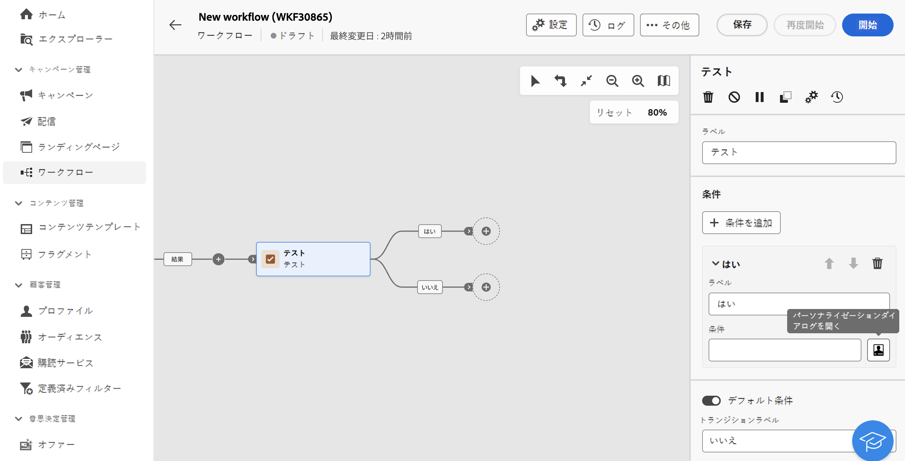
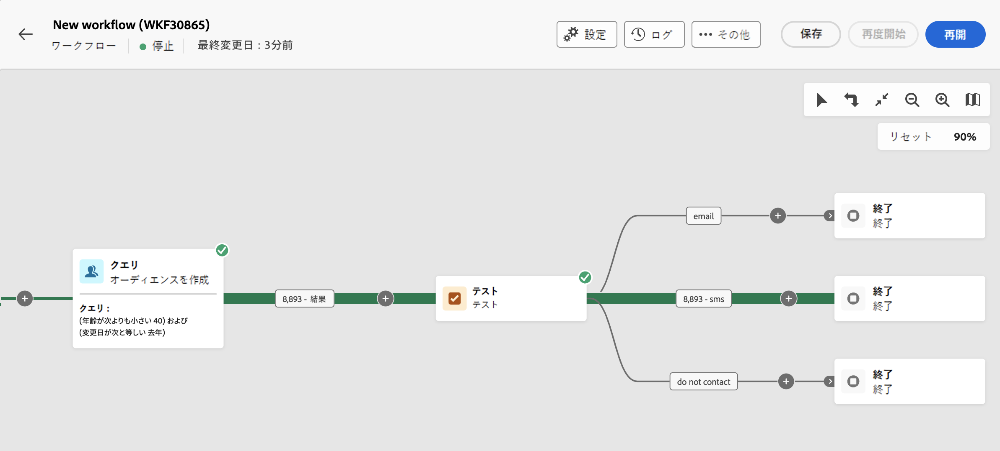
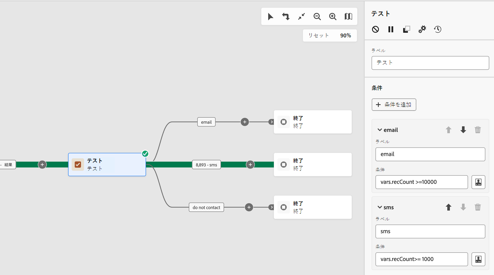

# テスト {#test}

**テスト**&#x200B;アクティビティは&#x200B;**フロー制御**&#x200B;アクティビティです。指定した条件に基づいたトランジションを有効にできます。

## テストアクティビティの設定 {#test-configuration}

**テスト**&#x200B;アクティビティを設定するには、次の手順に従います。

1. **テスト**&#x200B;アクティビティをワークフローに追加します。

1. デフォルトでは、**[!UICONTROL テスト]**&#x200B;アクティビティは、単純なブール値テストを提示します。「True」トランジションで定義された条件が満たされると、このトランジションがアクティブ化されます。それ以外の場合は、デフォルトの「False」トランジションがアクティブ化されます。

1. トランジションに関連付けられた条件を設定するには、**[!UICONTROL パーソナライズ機能ダイアログを開く]**&#x200B;アイコンをクリックします。式エディターを使用して、このトランジションをアクティブ化するために必要なルールを定義します。また、イベント変数、条件、日付／時刻関数も利用できます。[イベント変数と式エディターの操作方法を学ぶ](../event-variables.md)

   さらに、「**[!UICONTROL ラベル]**」フィールドを変更して、ワークフローキャンバスでトランジションの名前をパーソナライズできます。

   

1. 複数の出力トランジションを&#x200B;**[!UICONTROL テスト]**&#x200B;アクティビティに追加できます。これを行うには、「**[!UICONTROL 条件を追加]**」ボタンをクリックし、ラベルと各トランジションに関連付けられた条件を設定します。

1. ワークフローの実行中、各条件はいずれか 1 つが満たされるまで順番にテストされます。どの条件も満たされない場合、ワークフローは&#x200B;**[!UICONTROL デフォルト条件]**&#x200B;のパスに沿って続行されます。デフォルト条件がアクティブ化されていない場合、ワークフローはこの時点で停止します。

## 例 {#example}

この例では、**[!UICONTROL オーディエンスを作成]**&#x200B;アクティビティがターゲットとするプロファイルの数に基づいて、様々なトランジションが有効化されます。
* ターゲットとするプロファイルが 10,000 個以上の場合は、メールメッセージが送信されます。
* 1,000～10,000 個のプロファイルの場合、SMS が送信されます。
* ターゲットプロファイルが 1,000 個未満に該当する場合は、「連絡しない」トランジションに送信されます。

これを行うには、`vars.recCount` イベント変数を「メール」および「sms」条件で活用して、ターゲットプロファイルの数をカウントし、適切なトランジションをアクティブ化します。

