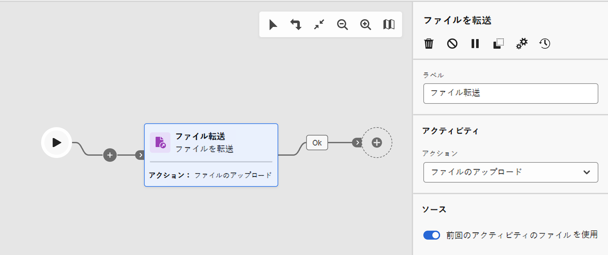
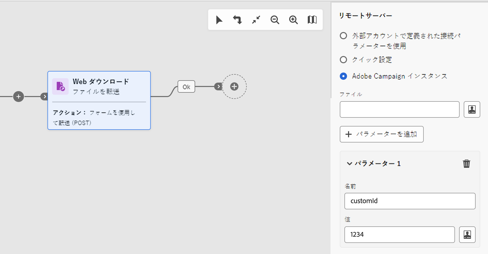
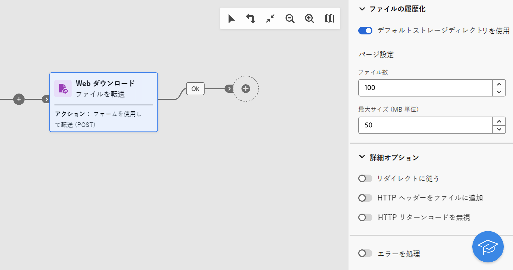

# ファイルを転送 {#transfer-file}

>[!CONTEXTUALHELP]
>id="acw_orchestration_transferfile"
>title="ファイルを転送"
>abstract="**ファイル転送**&#x200B;アクティビティでは、ファイルの送受信、ファイルの有無の確認、サーバー上のファイルのリストアップを行えます。使用されるプロトコルは、サーバー間プロトコルまたは HTTP プロトコルのいずれかです。"

>[!CONTEXTUALHELP]
>id="acw_orchestration_transferfile_options"
>title="「ファイルを転送」オプション"
>abstract="「ファイルを転送」オプション"

>[!CONTEXTUALHELP]
>id="acw_orchestration_transferfile_activity"
>title="ファイルを転送アクティビティ"
>abstract="ファイルを転送アクティビティ"

>[!CONTEXTUALHELP]
>id="acw_orchestration_transferfile_remoteserver"
>title="リモートサーバーにファイルを転送"
>abstract="リモートサーバーにファイルを転送"

>[!CONTEXTUALHELP]
>id="acw_orchestration_transferfile_source"
>title="ファイルのソースを転送"
>abstract="ファイルのソースを転送"

>[!CONTEXTUALHELP]
>id="acw_orchestration_transferfile_advancedoptions_delete_file"
>title="転送後にソースファイルを削除"
>abstract="転送後にソースファイルを削除"

>[!CONTEXTUALHELP]
>id="acw_orchestration_transferfile_advancedoptions_display_logs"
>title="セッションログを表示"
>abstract="セッションログを表示"

>[!CONTEXTUALHELP]
>id="acw_orchestration_transferfile_advancedoptions_list_files"
>title="すべてのファイルをリスト"
>abstract="すべてのファイルをリスト"

>[!CONTEXTUALHELP]
>id="acw_orchestration_transferfile_historization"
>title="ファイルの履歴化"
>abstract="ファイルの履歴化"

>[!CONTEXTUALHELP]
>id="acw_orchestration_transferfile_process_missing_file"
>title="不明なファイルを処理"
>abstract="不明なファイルを処理"

>[!CONTEXTUALHELP]
>id="acw_orchestration_transferfile_process_errors"
>title="エラーを処理"
>abstract="エラーを処理"

**ファイル転送**&#x200B;アクティビティは&#x200B;**データ管理**&#x200B;アクティビティで、ファイルの送受信、ファイルの有無のテスト、サーバー上のファイルのリストアップを行うことができます。使用されるプロトコルは、サーバー間プロトコルまたは HTTP プロトコルのいずれかです。

>[!NOTE]
>
>Campaign Web ユーザーインターフェイスでは、**ファイル転送**&#x200B;と **web ダウンロード**&#x200B;の機能を結合することで、2 つのアクティビティが 1 つに統合されています。この統合によるアクティビティの機能への影響は一切ありません。

**ファイル転送**&#x200B;アクティビティを設定するには、以下の手順に従ってください。

## 転送プロトコルと操作の選択 {#protocol}

1. **ファイル転送**&#x200B;アクティビティをワークフローにを追加し、使用するプロトコルに応じて、実行する転送のタイプを指定します。

   * HTTP プロトコルの場合は、「**[!UICONTROL Web ダウンロード]**」を選択します。これにより、明示的な URL や、外部アカウント、Adobe Campaign インスタンスで、ファイルの GET ダウンロードや POST ダウンロードを行うことができます。
   * その他のサーバー間プロトコルおよび関連するアクションについては、「**[!UICONTROL ファイル転送]**」を選択します。

1. アクティビティで実行するアクションを選択します。使用できるアクションは、選択した転送のタイプによって異なります。詳しくは、以下のセクションを展開してください。

   +++**ファイル転送**&#x200B;タイプのアクティビティで使用可能なアクション

   * **[!UICONTROL Web ダウンロード]**：サーバーからファイルをダウンロードします。
   * **[!UICONTROL ファイルをアップロード]**：サーバーにファイルをアップロードします。
   * **[!UICONTROL ファイルが存在するかどうかをテスト]**：特定のファイルがサーバー上に存在するかどうかを確認します。アクティビティの後に、「ファイルが存在します」と「ファイルが存在しません」という 2 つのアウトバウンドトランジションが生成されます。
   * **[!UICONTROL ファイルのリスト]**：サーバーで使用可能なすべてのファイルをリストします。

+++

   +++**Web ダウンロード**&#x200B;タイプのアクティビティで使用可能なアクション

   * **[!UICONTROL 簡易転送（GET）]**：ファイルを取得します。
   * **[!UICONTROL フォームを使用して転送（POST）]**：ファイルおよび追加パラメーターをアップロードします。

+++

   

1. デフォルトでは、ファイルのアップロードアクションの場合、アクティビティは前のアクティビティで指定されたファイルを使用します。別のファイルを使用するには、「**[!UICONTROL 前のアクティビティのファイルを使用]**」オプションをオフにして、「**[!UICONTROL ファイルを追加]**」ボタンをクリックします。

   「**[!UICONTROL ソース]**」フィールドに目的のファイル名を入力するか、式エディターを使用してイベント変数を使ってファイル名を計算します。[イベント変数と式エディターの操作方法を学ぶ](../event-variables.md)操作を繰り返して、必要な数のファイルを追加します。

## 転送先の定義 {#destination}

1. 「**[!UICONTROL リモートサーバー]**」セクションで、次のいずれかの方法を使用して接続するサーバーを指定します。

   * **[!UICONTROL 外部アカウントで定義された接続パラメーターを使用]**：外部アカウントの接続パラメーターを使用してサーバーに接続します。「**[!UICONTROL サーバーフォルダー]**」フィールドで、ファイル（またはファイルリストのアクションを表示するフォルダー）へのパスを指定します。
   * **[!UICONTROL クイック設定]**：ファイル（またはファイルリストのアクションを表示するフォルダー）の URL を入力します。
   * **[!UICONTROL Adobe Campaign インスタンス]**（web ダウンロードタイプのアクティビティ）：Adobe Campaign インスタンスサーバーからファイルをダウンロードします。

   

1. Web ダウンロード POST アクションの場合、操作で追加のパラメーターを渡すことができます。これを行うには、「**[!UICONTROL パラメーターを追加]**」ボタンをクリックし、パラメーターの名前と値を指定します。パラメーターを必要な数だけ追加できます。

1. デフォルトでは、ファイルのアップロードの場合、サーバーにアップロードされたファイルが自動的に保存されます。この履歴を保持しない場合は、「**[!UICONTROL 送信されたファイルの履歴を保持]**」オプションをオフにします。

## 履歴化設定 {#historization}

「**[!UICONTROL ファイルを転送]**」アクティビティが実行されるたびに、アップロードされたファイルまたはダウンロードされたファイルが専用のフォルダーに保存されます。ワークフローの「ファイルを転送」アクティビティごとに 1 つのフォルダーが作成されます。デフォルトでは、ファイルは処理される前に、Adobe Campaign インストールフォルダー（`/vars`）のデフォルトストレージディレクトリに保存されます。特定のフォルダーを使用するには、「**[!UICONTROL デフォルトストレージディレクトリを使用]**」オプションをオフに切り替えて、ディレクトリのパスを入力します。

サーバー上の物理領域を確保するために、このフォルダーのサイズを制限できるようにすることが重要です。これを行うには、アクティビティのフォルダーのファイルの最大数または合計サイズを定義します。デフォルトで許可されている値はそれぞれ 100 個と 50 MB です。

このアクティビティを実行するたびに、次のようにフォルダーがチェックされます。

* アクティビティ実行の 24 時間前までに作成されたファイルのみが対象です。
* 対象となるファイルの数が「**[!UICONTROL ファイル数]**」フィールドの値より大きい場合、許可されているファイルの最大数におさまるまで、古いファイルから順に削除されます。
* 対象となるファイルの合計サイズが「**[!UICONTROL 最大サイズ（MB 単位）]**」パラメーターの値より大きい場合、許可されている最大サイズ（MB 単位）の値におさまるまで、古いファイルから順に削除されます。

>[!CAUTION]
>
>アクティビティを再実行しない限り、フォルダーはチェックされず、消去もされません。そのため、大きなファイルを転送する場合は注意してください。

## 詳細オプションとエラー管理オプション {#advanced}

1. **[!UICONTROL 詳細オプション]**&#x200B;では、設定しているアクティビティのタイプに基づいて追加のオプションを使用できます。詳しくは、以下のセクションを展開してください。

   +++**[!UICONTROL ファイル転送]**&#x200B;タイプのアクティビティの追加オプション

   * **[!UICONTROL 転送後にソースファイルを削除]**：転送が正常に完了したら、ソースファイルを消去します。
   * **[!UICONTROL セッションログを表示]**：このオプションをアクティブ化すると、ワークフローの実行後に、転送操作に関連する情報がワークフローログに表示されます。
   * **[!UICONTROL すべてのファイルを表示]**（ファイルリストのアクション）：このオプションでは、`vars.filenames` イベント変数内のサーバー上に存在するすべてのファイルのインデックス作成を行います。ファイル名は、`n` 文字で区切られます。[詳しくは、イベント変数の操作方法を参照してください](../event-variables.md)

+++

   +++**[!UICONTROL Web ダウンロード]**&#x200B;タイプのアクティビティの追加オプション

   * **[!UICONTROL リダイレクトに従う]**：ファイルのリダイレクトでは、上書きを使用して、データの入力や出力を別のタイプのデバイスに送信できます。
   * **[!UICONTROL HTTP ヘッダーをファイルに追加]**：場合によっては、ファイルに HTTP ヘッダーを追加することが必要になる場合があります。最も一般的に、これらのヘッダーは、トラブルシューティング目的、[クロスオリジンリソース共有（CORS）](https://developer.mozilla.org/docs/Web/HTTP/CORS)用の追加情報を提供するため、または特定のキャッシュディレクティブを設定するために使用されます。
   * **[!UICONTROL HTTP リターンコードを無視]**：HTTP リターンコード（HTTP ステータスコードとも呼ばれる）は、HTTP リクエストの結果を示します。

1. 「**[!UICONTROL エラーを処理]**」オプションでは、転送中にエラーが発生した場合、アクティビティの後に「エラー」のアウトバウンドトランジションをアクティブ化できます。

   さらに、**ファイル転送**&#x200B;タイプのアクティビティでは、指定したパスでファイルが使用できない場合、「**[!UICONTROL 不明なファイルを処理]**」オプションを使用すると、アクティビティの後に「ファイルがありません」のアウトバウンドトランジションをアクティブ化できます。
