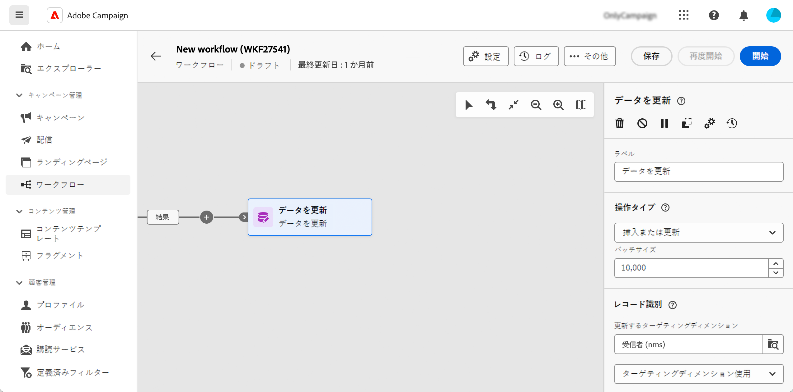

# データの更新 {#update-data}

この **データを更新** アクティビティはです **データ管理** アクティビティ。 これにより、データベース内のフィールドに対して一括更新を実行できます。 データ更新をパーソナライズできるオプションがいくつかあります。

<!--
The **Operation type** field lets you choose the process to be carried out on the data in the database. Select the first option to add data or update (it if it has already been added). You can also only add data, only update data, or delete data. Select the **Update and merge collections** to select a primary record to link duplicates to, and delete those duplicates safely

Specify how to identify the records in the database: if data relate to an existing targeting dimension, select the **Using the targeting dimension** option and select the targeting dimension and fields to update. Otherwise, specify one or more custom links to identify the data in the database, or direct use of reconciliation keys.

Select the fields to update and reconciliation settings. You can use the **Auto-mapping** option to automatically identify the fields to be updated.

The **Advanced options** section let you specify additional settings to manage data and duplicates.

Toggle the **Generate an outbound transition** option to add an outbound transition that will be activated at the end of the execution of the **Update data** activity. The update generally marks the end of a targeting workflow and therefore the option is not activated by default.

Toggle the **Generate an outbound transition for rejects** option to add an outbound transition containing records that have not been correctly processed after the update (for example if there is a duplicate). The update generally marks the end of a targeting workflow and therefore the option is not activated by default.
-->

## データを更新アクティビティを設定します{#update-data-configuration}

を設定するには **データを更新** アクティビティを使用する場合は、まずアクティビティをワークフローに追加して、ラベルを定義します。

### 操作のタイプ

「**操作のタイプ**」フィールドで、データベース内のデータに実行する処理を選択します。

* **挿入または更新**：レコードが既にデータベースに存在する場合は、データを挿入または更新します。
* **挿入**：データのみを挿入します。 既に存在するレコードは更新されません。紐付け条件が定義されている場合は、紐付けされていないレコードのみ追加されます。
* **更新**：データベースにのみ存在するレコードのデータを更新します。
* **削除**：データを削除する場合。

「**バッチサイズ**」フィールドで、更新するインバウンドトランジション要素の数を選択できます。例えば 500 を選択すると、処理される最初の 500 レコードが更新されます。

### レコード識別

このセクションでは、データベース内のレコードを識別する方法を指定できます。

* データエントリが既存のターゲティングディメンションに関連する場合は、 **ターゲティングディメンションの使用** 「」オプションを選択し、から「」を選択します **更新するターゲティングディメンション** フィールド。
* を選択することもできます **カスタムリンクの使用** そして、データベース内のデータを識別できる 1 つ以上のリンクを指定します
* 選択した操作タイプを更新する必要がある場合は、を使用する必要があります **紐付けルールの使用** オプション。

### 更新するフィールド

が含まれる **更新するフィールド** セクションは、更新が適用されるフィールドを追加し、必要に応じて、この更新が実行されるように条件を追加します。 これを行うには、 **次の場合に考慮** フィールド。 条件はリスト順に順番に適用されます。更新の順序を変更するには、右側の矢印を使用します。同じ宛先フィールドを何度も使用できます。

フィールドは、を使用して自動的にリンクできます **自動マッピング** ボタン。 自動リンクでは、同じ名前のフィールドが検出されます。

実行中 **挿入または更新** 操作の種類。適用する操作をフィールドごとに個別に選択できます。 それには、必要な値を **操作タイプ** フィールド。

### 詳細オプション

この **詳細オプション** では、データの更新や重複の管理に対処する追加のオプションを指定できます。

<!--
* **Disable automatic key management**
* **Disable audit**
* **Empty the destination value if the source value is empty**
* **Update all columns with matching names**
* **Ignore records which concern the same target**: only the first in the list of expressions will be considered
-->

最後の 2 つのオプションを使用すると、特定のアクションを実行できます。

* **アウトバウンドトランジションを生成**：実行の終了時にアクティブ化されるアウトバウンドトランジションを作成します。 通常は、更新によってターゲティングワークフローの終了が示されるので、このオプションはデフォルトでは有効化されません。

* **却下された項目のアウトバウンドトランジションを生成**：更新後に正しく処理されなかったレコード（重複がある場合など）を含むアウトバウンドトランジションを作成します。 通常は、更新によってターゲティングワークフローの終了が示されるので、このオプションはデフォルトでは有効化されません。
