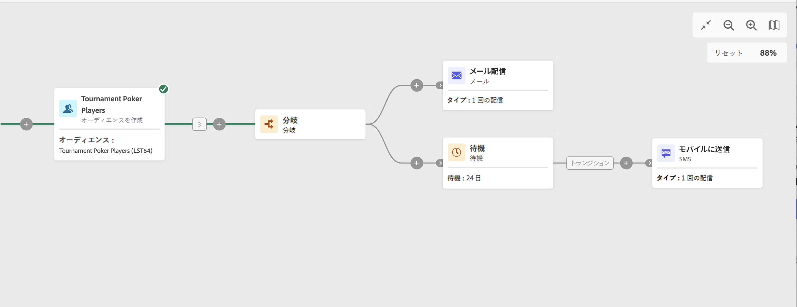

# 待機 {#wait}

**待機**&#x200B;アクティビティは、**フロー制御**&#x200B;アクティビティです。これは、実行する 2 つのアクティビティ間に一定の時間間隔を設定するために使用します。例えば、メール配信アクティビティを実行したあと数日間待機し、この期間中に発生した開封数とクリック数を分析してから、フォローアップ操作（リマインダーメール、オーディエンスの作成など）を実行します。

## 設定

**待機**&#x200B;アクティビティを設定するには、次の手順に従います。

1. **待機**&#x200B;アクティビティをワークフローに追加します。

1. インバウンドトランジションとアウトバウンドトランジションの間の待機の&#x200B;**期間**&#x200B;を指定します。

1. 「**期間**」フィールドで、秒、分、時間などの時間単位を選択します。

## 例

以下に、**待機**&#x200B;アクティビティの一般的なユースケースを示します。イベントへの招待メールを送信します。送信後 24 時間が経過すると、同じ母集団に SMS 配信が送信されます。

