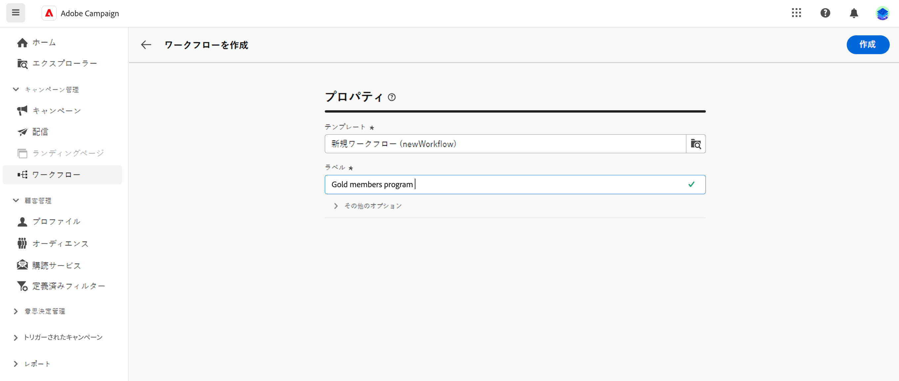
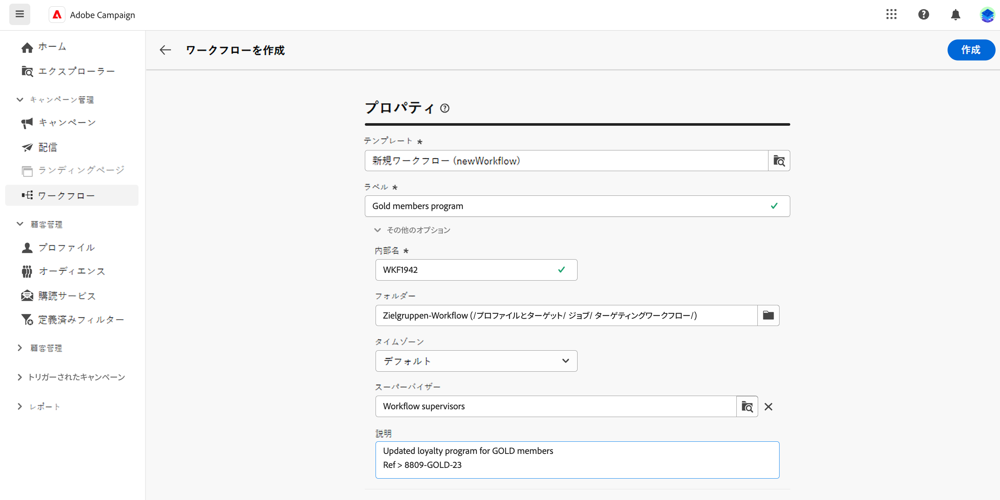
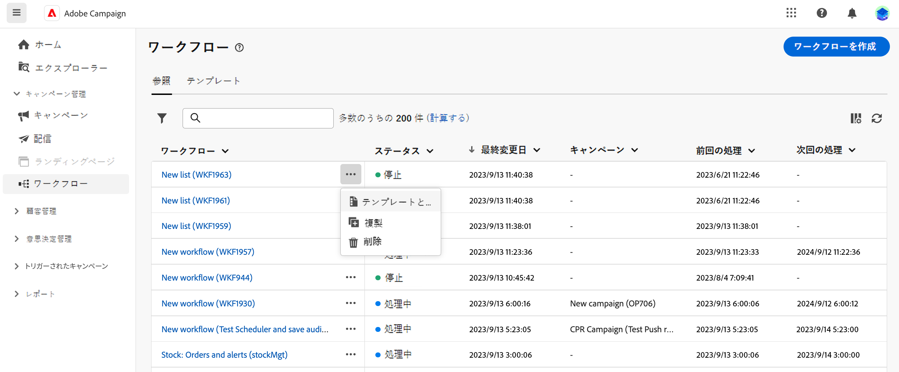
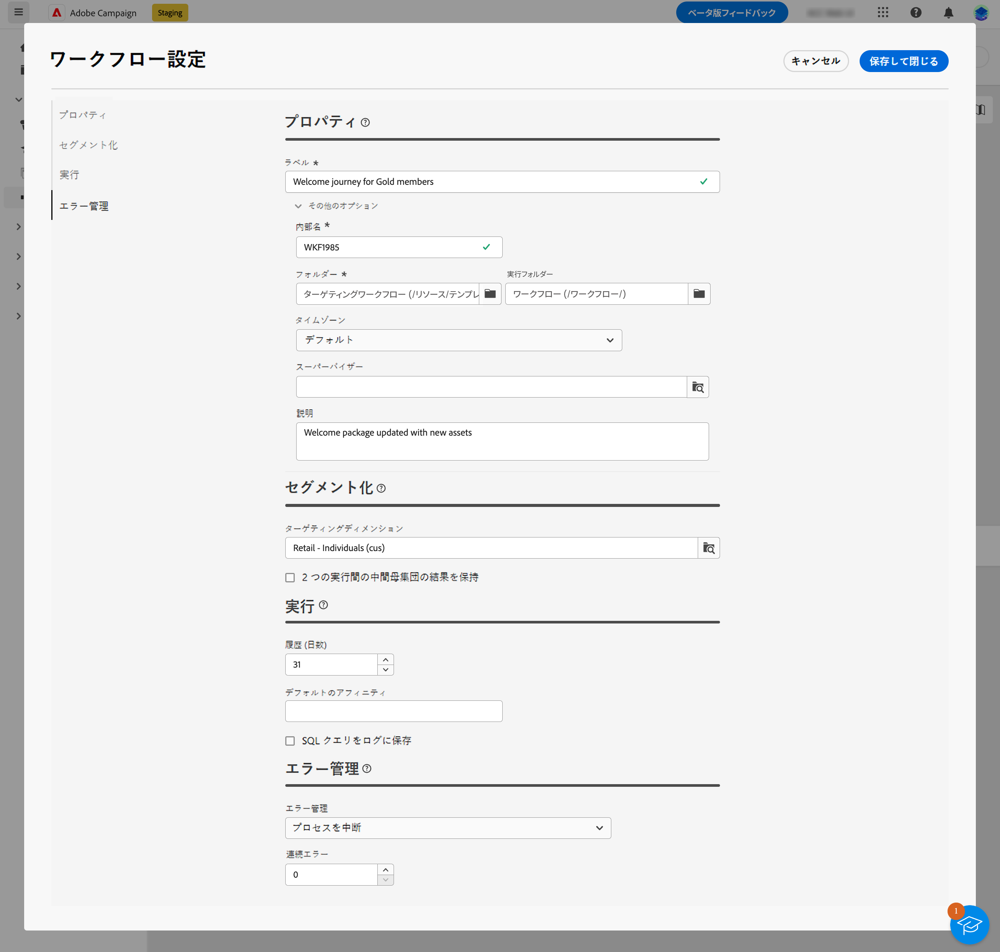
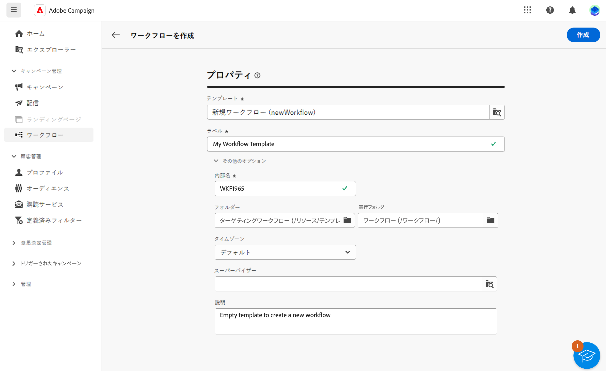
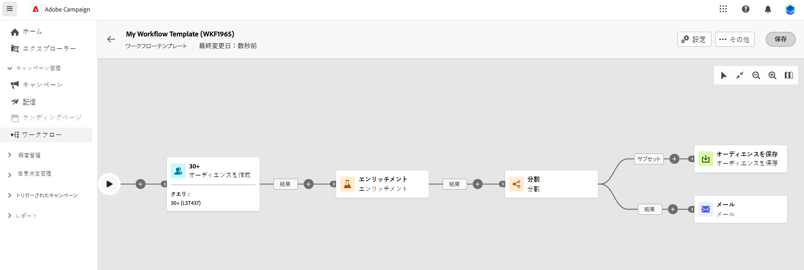

# ワークフローの作成 {#create-first-workflow}

>[!CONTEXTUALHELP]
>id="acw_campaign_creation_workflow"
>title="キャンペーン内のワークフローのリスト"
>abstract="「**ワークフロー**」タブには、現在のキャンペーンにリンクされているすべてのワークフローがリストされます。編集するワークフローの名前をクリックします。「**ワークフローを作成**」ボタンを使用して、このキャンペーンに新しいワークフローを追加します。"

スタンドアロンのワークフローや、キャンペーン内のワークフローを作成できます。最初の手順では、テンプレートを選択し、その一般プロパティを定義します。その後、必要に応じて追加の設定を行います。

それには、次の手順に従います。

1. **スタンドアロンワークフロー**&#x200B;を作成するには、**ワークフロー**&#x200B;メニューを参照します。**キャンペーンワークフロー**&#x200B;を作成するには、**キャンペーン**&#x200B;メニューに移動し、新しいワークフローを作成するキャンペーンを開きます。

1. 画面の右上隅にある「**[!UICONTROL ワークフローを作成]**」ボタンをクリックします。

   {zoomable="yes"}

1. ワークフローの&#x200B;**プロパティ**&#x200B;ダイアログで、ワークフローの作成に使用するテンプレートを選択します（また、デフォルトの組み込みテンプレートを使用することもできます）。[詳しくは、ワークフローテンプレートを参照してください](#workflow-templates)。

1. ワークフローのラベルを入力します。さらに、画面の「**[!UICONTROL その他のオプション]**」セクションの専用フィールドで、ワークフローの説明を追加します。

1. 「**[!UICONTROL その他のオプション]**」セクションを展開して、ワークフローの追加設定を行います。ワークフローのプロパティを設定する方法について詳しくは、[このページ](workflow-settings.md#properties)を参照してください。

   {zoomable="yes"}

1. 「**[!UICONTROL ワークフローを作成]**」ボタンをクリックして、ワークフローの作成を確定します。

ワークフローが作成され、ワークフローのリストに表示されます。ビジュアルキャンバスにアクセスし、実行するタスクの追加、設定および調整を開始できます。[詳しくは、ワークフローアクティビティの調整方法を参照してください](orchestrate-activities.md)。

## ワークフローテンプレートの操作 {#workflow-templates}

>[!CONTEXTUALHELP]
>id="acw_workflow_template_for_campaign"
>title="ワークフローテンプレート"
>abstract="ワークフローテンプレートには、新しいワークフローの作成に再利用できる、事前設定済みの設定とアクティビティが含まれています。"

>[!CONTEXTUALHELP]
>id="acw_workflow_template_creation_properties"
>title="ワークフローのプロパティ"
>abstract="ワークフローテンプレートには、新しいワークフローの作成に再利用できる、事前設定済みの設定とアクティビティが含まれています。この画面では、ワークフローテンプレートのラベルを入力し、内部名、フォルダーと実行フォルダー、タイムゾーン、スーパーバイザーグループなどの設定を行います。"

ワークフローテンプレートには、新しいワークフローの作成に再利用できる、事前設定済みの設定とアクティビティが含まれています。ワークフローを作成する際に、ワークフローのプロパティからワークフローのテンプレートを選択します。デフォルトでは、空のテンプレートが提供されます。

既存のワークフローからテンプレートを作成することも、ゼロから新しいテンプレートを作成することもできます。両方の方法について、以下で詳しく説明します。

>[!BEGINTABS]

>[!TAB 既存のワークフローからテンプレートを作成]

既存のワークフローからワークフローテンプレートを作成するには、次の手順に従います。

1. **ワークフロー**&#x200B;メニューを開き、テンプレートとして保存するワークフローを参照します。
1. ワークフロー名の右側にある「...」をクリックし、「**テンプレートとしてコピー**」を選択します。

   {zoomable="yes"}

1. ポップアップウィンドウで、テンプレートの作成を確認します。
1. ワークフローテンプレートキャンバスで、必要に応じて、アクティビティを確認、追加、設定します。
1. 「**設定**」ボタンから設定を参照し、ワークフローテンプレートの名前を変更して、説明を入力します。
1. テンプレートの&#x200B;**フォルダー**&#x200B;と&#x200B;**実行フォルダー**&#x200B;を選択します。フォルダーは、ワークフローテンプレートが保存される場所です。実行フォルダーは、このテンプレートに基づいて作成されたワークフローが保存されるフォルダーです。

   {zoomable="yes"}

   その他のプロパティは、ワークフローに共通です。詳しくは、[このページ](workflow-settings.md#properties)を参照してください。

1. 変更を保存します。

ワークフローテンプレートがテンプレートリストで使用できるようになりました。このテンプレートに基づいて、ワークフローを作成できます。このワークフローは、テンプレートで定義された設定とアクティビティを使用して、事前設定されます。

>[!TAB テンプレートをゼロから作成]

ワークフローテンプレートを最初から作成するには、次の手順に従います。

1. **ワークフロー**&#x200B;メニューを開き、「**テンプレート**」タブを参照します。使用可能なワークフローテンプレートのリストが表示されます。
1. 画面の右上隅にある「**[!UICONTROL テンプレートを作成]**」ボタンをクリックします。
1. ラベルを入力し、追加のオプションを開いて、ワークフローテンプレートの説明を入力します。
1. テンプレートのフォルダーと実行フォルダーを選択します。フォルダーは、ワークフローテンプレートが保存される場所です。実行フォルダーは、このテンプレートに基づいて作成されたワークフローが保存されるフォルダーです。

   {zoomable="yes"}

   その他のプロパティは、ワークフローに共通です。詳しくは、[このページ](workflow-settings.md#properties)を参照してください。

1. 「**作成**」ボタンをクリックして設定を確認します。
1. ワークフローテンプレートキャンバスで、必要に応じてアクティビティを追加し、設定します。

   {zoomable="yes"}

1. 変更を保存します。

ワークフローテンプレートがテンプレートリストで使用できるようになりました。このテンプレートに基づいて、ワークフローを作成できます。このワークフローは、テンプレートで定義された設定とアクティビティを使用して、事前設定されます。

>[!ENDTABS]