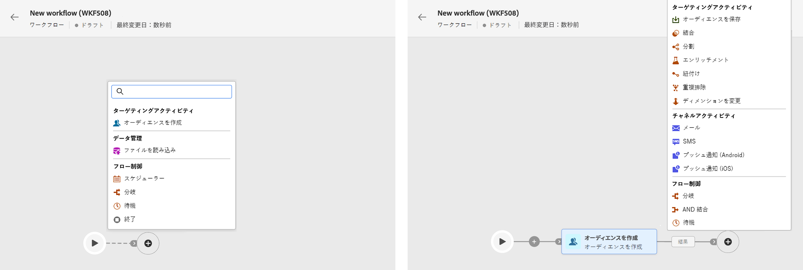

# ワークフローの作成 {#create}

>[!CONTEXTUALHELP]
>id="acw_workflow_creation_properties"
>title="ワークフローのプロパティ"
>abstract="未定"

## ワークフローの作成 {#create-workflow}

Campaign v8 Web でワークフローを作成する最初の手順は、ワークフローをスタンドアロンワークフローとして、またはキャンペーン内で直接作成し、その一般的なプロパティを定義することです。 それには、次の手順に従います。

1. まず、スタンドアロンワークフローを作成するか、キャンペーン内に直接統合するかを決定します。

   * **スタンドアロンワークフロー**:ワークフローメニューに移動し、右上隅の「ワークフローを作成」ボタンをクリックします。
   * **キャンペーンワークフロー：** キャンペーンメニューに移動し、新しいワークフローを作成するキャンペーンを開きます。 「ワークフロー」タブの右上隅にある「ワークフローを作成」ボタンをクリックします。

   ワークフローのプロパティダイアログボックスが表示されます。

   

1. ワークフローの作成に使用するテンプレートを選択し、ワークフローのラベルを指定します。

   ワークフローテンプレートには、事前に設定されたアクティビティと、新しいワークフローの作成に再利用できる全体的なプロパティ設定が含まれています。 クライアントコンソールから作成されます。 [テンプレートの使用方法を説明します。](https://experienceleague.adobe.com/docs/campaign/automation/workflows/introduction/build-a-workflow.html#workflow-templates)

1. 保存フォルダーやタイムゾーンなど、ワークフローに固有の設定を行う場合は、「追加オプション」セクションを展開します。 [ワークフローのプロパティを設定する方法を説明します](workflow-settings.md)

1. 「ワークフローを作成」ボタンをクリックして、ワークフローの作成を確定します。

ワークフローを作成したら、専用のビジュアルキャンバスを使用して、実行する様々なタスクのオーケストレーションを開始できます。 [ワークフローアクティビティの調整方法については、こちらを参照してください](#build)

## ワークフローアクティビティのオーケストレーション {#build}

一度 [ワークフローを作成しました](create-workflow.md)ワークフローメニューから、またはキャンペーン内から、実行する様々なタスクのオーケストレーションを開始できます。 これをおこなうには、視覚的なキャンバスが用意されており、ワークフローダイアグラムを作成できます。 このダイアグラムでは、様々なアクティビティを追加し、順番に接続できます。

設定のこの段階では、ダイアグラムが開始アイコン付きで表示され、ワークフローの開始を表します。 最初のアクティビティを追加するには、開始アイコンに接続されている「+」ボタンをクリックします。

ダイアグラムに追加できるアクティビティのリストが表示されます。 使用可能なアクティビティは、ワークフローダイアグラム内の位置に応じて異なります。 例えば、最初のアクティビティを追加する際に、オーディエンスのターゲティング、ワークフローパスの分割、または「待機」アクティビティを設定してワークフローの実行を遅らせることで、ワークフローを開始できます。 一方、「オーディエンスのビルド」アクティビティの後に、ターゲティングアクティビティでターゲットを絞り込んだり、チャネルアクティビティでオーディエンスに配信を送信したり、フロー制御アクティビティでワークフロープロセスを整理したりできます。

アクティビティがダイアグラムに追加されると、右側のウィンドウが表示され、新しく追加されたアクティビティを特定の設定で設定できます。 各アクティビティの設定方法について詳しくは、 [この節](workflow-activities.md).

この手順を、ワークフローで実行するタスクに応じて、必要な数の「 」アクティビティで繰り返します。 また、2 つのアクティビティの間に新しいアクティビティを挿入することもできます。 それには、アクティビティ間のトランジションの「 + 」ボタンをクリックし、目的のアクティビティを選択して、右側のウィンドウで設定します。

アクティビティを削除するには、キャンバスでアクティビティを選択し、アクティビティプロパティの削除アイコンをクリックします。

>[!TIP]
>
>各アクティビティ間のトランジションの名前をパーソナライズすることもできます。 それには、トランジションを選択し、右側のウィンドウでトランジションのラベルを変更します。

ワークフローを完了したら、ダイアグラムの最後に「終了」アクティビティを追加します。 このアクティビティを使用すると、ワークフローの終わりを視覚的に示すことができ、機能に影響を与えません。

ワークフローダイアグラムのデザインが完了したら、ワークフローを実行し、様々なタスクの進行状況を追跡できます。 [ワークフローを開始し、その実行を監視する方法については、こちらを参照してください](start-monitor-workflows.md)
