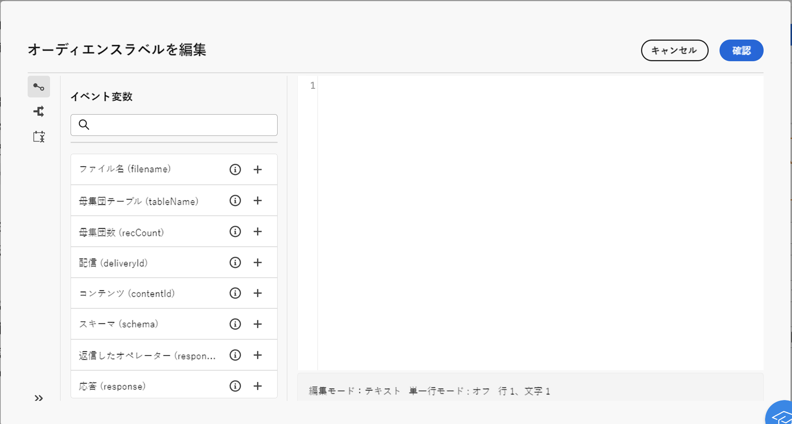

# ワークフローイベント変数 {#event-variables}

一部のワークフローアクティビティでは、式エディターでスクリプトを編集して、以前のアクティビティからのデータの取得、条件の作成、イベント変数に基づくファイル名の計算などの特定のアクションを実行できます。

## イベント変数とは {#scripting}

ワークフローのコンテキストで実行されるスクリプトは、一連の追加のグローバルにアクセスします **オブジェクト** 例えば、実行中のワークフロー自体（`ìnstance`）、その様々なタスク（`task`）、または特定のタスクをアクティブ化したイベント（`event`）に設定します。

タイプごとの **オブジェクト** は、次のカテゴリに関連付けられています **変数** これは、次のようなアクティビティでスクリプトを編集する際に、式エディターで利用できます **[!UICONTROL JavaScript コード]** または **[!UICONTROL テスト]**.

* **インスタンス変数** （`instance.vars.xxx`）はグローバル変数に相当します。 この変数はすべてのアクティビティが共有します。
* **タスク変数** （`task.vars.xxx`）は、ローカル変数に相当します。 現在のタスクでのみ使用されます。 この変数は、永続的なアクティビティでデータの維持に使用されるほか、同じアクティビティの異なるスクリプト間でデータを交換する場合に使用されることもあります。
* **イベント変数** （`vars.xxx`）を使用して、ワークフロープロセスの基本タスク間でデータを交換できます。 この変数は、進行中のタスクを有効化したタスクによって受け渡されます。その後、これらは次のアクティビティに渡されます。 **イベント変数** は最もよく使用される変数で、インスタンス変数よりも優先して使用する必要があります。

>[!NOTE]
>
>Adobe Campaignのスクリプトおよび公開されたオブジェクトと変数について詳しくは、Campaign v8 （クライアントコンソール）ドキュメントの以下を参照してください。 [この節](https://experienceleague.adobe.com/en/docs/campaign/automation/workflows/advanced-management/javascript-scripts-and-templates).
>
>このリソースは貴重なインサイトを提供しますが、Campaign web ユーザーインターフェイスではなくクライアントコンソールに特に適用されるので、不一致が存在する場合があることに注意してください。

## 式エディターでのイベント変数の活用 {#expression-editor}

定義済みのイベント変数は、式エディターの左側のパネルで使用できます。 コード内で新しい変数を初期化することで、新しい変数を作成することもできます。

これらのイベント変数に加えて、を利用することもできます **[!UICONTROL 条件]** 左側のパネルのメニューで条件と **[!UICONTROL 現在の日付を追加]** 日付の書式設定に関連する関数を使用するメニュー。
