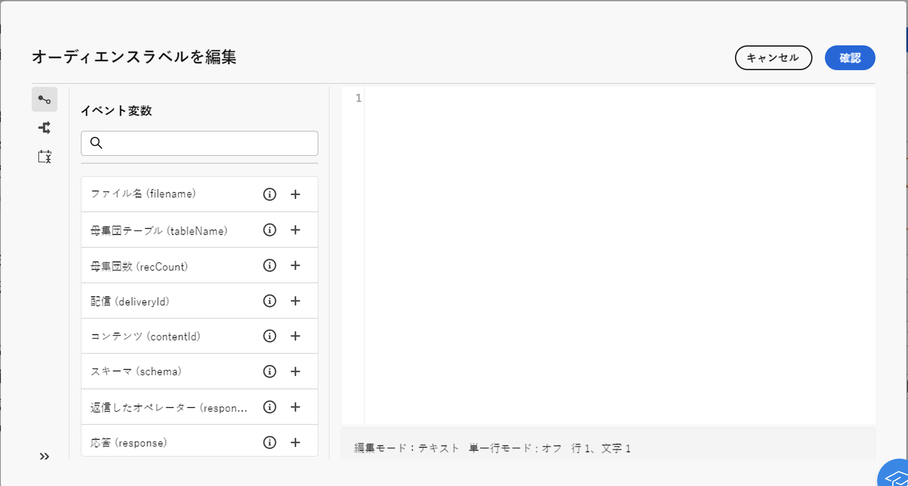

# ワークフローイベント変数 {#event-variables}

一部のワークフローアクティビティでは、式エディターでスクリプトを編集して、以前のアクティビティからのデータの取得、条件の作成、イベント変数に基づくファイル名の計算などの特定のアクションを実行できます。

## イベント変数とは {#scripting}

ワークフローのコンテキストで実行されるスクリプトは、実行されているワークフロー自体（`instance`）、その様々なタスク（`task`）、または特定のタスクをアクティブ化したイベント（`event`）など、一連の追加グローバル&#x200B;**オブジェクト**&#x200B;にアクセスします。

各タイプの&#x200B;**オブジェクト**&#x200B;には、**[!UICONTROL JavaScript コード]**&#x200B;や&#x200B;**[!UICONTROL テスト]**&#x200B;などのアクティビティでスクリプトを編集する際に式エディターで使用できる&#x200B;**変数**&#x200B;のカテゴリが関連付けられます。

* **インスタンス変数**（`instance.vars.xxx`）は、グローバル変数に相当します。 この変数はすべてのアクティビティで共有されます。
* **タスク変数**（`task.vars.xxx`）は、ローカル変数に相当します。 現在のタスクのみが使用します。 この変数は、永続的なアクティビティでデータの維持に使用されるほか、同じアクティビティの異なるスクリプト間でデータを交換する場合に使用されることもあります。
* **イベント変数**（`vars.xxx`）を使用すると、ワークフロープロセスの各基本タスク間でデータを交換できます。 この変数は、進行中のタスクを有効化したタスクによって受け渡されます。 その後、次のアクティビティに渡されます。 **イベント変数**&#x200B;は最も一般的に使用される変数です。インスタンス変数より優先して使用することをお勧めします。

>[!NOTE]
>
>Adobe Campaign のスクリプトと公開オブジェクトと変数に関する追加情報については、[この節](https://experienceleague.adobe.com/ja/docs/campaign/automation/workflows/advanced-management/javascript-scripts-and-templates)の Campaign v8（クライアントコンソール）ドキュメントを参照してください。
>
>このリソースは貴重なインサイトを提供しますが、Campaign web ユーザーインターフェイスではなくクライアントコンソールに特に適用されるので、不一致が存在する場合があることに注意してください。

## 式エディターでのイベント変数の活用 {#expression-editor}

定義済みのイベント変数は、式エディターの左側のパネルで使用できます。 また、コード内で新しい変数を初期化して、新しい変数を作成することもできます。

これらのイベント変数に加えて、左側のパネルの&#x200B;**[!UICONTROL 条件]**&#x200B;メニューを使用して条件を作成したり、**[!UICONTROL 現在の日付を追加]**&#x200B;メニューを使用して日付の書式設定に関連する関数を適用したりすることもできます。