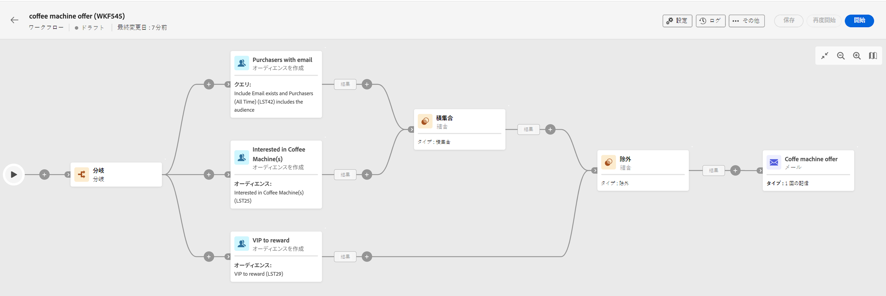

# ワークフロー作成の主な原則 {#gs-workflow-creation}

Campaign v8 Web を使用すると、ワークフローを視覚的なキャンバスに作成して、セグメント化、キャンペーン実行、ファイル処理などのクロスチャネルプロセスを設計できます。

ワークフローは、スタンドアロンワークフローとしてワークフローメニューから作成することも、キャンペーン内で直接作成することもできます。この場合、ワークフローはキャンペーンにリンクされ、他のすべてのキャンペーンのワークフローと共に実行されます。

## ワークフローの内部とは

ワークフローダイアグラムは、実行される処理を表したものです。これは、実行される様々なタスクと、タスク同士の関係を示すものです。

各ワークフローには次が含まれます。

* **アクティビティ**：アクティビティとは、実行されるタスクです。各種アクティビティは、ダイアグラム内にアイコンで示されます。各アクティビティには、特定のプロパティと、すべてのアクティビティに共通のその他のプロパティがあります。

  ワークフローのダイアグラムでは、指定されたアクティビティが、特にループまたは繰り返しアクションがある場合に複数のタスクを生成できます。

* **トランジション**：トランジションは、ソースアクティビティを宛先アクティビティにリンクし、そのシーケンスを定義します。

* **作業用テーブル**：作業用テーブルには、トランジションによって実行されるすべての情報が含まれます。各ワークフローは、複数のワークテーブルを使用します。これらのテーブルで伝達されたデータは、ワークフローのライフサイクルを通じて使用できます。

## ワークフローを作成するための主な手順

ワークフローを作成する主な手順は次のとおりです。

