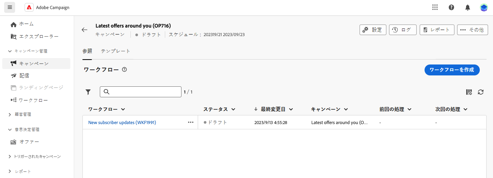

# ワークフロー作成の主な原則 {#gs-workflow-creation}

Adobe Campaign web を使用すると、ワークフローを視覚的なキャンバスに作成して、セグメント化、キャンペーン実行、ファイル処理などのクロスチャネルプロセスを設計できます。

## ワークフローの内部とは {#gs-workflow-inside}

ワークフローダイアグラムは、予定処理を表します。これは、実行される様々なタスクと、タスク同士の関係を示すものです。

{zoomable="yes"}

各ワークフローには次が含まれます。

* **アクティビティ**：アクティビティとは、実行されるタスクです。ダイアグラム上のアイコンは、様々なアクティビティを表します。各アクティビティには、特定のプロパティと、すべてのアクティビティに共通のプロパティがあります。

  ワークフローのダイアグラムでは、指定されたアクティビティが、特にループまたは繰り返しアクションがある場合に複数のタスクを生成できます。

* **トランジション**：トランジションは、ソースアクティビティを宛先アクティビティにリンクし、そのシーケンスを定義します。

* **ワークテーブル**：ワークテーブルには、トランジションによって実行されるすべての情報が含まれます。各ワークフローは、複数のワークテーブルを使用します。これらのテーブル内のデータは、ワークフローのライフサイクルを通じて使用できます。

## ワークフローを作成するための主な手順 {#gs-workflow-steps}

キャンペーンでは、2 つの方法でワークフローを作成できます。

1. ワークフローは、**ワークフロー**&#x200B;メニューからスタンドアロンワークフローとして作成できます。

   {zoomable="yes"}

1. ワークフローは、キャンペーンの「**ワークフロー**」タブからキャンペーン内で直接作成できます。キャンペーンに含めると、ワークフローは他のすべてのキャンペーンのワークフローと共に実行され、レポート指標はキャンペーンレベルでグループ化されます。

   {zoomable="yes"}

ワークフローを作成する主な手順は次のとおりです。

{zoomable="yes"}

以下の手順については、次の節で詳しく説明します。

1. [ワークフローを作成し、そのプロパティを定義](create-workflow.md)
1. [アクティビティを調整および設定](orchestrate-activities.md)
1. [ワークフローの詳細設定を指定](workflow-settings.md)
1. [ワークフローを開始し、その実行を監視](start-monitor-workflows.md)