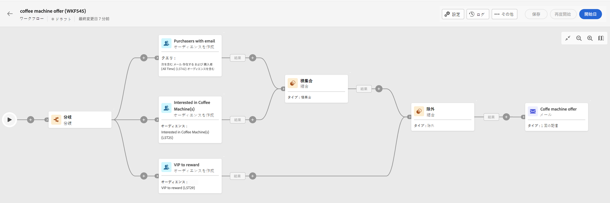

# ワークフロー作成の主な原則 {#gs-workflow-creation}

Adobe Campaign Web を使用すると、視覚的なキャンバス上にワークフローを作成して、セグメント化、キャンペーン実行、ファイル処理などのクロスチャネルプロセスを設計できます。

## ワークフローの内部とは {#gs-workflow-inside}

ワークフローダイアグラムは、計画されたプロセスを表します。 これは、実行される様々なタスクと、タスク同士の関係を示すものです。

{zoomable="yes"}

各ワークフローには次が含まれます。

* **アクティビティ**：アクティビティとは、実行されるタスクです。ダイアグラム上のアイコンは、様々なアクティビティを表します。 各アクティビティには、すべてのアクティビティに共通の固有のプロパティとプロパティがあります。

  ワークフローダイアグラムでは、指定されたアクティビティが、特にループまたは繰り返しアクションがある場合に複数のタスクを生成できます。

* **トランジション**：トランジションは、ソースアクティビティを宛先アクティビティにリンクし、そのシーケンスを定義します。

* **作業用テーブル**：作業用テーブルには、トランジションによって実行されるすべての情報が含まれます。各ワークフローは、複数のワークテーブルを使用します。これらのテーブルのデータは、ワークフローのライフサイクルを通じて使用できます。

## ワークフローを作成するための主な手順 {#gs-workflow-steps}

キャンペーンでは、2 つの方法でワークフローを作成できます。

1. ワークフローは、**ワークフロー** メニューからスタンドアロンワークフローとして作成できます。

   {zoomable="yes"}

1. ワークフローは、キャンペーンの **ワークフロー** タブから、キャンペーン内で直接作成できます。 キャンペーンに含めると、ワークフローは他のすべてのキャンペーンのワークフローと共に実行され、レポート指標はキャンペーンレベルでグループ化されます。

   {zoomable="yes"}

ワークフローを作成する主な手順は次のとおりです。

{zoomable="yes"}

これらの手順について詳しくは、次の節を参照してください。

1. [ワークフローを作成し、そのプロパティを定義](create-workflow.md)
1. [アクティビティを調整および設定](orchestrate-activities.md)
1. [ワークフローの詳細設定を指定](workflow-settings.md)
1. [ワークフローを開始し、その実行を監視](start-monitor-workflows.md)