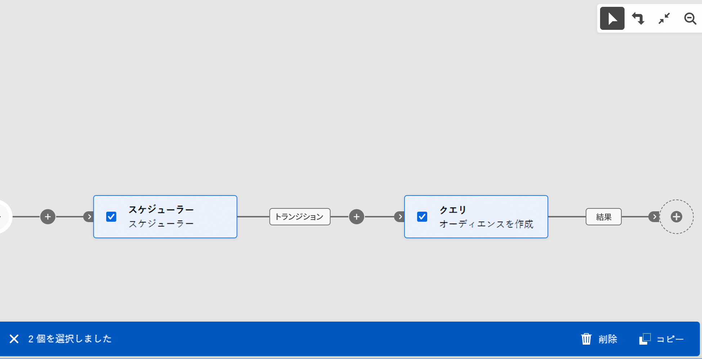

# アクティビティをオーケストレーション {#orchestrate}

ワークフローメニューまたはキャンペーン内で[ワークフローを作成](create-workflow.md)したら、実行される様々なタスクの調整を開始できます。これを行うために、ワークフローダイアグラムを構築できる視覚的なキャンバスが用意されています。このダイアグラムに様々なアクティビティを追加し、順番に接続できます。

## アクティビティを追加 {#add}

設定のこの段階では、ダイアグラムには、ワークフローの開始を表す「開始」アイコンが表示されます。最初のアクティビティを追加するには、「開始」アイコンに接続されている「**+**」ボタンをクリックします。

ダイアグラムに追加できるアクティビティのリストが表示されます。使用可能なアクティビティは、ワークフローダイアグラム内の位置によって異なります。例えば、最初のアクティビティを追加する際に、オーディエンスをターゲティング、ワークフローパスを分割、またはワークフローの実行を遅らせる「**待機**」アクティビティを設定して、ワークフローを開始できます。**オーディエンスを作成**&#x200B;アクティビティの後に、ターゲティングアクティビティでターゲットを絞り込んだり、チャネルアクティビティでオーディエンスに配信を送信したり、フロー制御アクティビティでワークフロープロセスを整理したりできます。

{zoomable="yes"}

アクティビティがダイアグラムに追加されると、右側のパネルが表示され、新しく追加されたアクティビティを特定の設定で指定できます。各アクティビティの設定方法について詳しくは、[この節](activities/about-activities.md)を参照してください。

{zoomable="yes"}

この手順を繰り返し、ワークフローで実行するタスクに応じて、必要なだけアクティビティを追加します。また、2 つのアクティビティの間に新しいアクティビティを挿入することもできます。これを行うには、アクティビティ間のトランジションで「**+**」ボタンをクリックし、目的のアクティビティを選択して、右側のパネルで設定します。

アクティビティを削除するには、キャンバスでアクティビティを選択し、アクティビティプロパティの「**削除**」アイコンをクリックします。

>[!TIP]
>
>各アクティビティ間のトランジションの名前をパーソナライズできます。これを行うには、トランジションを選択し、右側のパネルでそのラベルを変更します。

## ツールバー {#toolbar}

キャンバスの右上隅にあるツールバーには、アクティビティを簡単に操作し、キャンバス内を移動するオプションが表示されます。

* **複数選択モード**：複数のアクティビティを選択してすべてを一度に削除するか、コピー＆ペーストします。詳しくは、[この節](#copy)を参照してください。
* **回転**：キャンバスを垂直方向に切り替えます。
* **画面に合わせる**：キャンバスのズームレベルを画面に合わせて調整します。
* **ズームアウト**／**ズームイン**：キャンバスをズームアウトまたはズームインします。
* **マップを表示**：位置を示すキャンバスのスナップショットを開きます。

{zoomable="yes"}{width="50%"}

## アクティビティを管理 {#manage}

アクティビティを追加する場合、プロパティパネルでアクションボタンを使用して複数の操作を実行できます。

{zoomable="yes"}

以下を行うことができます。

* キャンバスからアクティビティを「**削除**」します。
* アクティビティを「**無効／有効**」にします。ワークフローを実行すると、無効になっているアクティビティと、同じパス上にある後続のアクティビティは実行されず、ワークフローが停止します。
* アクティビティを「**一時停止／再開**」します。ワークフローを実行すると、一時停止したアクティビティで一時停止します。対応するタスクと、同じパス内でそのタスクに続くすべてのタスクが実行されません。
* アクティビティを「**コピー**」します。詳しくは、[この節](#copy)を参照してください。
* アクティビティとそのすべての子ノードを別のトランジションに&#x200B;**移動**&#x200B;します。詳しくは、[この節](#move)を参照してください。
* アクティビティの&#x200B;**実行オプション**&#x200B;にアクセスします。
* アクティビティの「**ログとタスク**」にアクセスします。

「**結合**」や「**重複排除**」などの&#x200B;**ターゲティング**&#x200B;アクティビティを使用すると、残りの母集団を処理し、追加のアウトバウンドトランジションに含めることができます。例えば、**分割**&#x200B;アクティビティを使用している場合、補集合は、以前に定義されたサブセットのいずれにも一致しなかった母集団で構成されます。この機能を使用するには、「**補集合を生成**」オプションを有効化します。

## アクティビティの移動またはコピー {#move-copy}

### アクティビティのコピーとペースト {#copy}

ワークフローアクティビティをコピーして、任意のワークフローにペーストできます。宛先ワークフローは、別のブラウザータブにある場合があります。

アクティビティをコピーするには、次の 2 つの方法があります。

* アクションボタンを使用して 1 個のアクティビティをコピーする。

  {zoomable="yes"}{width="70%"}

* ツールバーボタンを使用して複数のアクティビティをコピーする。

  {zoomable="yes"}{width="70%"}

コピーしたアクティビティをペーストするには、トランジションの「**+**」ボタンをクリックし、「X 個のアクティビティをペースト」を選択します。

{zoomable="yes"}{width="50%"}

### アクティビティとその子ノードの移動 {#move}

Journey Optimizer を使用すると、アクティビティとその子ノードのコンテンツ全体（その中のすべてのトランジションとアクティビティを含む）を、同じワークフロー内の別のトランジションの最後に移動できます。

このプロセスは、アクティビティとそのアウトバウンドトランジション内のすべてのものを最初の場所から切断し、新しいターゲットトランジションに移動します。

アクティビティを移動するには：

1. 移動するアクティビティを選択します。
1. アクティビティのプロパティパネルで、「**移動**」ボタンをクリックします。
1. アクティビティを配置するトランジションと、そのアウトバウンドトランジションを選択し、確認します。

## 実行オプション {#execution}

すべてのアクティビティで、実行オプションを管理できます。アクティビティを選択し、「**実行オプション**」ボタンをクリックします。これにより、アクティビティの実行モードとエラー時の動作を定義できます。

{zoomable="yes"}{width="70%"}

### プロパティ

「**実行**」フィールドでは、タスクの開始時に実行されるアクションを定義できます。

「**最大実行時間**」フィールドでは、「30 秒」や「1 時間」などの期間を指定できます。指定した期間が経過してもアクティビティが完了しない場合は、アラートがトリガーされます。このアラートは、ワークフローの機能には影響しません。

「**タイムゾーン**」フィールドでは、アクティビティのタイムゾーンを選択できます。Adobe Campaign では、同じインスタンス上で複数の国の時差を管理します。適用される設定は、インスタンスの作成時に設定されます。

「**アフィニティ**」フィールドでは、特定のマシン上でワークフローまたはワークフローアクティビティを強制的に実行できます。これを行うには、対象のワークフローまたはアクティビティに対して 1 つまたは複数のアフィニティを指定します。

「**動作**」フィールドでは、非同期タスクが使用される場合に従う手順を定義できます。

### エラー管理

「**エラーの場合**」フィールドでは、アクティビティでエラーが発生した場合に実行するアクションを指定できます。

### 初期化スクリプト

**初期化スクリプト**&#x200B;では、変数を初期化したり、アクティビティのプロパティを変更したりできます。「**コードを編集**」ボタンをクリックし、実行するコードのスニペットを入力します。スクリプトは、アクティビティの実行時に呼び出されます。[イベント変数](../workflows/event-variables.md)に関連する節を参照してください。

## 例 {#example}

次に、コーヒーマシンに関心のあるすべての顧客（VIP 顧客を除く）にメールを送信するように設計されたワークフローの例を示します。

{zoomable="yes"}

これを実現するために、以下のアクティビティが追加されました。

* ワークフローを 3 つのパス（顧客の組ごとに 1 つ）に分割する&#x200B;**[!UICONTROL 分岐]**&#x200B;アクティビティ。
* **[!UICONTROL オーディエンスを作成]**&#x200B;アクティビティを使用して、3 組の顧客をターゲットに設定します。
   * メールを送信した顧客。
   * 「コーヒーマシンに関心のある」既存のオーディエンスに属する顧客。
   * 既存の「VIP」オーディエンスまたは「報酬」オーディエンスに属する顧客。
* メールを送信した顧客とコーヒーマシンに関心のある顧客をグループ化する&#x200B;**[!UICONTROL 結合]**&#x200B;アクティビティ。
* VIP 顧客を除外する&#x200B;**[!UICONTROL 結合]**&#x200B;アクティビティ。
* 結果の顧客にメールを送信する&#x200B;**[!UICONTROL メール配信]**&#x200B;アクティビティ。

ワークフローを完了したら、ダイアグラムの最後に&#x200B;**[!UICONTROL 終了]**&#x200B;アクティビティを追加します。このアクティビティは、ワークフローの終了を視覚的に示すものであり、機能には影響はありません。

ワークフローダイアグラムのデザインが完了したら、ワークフローを実行し、様々なタスクの進行状況を追跡します。[詳しくは、ワークフローを開始し、その実行を監視する方法を参照してください](start-monitor-workflows.md)。