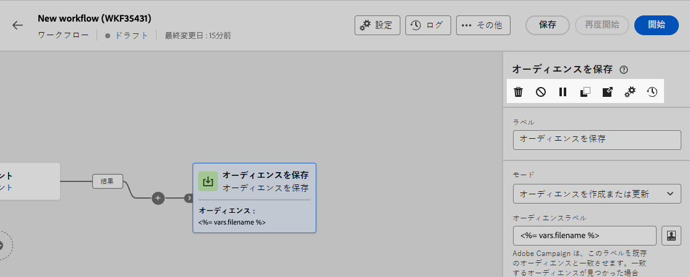

# アクティビティをオーケストレーション {#orchestrate}

ワークフローメニューまたはキャンペーン内で[ワークフローを作成](create-workflow.md)したら、実行される様々なタスクの調整を開始できます。これを行うために、ワークフローダイアグラムを構築できる視覚的なキャンバスが用意されています。このダイアグラムに様々なアクティビティを追加し、順番に接続できます。

## アクティビティを追加 {#add}

設定のこの段階では、ダイアグラムに、ワークフローの開始を表す「開始」アイコンが付きます。最初のアクティビティを追加するには、 **+** ボタンをクリックします。

ダイアグラムに追加できるアクティビティのリストが表示されます。使用可能なアクティビティは、ワークフローダイアグラム内の位置によって異なります。例えば、最初のアクティビティを追加する際に、オーディエンスのターゲティング、ワークフローパスの分割、 **待機** 「 」アクティビティを使用して、ワークフローの実行を遅らせます。 一方、 **オーディエンスの構築** アクティビティを使用すると、ターゲティングアクティビティでターゲットを絞り込んだり、チャネルアクティビティでオーディエンスに配信を送信したり、フロー制御アクティビティでワークフロープロセスを整理したりできます。

アクティビティがダイアグラムに追加されると、右側のパネルが表示され、新しく追加されたアクティビティを特定の設定で設定できます。各アクティビティの設定方法について詳しくは、[この節](activities/about-activities.md)を参照してください。

この手順を繰り返し、ワークフローで実行するタスクに応じて、必要な数のアクティビティを追加します。 また、2 つのアクティビティの間に新しいアクティビティを挿入することもできます。これをおこなうには、 **+** ボタンをクリックして、目的のアクティビティを選択し、右側のウィンドウで設定します。

アクティビティを削除するには、キャンバスでアクティビティを選択し、 **削除** アクティビティプロパティのアイコン

>[!TIP]
>
>各アクティビティ間のトランジションの名前をパーソナライズすることもできます。これを行うには、トランジションを選択し、右側のパネルでそのラベルを変更します。

## アクティビティを管理 {#manage}

アクティビティを追加する場合、プロパティウィンドウでアクションボタンを使用して複数の操作を実行できます。以下を行うことができます。

* キャンバスからアクティビティを「**削除**」します。
* アクティビティを「**無効／有効**」にします。ワークフローを実行すると、無効になっているアクティビティと、同じパス上にある後続のアクティビティは実行されず、ワークフローが停止します。
* アクティビティを「**コピー**」します。その後、 **+** ボタンをクリックし、「1 つの貼り付け」アクティビティを選択します。
* アクティビティの「**ログとタスク**」にアクセスします。
* アクティビティを「**一時停止／再開**」します。ワークフローを実行すると、一時停止したアクティビティで一時停止します。対応するタスクと、同じパス内でそのタスクに続くすべてのタスクが実行されません。

{width="50%"}

## 例 {#example}

次に、コーヒーマシンに関心のあるすべての顧客（VIP 顧客を除く）にメールを送信するように設計されたワークフローの例を示します。

{zoomable=&quot;yes&quot;}

これを実現するために、以下のアクティビティが追加されました。

* ワークフローを 3 つのパス（顧客の組ごとに 1 つ）に分割する&#x200B;**[!UICONTROL 分岐]**&#x200B;アクティビティ。
* **[!UICONTROL オーディエンスを作成]**&#x200B;アクティビティを使用して、3 組の顧客をターゲットに設定します。

   * メールを送信した顧客。
   * 「コーヒーマシンに関心のある」既存のオーディエンスに属する顧客。
   * 既存の「VIP」オーディエンスまたは「報酬」オーディエンスに属する顧客。

* メールを送信した顧客とコーヒーマシンに関心のある顧客をグループ化する&#x200B;**[!UICONTROL 結合]**&#x200B;アクティビティ。
* VIP 顧客を除外する&#x200B;**[!UICONTROL 結合]**&#x200B;アクティビティ。
* 結果の顧客にメールを送信する&#x200B;**[!UICONTROL メール配信]**&#x200B;アクティビティ。

ワークフローを完了したら、ダイアグラムの最後に&#x200B;**[!UICONTROL 終了]** アクティビティを追加します。このアクティビティを使用すると、ワークフローの終了を視覚的に示すことができ、機能には影響はありません。

ワークフローダイアグラムのデザインが完了したら、ワークフローを実行し、様々なタスクの進行状況を追跡できます。[ワークフローを開始し、その実行を監視する方法については、こちらを参照してください](start-monitor-workflows.md)
