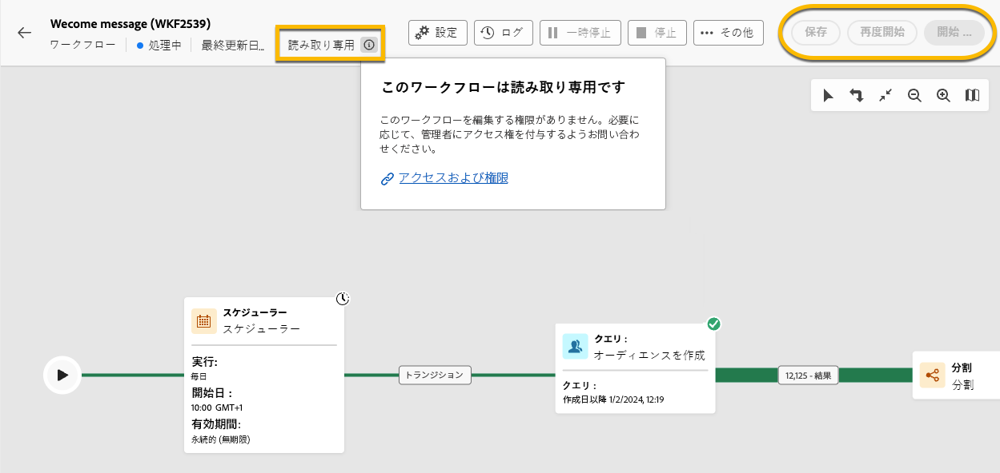

# 読み取り専用ワークフローについて {#readonly-workflows}

>[!CONTEXTUALHELP]
>id="acw_wf_read_only_canvas"
>title="このワークフローは読み取り専用です"
>abstract="権限またはワークフローのタイプにより、このワークフローを編集できません。"

一部のワークフローは読み取り専用です。ビルトインテクニカルワークフローは常に読み取り専用ですが、この制限は他のタイプのワークフローにも適用できます。

Campaign ユーザーは、Adobe Campaign データへのアクセスが制限されている場合があります。Campaign 管理者は、特定の機能を表示する権限を付与できますが、編集または変更する権限は付与できません。データとプロセスのセキュリティを確保するには、データに対するユーザー権限が重要です。Campaign の権限管理について詳しくは、[この節](../get-started/permissions.md)を参照してください。

ワークフローが読み取り専用モードの場合：

* 「**[!UICONTROL 設定]**」ボタンの近くに「**[!UICONTROL 読み取り専用]**」という記載が表示されます。
* アクションボタンにはアクセスできません。

{zoomable="yes"}

ユーザーは、読み取り専用ワークフローでは何も編集できません。アクティビティの設定は変更できません。

{zoomable="yes"}

ユーザーは、ワークフローを削除できません。

{zoomable="yes"}

## 読み取り専用ワークフローのタイプ {#readonly-workflow-types}

ワークフローのタイプによって、読み取り専用モードは異なる場合があります。

### キャンペーンワークフロー {#readonly-campaign-wf}

読み取り専用キャンペーンワークフローの場合、ユーザーは監視ボタンにアクセスできません。

{zoomable="yes"}

### テクニカルワークフロー {#readonly-tech-wf}

ビルトインテクニカルワークフローは、すべての Campaign ユーザー（管理者も含む）に対して読み取り専用です。ただし、ユーザーは、必要に応じて&#x200B;**一時停止**&#x200B;または&#x200B;**停止**&#x200B;することができます。許可されるアクションは以下に限られています。

{zoomable="yes"}

テクニカルワークフローについて詳しくは、[この節](https://experienceleague.adobe.com/ja/docs/campaign/automation/workflows/introduction/wf-type/technical-workflows)を参照してください。